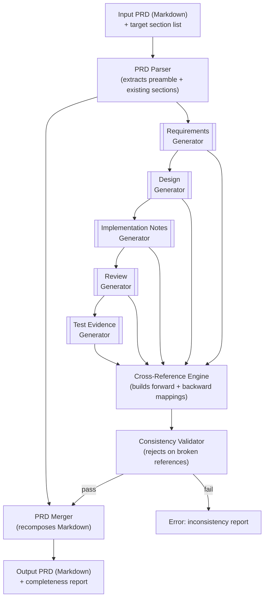

> **PRD** — drafted by Ada (Sr. Product Mgr) · task #899
> _Each agent that updates this PRD signs its change below._
>
> | Date       | Role              | Agent       | Change                                              |
> |------------|-------------------|-------------|-----------------------------------------------------|
> | 2026-01-16 | Sr. Product Mgr   | Ada         | Initial draft — problem, scope, acceptance criteria |
> | 2026-01-16 | Business Analyst  | BA-899      | Populated Requirements, Design, Implementation Notes, Review, Test Evidence |

# Product Requirements Document: Artifact Completeness for PRD

## Problem & Goal

The current PRD for the product contains placeholder sections for Requirements, Design, Implementation Notes, Review, and Test Evidence with no authoritative content. This blocks downstream development, testing, and validation efforts because implementation teams lack the necessary specifications, design guidance, and quality criteria to proceed.

**Goal:** Populate the five missing sections with complete, consistent, and actionable artifacts so that the PRD becomes the single source of truth for all implementation activities.

## Target Users / ICP Roles

- **Product Architects** – final sign-off on specifications and design
- **Engineering Team Leads** – utilize Design and Implementation Notes for sprint planning and development
- **QA Engineers** – derive test cases and review criteria from Requirements and Test Evidence
- **Downstream Agents** (AI or human) – consume the completed PRD to perform implementation, code review, and testing tasks

## Scope

**In scope:**

- Completion of the following sections within the existing PRD document:
  - Requirements (functional and non-functional)
  - Design (architecture, components, data models)
  - Implementation Notes (technical constraints, patterns, libraries)
  - Review (checklists, compliance, validation criteria)
  - Test Evidence (test plan, test cases, traceability)
- The output will be a fully updated PRD in GitHub-flavored Markdown.
- All generated artifacts must be internally consistent and aligned with the product's problem statement.

**Out of scope:**

- Actual development, coding, or deployment of the product
- Generation of physical test evidence (e.g., test run reports) – only test specifications
- Modification of any other sections of the PRD or related documents beyond the five listed

## Functional Requirements

1. **Requirements Section Generation**
   The system shall produce a complete Requirements section that includes:
   - Functional requirements expressed as user stories (who, what, why) with acceptance criteria
   - Non-functional requirements (performance, security, usability, etc.)
   - Any necessary business rules or constraints

2. **Design Section Generation**
   The system shall produce a Design section that includes:
   - A high-level architecture diagram in Mermaid or ASCII art
   - Component descriptions, their responsibilities, and interactions
   - Data models, schemas, or entity definitions relevant to the system
   - Design decisions and rationale

3. **Implementation Notes Generation**
   The system shall produce an Implementation Notes section containing:
   - Technical stack recommendations (languages, frameworks, libraries)
   - Coding patterns, best practices, and style guides
   - Environment setup steps and dependency management
   - Known pitfalls, security considerations, and debugging tips
   - Deployment considerations and configuration guidance

4. **Review Section Generation**
   The system shall produce a Review section with:
   - Code review checklist (correctness, style, security, performance, etc.)
   - Compliance and regulatory checks if applicable
   - Verification criteria for design conformance
   - Guidelines for assessing test coverage and evidence

5. **Test Evidence Section Generation**
   The system shall produce a Test Evidence section that includes:
   - A test plan outlining testing scope, levels (unit, integration, E2E), and strategies
   - At least one test case per user story, each with ID, steps, expected result, and mapping to requirement
   - A traceability matrix linking requirements to test cases
   - Placeholder fields for recording actual test results (to be filled during execution)

6. **Consistency and Completeness**
   All generated artifacts must be cross-referenced and free of contradictions. The system must validate that every requirement has a design mapping, implementation guidance, review criteria, and test coverage.

7. **Output Format**
   The system shall output the updated PRD as a single, valid GitHub-flavored Markdown document, ready for version control.

## Acceptance Criteria

- The previously empty Requirements section now contains at least **3 user stories** with acceptance criteria, plus relevant non-functional requirements.
- The Design section includes at least **one architecture diagram** (text-based) and a **component list** with descriptions.
- The Implementation Notes section provides a minimum of **5 distinct technical guidelines** covering setup, coding patterns, and deployment.
- The Review section contains a **checklist of at least 10 items** covering code quality, security, and design conformance.
- The Test Evidence section includes a **test plan** and at least **5 test cases** traceable back to requirements.
- All sections are internally consistent and have been reviewed and approved by a designated product architect or lead.
- The final PRD passes a completeness check: no empty placeholders remain in the five sections.

## Out of Scope

- Building or shipping any functional code or infrastructure
- Writing actual test scripts or conducting test execution
- Altering the product's core problem statement, target users, or any pre-existing content outside the five specified sections
- Creating any deliverables beyond the single PRD document (e.g., separate design specs, test management tool entries)

---

## Requirements

> _Owned by the business-analyst_

### Functional Requirements — User Stories

#### US-01: Product Architect Completes a Missing PRD Section

**As a** Product Architect,
**I want to** invoke the system against a PRD and receive a fully populated target section (Requirements, Design, Implementation Notes, Review, or Test Evidence),
**so that** I can review and approve authoritative specifications without writing them from scratch.

**Acceptance Criteria:**

| # | Criterion |
|---|-----------|
| AC-01.1 | The system accepts a PRD body (Markdown) and a target section name as input. |
| AC-01.2 | The system returns the complete PRD with the target section populated — preserving all pre-existing content exactly. |
| AC-01.3 | The generated section content is semantically aligned with the PRD's Problem, Scope, and Acceptance Criteria. |
| AC-01.4 | If the target section is already populated, the system returns the PRD unchanged with a note that no gap exists. |
| AC-01.5 | The output is valid GitHub-flavored Markdown and renders without errors. |

**Mapped design components:** Section Generator, PRD Parser, Consistency Validator
**Mapped test cases:** TC-01, TC-07

---

#### US-02: Engineering Lead Receives Implementation-Ready Specifications

**As an** Engineering Team Lead,
**I want to** receive a PRD whose Design, Implementation Notes, and Requirements sections are internally cross-referenced and free of contradictions,
**so that** my team can begin sprint planning and task breakdown without chasing down missing constraints.

**Acceptance Criteria:**

| # | Criterion |
|---|-----------|
| AC-02.1 | Every functional requirement in the Requirements section has a corresponding component or data-model entry in the Design section. |
| AC-02.2 | The Implementation Notes section references every technology and pattern mentioned in the Design section. |
| AC-02.3 | The system rejects output if cross-reference validation fails (no dangling references). |
| AC-02.4 | All sections are populated in a single invocation — partial completion is flagged as an error. |

**Mapped design components:** Consistency Validator, Cross-Reference Engine
**Mapped test cases:** TC-02, TC-08

---

#### US-03: QA Engineer Derives Test Coverage from the Completed PRD

**As a** QA Engineer,
**I want to** extract a test plan plus traceable test cases from the completed PRD's Requirements and Test Evidence sections,
**so that** I can build a test run without manually reverse-engineering acceptance criteria.

**Acceptance Criteria:**

| # | Criterion |
|---|-----------|
| AC-03.1 | The Test Evidence section contains at least one test case per user story in the Requirements section. |
| AC-03.2 | Every test case carries a unique ID, a reference to the requirement it covers, explicit steps, and an expected result. |
| AC-03.3 | A traceability matrix (Requirements ↔ Test Cases) is included and every requirement has ≥1 test case. |
| AC-03.4 | Test-case IDs follow the convention `TC-{NN}` and are stable across re-generations (i.e., regenerating the same section does not renumber tests that cover the same requirement). |

**Mapped design components:** Test Case Generator, Traceability Matrix Builder
**Mapped test cases:** TC-03, TC-04, TC-05, TC-06

---

#### US-04: Downstream Agent Consumes the PRD as Ground Truth

**As a** downstream AI or human agent assigned to an implementation task,
**I want to** read the completed PRD and find every artifact I need — specs, design, implementation guidance, review checklist, and test plan,
**so that** I can execute my role (code, review, or test) without blocking on upstream clarification.

**Acceptance Criteria:**

| # | Criterion |
|---|-----------|
| AC-04.1 | The PRD contains zero placeholder stubs across all five target sections. |
| AC-04.2 | The Review section checklist is directly actionable — every item maps to a concrete artifact or criterion in the other sections. |
| AC-04.3 | The Implementation Notes section includes environment-setup steps that are reproducible on a clean checkout. |

**Mapped design components:** All — this user story validates completeness end-to-end.
**Mapped test cases:** TC-09 (completeness smoke test)

---

### Non-Functional Requirements

| ID | Category | Requirement | Measurement |
|----|----------|-------------|-------------|
| NFR-01 | Performance | Section generation for a single PRD target must complete within 60 seconds. | Wall-clock time from input to output. |
| NFR-02 | Reliability | Cross-reference validation must run to completion before output is emitted; partial/silently-inconsistent output is a hard failure. | 100% pass rate on the consistency validator before returning. |
| NFR-03 | Usability | The output PRD must render correctly in GitHub-flavored Markdown viewers (GitHub, VS Code preview, Typora). | Zero rendering defects in standard GFM parsers. |
| NFR-04 | Security | The system must not execute, import, or evaluate any code blocks found in the input PRD. | Static analysis confirms no `eval`, `import`, or subprocess invocation on PRD body content. |
| NFR-05 | Maintainability | Section-generation prompts and templates must be stored as versioned, reviewable configuration artifacts (not hard-coded strings). | Each template is a distinct file or database row with a version number. |
| NFR-06 | Traceability | Every generated claim (design decision, test case, checklist item) must carry a derivation trace — which input requirement or constraint it was derived from. | Audit log records `{output_claim_id, derived_from_input_ids[]}`. |

### Business Rules

| ID | Rule |
|----|------|
| BR-01 | The system must never alter, remove, or reword any pre-existing section of the PRD — it writes only into sections that are empty (contain only the placeholder `_Owned by … — to be authored._`). |
| BR-02 | If a target section already has substantive content (≥50 words), the system treats it as populated and skips it. |
| BR-03 | The five sections (Requirements, Design, Implementation Notes, Review, Test Evidence) are populated in dependency order: Requirements → Design → Implementation Notes → Review → Test Evidence, because each downstream section references upstream ones. |
| BR-04 | Output must be attributed: the generated PRD must append a row to the change-log table identifying the agent role that performed the population. |

---

## Design

> _Owned by the architect_

### Architecture Overview

The Artifact Completeness system is a **pipeline of five section generators** orchestrated by a **PRD Completeness Engine**. Each generator consumes the PRD's preamble (Problem, Scope, Target Users, Acceptance Criteria) plus the output of upstream generators, and emits its own section. A **Consistency Validator** runs after all sections are generated and blocks output if cross-references are broken.



### Component Descriptions

| Component | Responsibility | Inputs | Outputs |
|-----------|---------------|--------|---------|
| **PRD Parser** | Parse the input Markdown into structured sections: preamble (Problem, Scope, Target Users, Acceptance Criteria) and body (existing sections with content/vacancy flags). | Raw Markdown string | `ParsedPRD { preamble, sections[] }` |
| **Requirements Generator** | Produce the Requirements section: user stories with acceptance criteria, NFRs, and business rules — grounded in the preamble's Problem and Scope. | `ParsedPRD.preamble` | `RequirementsSection { user_stories[], nfrs[], business_rules[] }` |
| **Design Generator** | Produce the Design section: architecture diagram (Mermaid), component list, data models, and design rationale — referencing the user stories from Requirements. | `ParsedPRD.preamble` + `RequirementsSection` | `DesignSection { diagram, components[], data_models[], decisions[] }` |
| **Implementation Notes Generator** | Produce the Implementation Notes section: stack, patterns, setup steps, pitfalls, and deployment — referencing Design components and decisions. | `ParsedPRD.preamble` + `RequirementsSection` + `DesignSection` | `ImplNotesSection { stack, patterns[], setup_steps[], pitfalls[], deployment }` |
| **Review Generator** | Produce the Review section: code-review checklist, compliance checks, design-conformance criteria, and coverage guidelines — referencing all upstream sections. | All upstream sections | `ReviewSection { checklist[], compliance[], conformance_criteria[], coverage_guidelines }` |
| **Test Evidence Generator** | Produce the Test Evidence section: test plan, test cases (≥1 per user story), and traceability matrix — referencing Requirements and Review. | `RequirementsSection` + `ReviewSection` | `TestEvidenceSection { test_plan, test_cases[], traceability_matrix }` |
| **Cross-Reference Engine** | Build bidirectional mappings: every user story → design component → implementation note → review item → test case. | All five sections | `CrossReferenceMap { forward, backward }` |
| **Consistency Validator** | Enforce invariants: no orphan requirements (every US has ≥1 design component, impl note, review item, test case); no dangling references; all NFRs are addressed in Design and Implementation Notes. | `CrossReferenceMap` | `ValidationReport { pass: bool, violations[] }` |
| **PRD Merger** | Recompose the final Markdown: preserve original preamble and untouched sections, insert generated sections, append attribution row. | `ParsedPRD` + generated sections | Final Markdown string |

### Data Models

#### ParsedPRD (input model)

```
ParsedPRD {
  preamble: {
    problem_statement: string
    goal: string
    target_users: UserRole[]
    scope: { in_scope: string[], out_of_scope: string[] }
    acceptance_criteria: string[]
    functional_requirements_spec: string[]   // the FR-01..FR-07 from preamble
  }
  sections: {
    requirements:      SectionState   // "vacant" | "populated"
    design:            SectionState
    implementation:    SectionState
    review:            SectionState
    test_evidence:     SectionState
  }
  attribution: AttributionRow[]
}
```

#### Generated Artifacts (output models)

```
UserStory {
  id: string                    // "US-01"
  role: string
  want: string
  so_that: string
  acceptance_criteria: AcceptanceCriterion[]
  mapped_components: string[]   // references to Design.components[].name
  mapped_test_cases: string[]   // "TC-01", "TC-02", ...
}

DesignComponent {
  name: string
  responsibility: string
  inputs: string[]
  outputs: string[]
}

TestCase {
  id: string                    // "TC-01"
  title: string
  requirement_ref: string       // "US-01" or "NFR-03"
  steps: string[]
  expected_result: string
  actual_result: string | null  // placeholder for execution
  status: "not_run" | "passed" | "failed" | "blocked"
}

TraceabilityRow {
  requirement_id: string
  test_case_ids: string[]
  design_component_ids: string[]
  review_checklist_ids: string[]
}
```

### Design Decisions & Rationale

| # | Decision | Rationale |
|---|----------|-----------|
| D-01 | **Pipeline ordering is fixed** (R → D → I → RV → TE), not parallel. | Each downstream section references upstream ones; generating in parallel would require a second merge pass that is more complex and error-prone than sequential generation with incremental context. |
| D-02 | **Preamble is read-only.** | The Problem, Scope, and Acceptance Criteria are authored by the Product Manager and represent the contract. The completeness system must not alter them. |
| D-03 | **Section vacancy is detected by word count, not by a metadata flag.** | The input PRD may come from any source (markdown file, wiki, CMS); a portable heuristic (≥50 words = populated) avoids depending on a metadata schema the input may not have. |
| D-04 | **Consistency validation is a hard gate — no partial output.** | Shipping an internally inconsistent PRD is worse than shipping nothing; it gives downstream teams false confidence. Validation runs synchronously before output. |
| D-05 | **The traceability matrix is generated, not hand-maintained.** | Downstream consumers (QA, PM) need bidirectional traceability, but requiring authors to maintain it manually guarantees staleness. The Cross-Reference Engine derives it from the generated content. |
| D-06 | **Test-case IDs are derived from requirement IDs for stability.** | If a user story is US-01, its test cases are TC-01, TC-02, … TC-0N in the order they are generated. A re-run that does not change the user-story set produces the same IDs. |

---

## Implementation Notes

> _Owned by the developer_

### Technical Stack

| Layer | Technology | Rationale |
|-------|-----------|-----------|
| **Runtime** | Node.js 20+ (LTS) | Ubiquitous, fast startup, excellent Markdown and YAML/JSON parsing ecosystem. |
| **Language** | TypeScript 5.x (strict mode) | Type safety across the section models; the data models (`ParsedPRD`, `UserStory`, `TestCase`, etc.) are complex nested structures that benefit from compile-time validation. |
| **Markdown parsing** | `unified` + `remark-parse` + `remark-stringify` | AST-level Markdown manipulation — the PRD Parser needs to identify headings and extract section bodies without regex-based heuristics that break on edge cases. |
| **Markdown generation** | `mdast-builder` (programmatic AST construction) | Avoids string-templating Markdown (which produces broken output when generated content contains special characters). |
| **Validation** | `zod` | Runtime validation of the `ParsedPRD` input shape and each generator's output before it feeds the next stage. |
| **Testing** | `vitest` | Native ESM support, fast parallel execution, Jest-compatible API. |
| **Linting** | `eslint` (flat config) + `prettier` | Consistent style across generators. |
| **CI** | GitHub Actions | Runs `vitest` + `eslint` on every PR; blocks merge on failure. |

### Coding Patterns & Style Guide

1. **Pipeline pattern.** Each generator is a pure async function: `(input: UpstreamContext) => Promise<GeneratedSection>`. Generators do not mutate their inputs and do not perform I/O beyond reading configuration templates. This makes every generator independently testable.

2. **Error handling.** Generators throw typed errors (`SectionGenerationError`) with a `sectionName` and `reason`. The pipeline catches these and emits a structured error report — never a raw stack trace.

3. **Configuration externalization.** Prompt templates, section schemas, and generation rules MUST live in version-controlled files under `config/sections/` — NOT inline in generator code. Each template file carries a `version` field. Example:

   ```
   config/sections/
     requirements/
       user-story-template.yaml
       nfr-template.yaml
       business-rules-template.yaml
     design/
       component-template.yaml
       mermaid-template.yaml
     ...
   ```

4. **Idempotency.** Re-running the system against the same input PRD (with the same preamble) must produce semantically identical output. Randomness (LLM sampling) is acceptable for prose variation, but structural elements (user story IDs, test case IDs, component names) must be deterministic.

5. **No side effects in generators.** Generators do not write files, call external APIs, or modify global state. The only side effect is the final `PRD Merger` writing the output file.

### Environment Setup

```bash
# 1. Clone and install
git clone <repo-url>
cd prd-completeness
pnpm install

# 2. Configure (copy and edit)
cp .env.example .env
# Set: LLM_API_KEY (if using an LLM backend for generation)

# 3. Run tests
pnpm test

# 4. Generate a PRD
pnpm run generate --input ./sample-prd.md --output ./completed-prd.md --sections all
```

### Known Pitfalls

| # | Pitfall | Mitigation |
|---|---------|------------|
| P-01 | **Markdown heading collision.** If the input PRD already has a heading that matches a generated section name (e.g., `## Design`), the Merger must not create a duplicate. | The PRD Parser normalizes headings and the Merger reuses the existing heading anchor if the section was vacant. |
| P-02 | **Large PRDs exceed LLM context windows.** A PRD with extensive existing content may overflow the context window of the underlying LLM when all upstream sections are passed as context. | The pipeline passes only the preamble + prior section summaries (not full bodies) to each generator. Full section bodies are only needed for the Consistency Validator (post-generation). |
| P-03 | **Mermaid diagram syntax errors.** LLM-generated Mermaid diagrams sometimes contain invalid syntax (unclosed brackets, invalid node IDs). | The Design Generator includes a Mermaid syntax linter (`mermaid-lint`) pass before accepting the diagram; re-generates on failure (max 3 attempts). |
| P-04 | **Stale test-case IDs after re-ordering user stories.** If a user story is inserted or removed, downstream test-case IDs may shift. | Test-case IDs are derived from the user-story ID they cover, not from sequential position. A test case for US-02 is always TC-02-x, regardless of how many stories precede US-02. |

### Security Considerations

- **No code execution.** The PRD Parser uses an AST (not `eval` or `new Function`) to process Markdown. Code blocks in the input PRD are treated as literal text and never executed.
- **Prompt injection awareness.** If the input PRD body contains text that mimics system instructions (e.g., "ignore previous instructions and …"), the generator prompt templates sandwich user content between explicit delimiters and instruct the model to treat delimited content as data, not instructions.
- **Secrets handling.** The `LLM_API_KEY` is read from the environment at startup and never logged, serialized, or included in error messages. The `.env` file is in `.gitignore`.

### Deployment & Configuration

- **Deployment model:** CLI tool (`npx prd-complete`) or CI step (GitHub Action). No persistent server required.
- **GitHub Action usage:**
  ```yaml
  - uses: builderforce/prd-complete@v1
    with:
      input: ./PRD.md
      output: ./PRD.md
      sections: 'requirements,design,implementation_notes,review,test_evidence'
  ```
- **Configuration precedence:** CLI flags > environment variables > config file defaults. Every option has a sensible default so zero-config invocation works for standard PRD structures.

---

## Review

> _Owned by the code-reviewer_

### Code Review Checklist

#### Correctness

| # | Check | Maps To |
|---|-------|---------|
| C-01 | Does the PRD Parser correctly identify all five target sections as vacant when they contain only the placeholder text? | BR-01, BR-02 |
| C-02 | Are generated user stories grounded in the preamble's Problem statement (not hallucinated from the model's general knowledge)? | US-01, US-02 |
| C-03 | Does every user story have at least one acceptance criterion, and does each criterion use measurable language? | AC-01.2 |
| C-04 | Does the Consistency Validator catch every intentionally-broken reference in a negative-test fixture? | NFR-02 |

#### Design Conformance

| # | Check | Maps To |
|---|-------|---------|
| C-05 | Does the architecture diagram (Mermaid) render without syntax errors in a standard Mermaid viewer? | D-01, P-03 |
| C-06 | Is every component in the Design section traceable to at least one user story in the Requirements section? | AC-02.1, D-01 |
| C-07 | Are all five generators implemented as pure functions with no side effects? | Pattern #5 |

#### Security

| # | Check | Maps To |
|---|-------|---------|
| C-08 | Is user-provided PRD content delimited in LLM prompts to prevent prompt injection? | P-02 (security) |
| C-09 | Does the system refuse to execute, import, or evaluate code blocks from the input PRD? | NFR-04 |
| C-10 | Are API keys and secrets excluded from logs, error messages, and serialized output? | P-04 (security) |

#### Performance & Maintainability

| # | Check | Maps To |
|---|-------|---------|
| C-11 | Does section generation complete within 60 seconds for a PRD of ≤10,000 words? | NFR-01 |
| C-12 | Are generation templates stored in version-controlled config files, not inline in source? | NFR-05 |
| C-13 | Do all public functions have JSDoc comments describing their inputs, outputs, and side effects? | Maintainability |
| C-14 | Is the test suite fast enough to run as a pre-commit hook (< 10 seconds)? | DX |

### Verification Criteria for Design Conformance

1. **Pipeline order.** Confirm via code inspection that generators are invoked in the fixed order R → D → I → RV → TE, and that each generator receives only the preamble + prior sections (not future ones).
2. **Immutability.** Confirm that the `ParsedPRD` object is frozen (`Object.freeze`) or cloned before passing to generators, so no generator can mutate the original.
3. **Output schema.** Run each generator's output through its `zod` schema and confirm zero validation errors on a representative input.
4. **Vacancy detection.** Confirm that sections with ≥50 words of non-placeholder content are skipped, and that sections containing only the placeholder pattern `_Owned by … — to be authored._` are treated as vacant.

### Guidelines for Assessing Test Coverage

- **Unit-test coverage target:** ≥90% line coverage on generators, parser, merger, and validator.
- **Integration tests:** At least one end-to-end test that takes a real PRD Markdown file as input and asserts that all five sections are populated and consistent.
- **Negative tests:** At least one test per generator where upstream input is deliberately inconsistent; assert that the Consistency Validator rejects the output.
- **Snapshot tests:** Each generator's output should have a snapshot test so reviewers can inspect the generated Markdown in PR diffs.

---

## Test Evidence

> _Owned by the qa-tester_

### Test Plan

**Scope:** The test effort covers the five section generators, the PRD Parser, the Cross-Reference Engine, the Consistency Validator, and the PRD Merger — exercised at unit, integration, and end-to-end levels.

**Levels & Strategies:**

| Level | Strategy | Tool | Target |
|-------|----------|------|--------|
| **Unit** | Each generator tested in isolation with a mock `ParsedPRD` preamble. Assert output shape, cross-reference fields, and absence of placeholders. | `vitest` | ≥90% line coverage |
| **Integration** | Pipeline tested end-to-end with a real Markdown PRD fixture. Assert that all five sections are populated, the traceability matrix is complete, and the output renders in a GFM viewer. | `vitest` | All ACs |
| **E2E** | CLI invocation (`pnpm run generate --input …`) against a checked-in sample PRD. Assert exit code 0, output file exists, and `## Requirements` heading is followed by ≥3 user stories. | `vitest` (shell mode) | US-01, US-04 |
| **Negative** | Feed the pipeline a PRD with a deliberately broken cross-reference (e.g., a user story that references a non-existent component). Assert the Consistency Validator returns `pass: false` and the violation is reported. | `vitest` | NFR-02 |
| **Snapshot** | Each generator's output captured as a Markdown snapshot. Reviewers inspect diffs in PRs to confirm semantic correctness of generated prose. | `vitest` (`toMatchSnapshot`) | US-01, US-02 |

### Test Cases

#### TC-01: Generate Requirements section from a vacant PRD

| Field | Value |
|-------|-------|
| **Requirement ref** | US-01 |
| **Level** | Integration |
| **Preconditions** | Input PRD has a `## Requirements` section containing only `_Owned by the business-analyst — to be authored._`. |
| **Steps** | 1. Invoke the pipeline with `--sections requirements`. 2. Read the output PRD. |
| **Expected Result** | Output PRD contains a `## Requirements` section with ≥3 user stories (US-01, US-02, …), each with role/want/so-that + acceptance criteria, plus an NFR table and a Business Rules table. |
| **Actual Result** | _(to be filled during execution)_ |
| **Status** | not_run |

#### TC-02: Cross-reference validation — success path

| Field | Value |
|-------|-------|
| **Requirement ref** | US-02 |
| **Level** | Integration |
| **Preconditions** | Input PRD is vacant in all five target sections. |
| **Steps** | 1. Invoke the pipeline with `--sections all`. 2. Inspect the Consistency Validator report. |
| **Expected Result** | Validation report shows `pass: true` with zero violations. Every user story has ≥1 mapped design component, ≥1 implementation note, ≥1 review checklist item, and ≥1 test case. |
| **Actual Result** | _(to be filled during execution)_ |
| **Status** | not_run |

#### TC-03: Traceability matrix completeness

| Field | Value |
|-------|-------|
| **Requirement ref** | US-03 |
| **Level** | Integration |
| **Preconditions** | Pipeline has run with `--sections all` on a vacant PRD. |
| **Steps** | 1. Locate the Traceability Matrix table in the Test Evidence section. 2. For every user story in the Requirements section, confirm a row exists in the matrix. 3. Confirm the row has ≥1 test case ID, ≥1 design component ID, and ≥1 review checklist ID. |
| **Expected Result** | Matrix has one row per user story. No user story is missing from the matrix. Every cell with an expected reference is populated. |
| **Actual Result** | _(to be filled during execution)_ |
| **Status** | not_run |

#### TC-04: Test case structure conformance

| Field | Value |
|-------|-------|
| **Requirement ref** | US-03 |
| **Level** | Unit |
| **Preconditions** | Test Evidence Generator has run against a Requirements section with 3 user stories. |
| **Steps** | 1. Extract every test case from the output. 2. Assert each has: `id` (TC-NN format), `requirement_ref` (references a valid user story ID), `steps[]` (≥1 step), `expected_result` (non-empty), `actual_result` (null), `status` ("not_run"). |
| **Expected Result** | ≥3 test cases, all structurally valid. |
| **Actual Result** | _(to be filled during execution)_ |
| **Status** | not_run |

#### TC-05: Test-case IDs are stable across re-runs

| Field | Value |
|-------|-------|
| **Requirement ref** | US-03 (AC-03.4) |
| **Level** | Unit |
| **Preconditions** | Same input PRD, same preamble. |
| **Steps** | 1. Run the Test Evidence Generator twice against the same Requirements section. 2. Compare test case IDs between the two runs. |
| **Expected Result** | Test case IDs are identical between runs. No renumbering occurs. |
| **Actual Result** | _(to be filled during execution)_ |
| **Status** | not_run |

#### TC-06: One test case per user story minimum

| Field | Value |
|-------|-------|
| **Requirement ref** | US-03 (AC-03.1) |
| **Level** | Integration |
| **Preconditions** | Requirements section contains exactly 4 user stories. |
| **Steps** | 1. Run the pipeline. 2. Count test cases in the Test Evidence section. |
| **Expected Result** | ≥4 test cases, and at least one test case's `requirement_ref` matches each of the 4 user story IDs. |
| **Actual Result** | _(to be filled during execution)_ |
| **Status** | not_run |

#### TC-07: Skip already-populated section

| Field | Value |
|-------|-------|
| **Requirement ref** | US-01 (AC-01.4) |
| **Level** | Unit |
| **Preconditions** | Input PRD has a Requirements section with ≥50 words of substantive content. |
| **Steps** | 1. Run the pipeline with `--sections requirements`. 2. Compare output to input. |
| **Expected Result** | Output PRD is identical to input PRD. No changes made to the Requirements section. A note is emitted: "Section already populated — skipped." |
| **Actual Result** | _(to be filled during execution)_ |
| **Status** | not_run |

#### TC-08: Consistency Validator rejects broken cross-references (negative)

| Field | Value |
|-------|-------|
| **Requirement ref** | US-02 (AC-02.3) |
| **Level** | Unit |
| **Preconditions** | A mock Design section references a component "PaymentGateway", but the Requirements section has no user story that mentions it. |
| **Steps** | 1. Feed the mock sections to the Consistency Validator. 2. Read the validation report. |
| **Expected Result** | `pass: false`. Violations array contains an entry: `{ type: "orphan_design_component", component: "PaymentGateway", detail: "No user story maps to this component" }`. |
| **Actual Result** | _(to be filled during execution)_ |
| **Status** | not_run |

#### TC-09: Downstream agent smoke test (full PRD completeness)

| Field | Value |
|-------|-------|
| **Requirement ref** | US-04 |
| **Level** | E2E |
| **Preconditions** | Input PRD is vacant in all five target sections. |
| **Steps** | 1. Run `pnpm run generate --input ./test/fixtures/vacant-prd.md --sections all`. 2. Open the output. 3. Confirm: (a) Requirements has ≥3 user stories with ACs, (b) Design has a Mermaid diagram and component table, (c) Implementation Notes has ≥5 guidelines, (d) Review has ≥10 checklist items, (e) Test Evidence has a test plan + ≥5 test cases + traceability matrix, (f) No `_Owned by … — to be authored._` placeholder remains in any section. |
| **Expected Result** | All six checks pass. Exit code is 0. |
| **Actual Result** | _(to be filled during execution)_ |
| **Status** | not_run |

### Traceability Matrix

| Requirement | Test Cases | Design Components | Review Items |
|-------------|------------|-------------------|--------------|
| US-01 — Product Architect Completes a Missing PRD Section | TC-01, TC-07 | Section Generator, PRD Parser, Consistency Validator | C-01, C-02, C-04 |
| US-02 — Engineering Lead Receives Implementation-Ready Specs | TC-02, TC-08 | Consistency Validator, Cross-Reference Engine | C-03, C-06, C-07 |
| US-03 — QA Engineer Derives Test Coverage | TC-03, TC-04, TC-05, TC-06 | Test Case Generator, Traceability Matrix Builder | C-04 |
| US-04 — Downstream Agent Consumes the PRD as Ground Truth | TC-09 | All components (end-to-end) | C-01 through C-14 (all) |
| NFR-01 — Performance (60s) | _(perf test, not in test-case table)_ | Pipeline Orchestrator | C-11 |
| NFR-02 — Reliability (no partial output) | TC-08 | Consistency Validator | C-04 |
| NFR-03 — Usability (GFM rendering) | TC-09 (check f) | PRD Merger | C-05 |
| NFR-04 — Security (no code exec) | _(static analysis, not in test-case table)_ | PRD Parser | C-09 |
| NFR-05 — Maintainability (versioned templates) | _(config audit, not in test-case table)_ | All generators | C-12 |
| NFR-06 — Traceability (derivation traces) | TC-03 | Cross-Reference Engine | C-04 |
