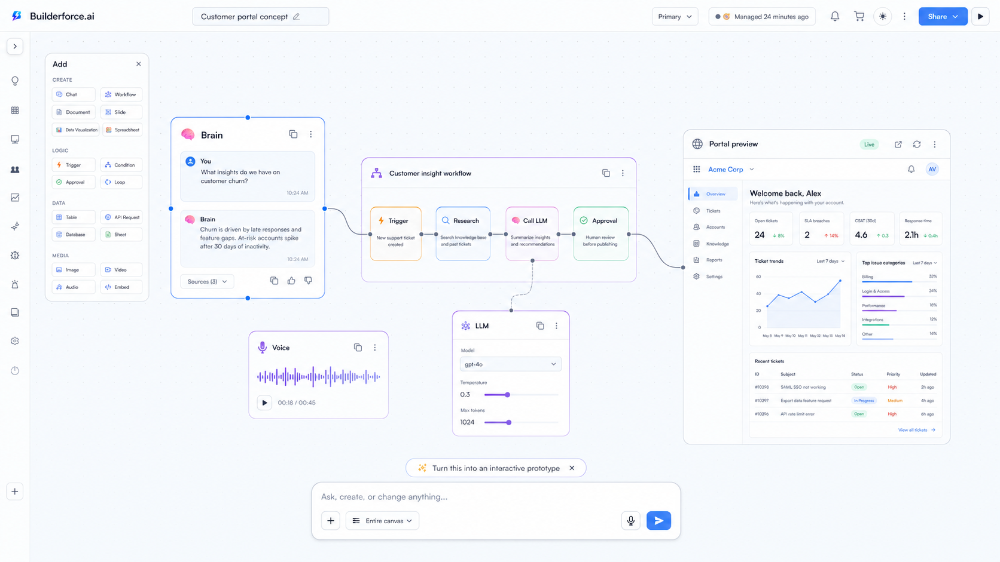
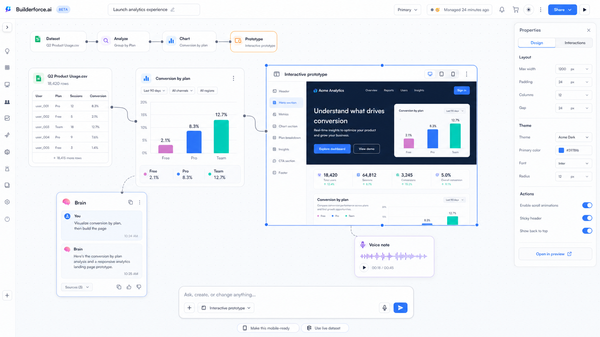
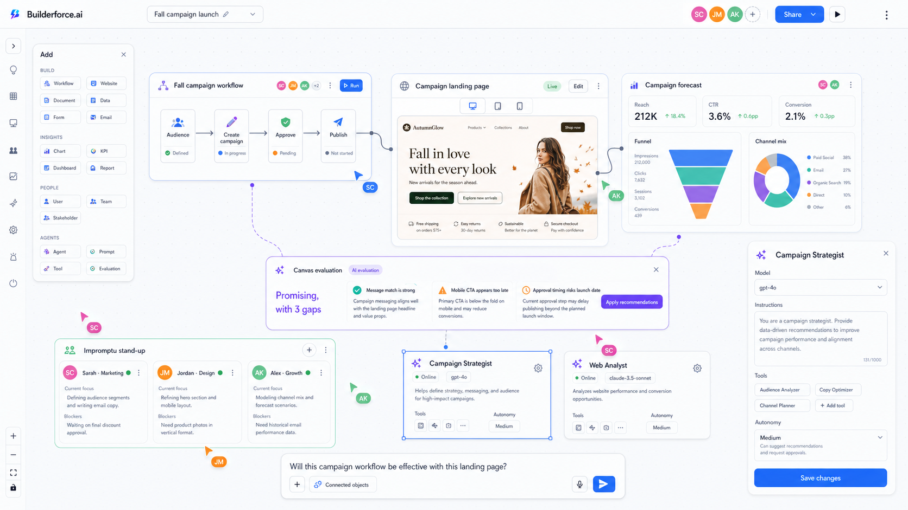

# Creation Canvas

## Recommendation

Replace Brainstorm, the workflow builder, and the IDE launcher as separate creation destinations with one session-based surface:

```text
/create                         New or recent creation sessions
/create/new                     Create a blank session, then replace the URL
/create/:sessionId              Open a creation session
/create/:sessionId?focus=:id    Open and select one canvas object
```

`/create/:sessionId` is the canonical route. A session is the durable container; workflows, chats, prototypes, datasets, models, and voice clips are objects on its canvas.

The existing routes should remain as compatibility entry points during migration:

| Existing entry | New behavior |
| --- | --- |
| `/brainstorm` | Open a new or most recent session with a Chat object selected |
| `/workflows` | List sessions filtered to those containing Workflow objects |
| `/workflows/builder?id=:id` | Open the owning session with that Workflow object selected |
| `/ide/dashboard` | Open the creation-session library, filtered to projects and prototypes |
| `/ide/:id` | Open the owning session with its Code/Preview object selected |

Do not immediately hard-redirect old routes. First make them thin views over the shared session model, then add redirects after saved workflows and projects have session ownership.

## Product model

The canvas is the product. Chat is a familiar control and a reusable canvas object, not the page shell.

- **Session**: scope for history, permissions, files, MCP connections, agent state, and version history.
- **Object**: a movable live view such as Chat, Workflow, Website, Dataset, Chart, Dashboard, Agent, Staff Member, WYSIWYG Prototype, Code, Browser Preview, LLM, Voice, Document, Slide, or Spreadsheet.
- **Connection**: an explicit typed edge. `data`, `control`, `reference`, and `presentation` edges should be visually distinct.
- **Selection**: supplies context to the agent. The bottom composer targets the selected object, a multi-selection, or the entire canvas.
- **Agent action**: produces a visible proposal before destructive changes and records mutations in session history.
- **MCP capability**: appears as an available action or workflow node based on the selected object; MCP configuration stays out of the main canvas until needed.
- **Resource reference**: links an object to its canonical application entity. Editing a Workflow, Website, Agent, report, or dashboard on the canvas edits the same resource seen elsewhere in Builderforce.ai.

Spatial proximity must not imply execution. Only a connection or explicit agent action changes data flow or workflow behavior.

## Primary interaction

1. The user types into the familiar bottom composer or adds an object from the compact palette.
2. The agent creates objects directly on the canvas and connects them when the relationship is executable or data-bearing.
3. Selecting an object changes the composer scope and opens a contextual inspector.
4. The user can drag, resize, connect, draw, annotate, or ask the agent to transform selected objects.
5. Outputs remain first-class artifacts. Each supports copy, download/export, duplicate, version, and "use as input" actions.

Objects have three presentation levels without changing identity:

- **Card** for status, summary, and connecting objects.
- **Expanded** for direct interaction in place, such as editing a workflow or website.
- **Focus** for a full-canvas editing experience with the rest of the session still available through breadcrumbs or zoom-to-selection.

A dragged resource is therefore a portal, not an export. Dropping a saved marketing workflow lets the team run and change that workflow in the session. Dropping a website opens its live preview and WYSIWYG controls. Changes use the resource's existing permissions, validation, versioning, and audit trail.

The composer remains stable at the bottom, but has a scope chip:

- `Entire canvas` for session intent.
- `Selected: Interactive prototype` for targeted edits.
- `3 selected objects` for transformations such as "turn this dataset and sketch into a dashboard."

## Canvas objects

| Object | Purpose | Key actions |
| --- | --- | --- |
| Chat | Familiar conversation stream | Prompt, copy, branch, turn response into object |
| Workflow | Executable graph or collapsed workflow group | Connect, validate, run, inspect output |
| Website | Live site, page, or WYSIWYG creation surface | Edit, preview, evaluate, publish |
| Dataset | Imported CSV/XLSX/JSON/database result | Profile, clean, filter, visualize |
| Chart | Live view bound to a dataset | Change encoding, filter, export, use in prototype |
| Report/Dashboard | Existing informational widget or a canvas-native composition | Filter, refresh, drill down, connect as evidence |
| WYSIWYG Prototype | High-fidelity interactive UI | Edit visually, bind data, preview breakpoints, export |
| Code/Browser | Source and live runtime preview | Edit, run, inspect, deploy |
| LLM | Model, prompt, knowledge, memory, and evaluation configuration | Test, compare, train, package |
| Voice | Recording, generated speech, or voice interface | Transcribe, synthesize, attach, route |
| Agent | Live workforce member and configuration | Assign, inspect activity, edit model/tools/instructions/autonomy |
| Staff Member | Human collaborator or stakeholder | Invite, mention, assign, join stand-up, share context |
| Document/Slide/Sheet | Existing generated deliverables | Edit, copy, download, use as input |

The Add palette should expose the application's object registry, not a second hard-coded catalog. Anything that has a detail view in Builderforce.ai should be able to declare a canvas renderer, compact renderer, inspector, actions, permissions, and agent-readable context adapter.

## Cross-object AI evaluation

The agent must reason about the actual selected resources and their typed relationships, not just a screenshot of the board. For example:

1. The user drags a saved marketing Workflow and a proposed Website page into the session.
2. The user connects them or multi-selects both and asks, "Will this campaign workflow be effective with this landing page?"
3. The canvas context service supplies the workflow definition, audience and timing, page content/structure, analytics, constraints, recent runs, and relevant MCP data.
4. The agent adds a `Canvas evaluation` object with a verdict, evidence linked back to source objects, gaps, confidence, and proposed changes.
5. `Apply recommendations` previews a multi-resource change set. The user can accept changes individually before the workflow or website is mutated.

Evaluation objects remain on the canvas so collaborators can comment, revisit the evidence, and compare a later evaluation after changes.

## Multiplayer collaboration

- Presence, cursors, selections, object locks, comments, mentions, and viewport following are session-scoped.
- Invites support view, comment, edit, and run permissions; underlying resource permissions still apply.
- Canvas geometry and comments use realtime collaborative state. Resource edits continue through their authoritative APIs.
- Agent actions stream into the same session for every collaborator and identify who requested the action.
- A lightweight activity feed records joins, prompts, runs, approvals, settings changes, and applied recommendations.
- Collaborators may enter a temporary presentation/follow mode without moving other users' personal viewport.

An **Impromptu stand-up** is a frame template, not a separate meeting product. Staff Member and Agent objects can be dropped into it; each card surfaces current work, blockers, recent activity, and availability. The Brain can facilitate, summarize updates, identify dependencies, and turn follow-ups into tasks or workflow changes.

## Layout

- Keep the existing global top bar and collapsed navigation rail.
- Use an infinite dotted canvas with pan, zoom, minimap, marquee select, and undo/redo.
- Put a compact searchable Add palette at the upper left. It may collapse to one button.
- Use a contextual right inspector only while an object is selected.
- Float the agent composer at bottom center so it remains familiar and reachable.
- Let Chat exist anywhere on the canvas and collapse to a small conversation chip.
- Allow freehand drawing, arrows, frames, sticky notes, and comments without requiring workflow semantics.

## Reuse plan

The first implementation should compose existing code rather than replace it:

| Existing component/module | Reuse in Creation Canvas |
| --- | --- |
| `components/workflow-builder/WorkflowBuilder.tsx` | Extract XYFlow viewport, drag/drop, connections, controls, minimap, save/run behaviors |
| `components/workflow-builder/BuilderNode.tsx` | Base for executable workflow objects and compact nodes inside a workflow frame |
| `components/workflow-builder/nodeKinds.ts` | Initial Logic, LLM, training, and integration palette registry |
| `components/brain/BrainPanel.tsx` | Chat object content and session conversation behavior |
| `components/ChatInput.tsx` | Global bottom composer; add canvas-selection scope |
| `components/ChatMessageBubble.tsx` and `ChatMessageActions.tsx` | Messages, copy, and artifact actions inside Chat objects |
| `components/canvas/CanvasBoard.tsx` | Freeform block behavior to merge into the XYFlow viewport, especially resize and non-executable blocks |
| `components/canvas/canvasModel.ts` | Seed object geometry and portable content concepts; supersede with a typed session graph |
| `components/workflow-builder/NodeConfigPanel.tsx` | Starting point for the contextual right inspector |
| `components/workflow-builder/EvermindBuildPanel.tsx` | LLM build inspector shown when an LLM/train object is selected |

Use XYFlow as the single spatial engine. Nesting the current `CanvasBoard` inside it would create competing pan, zoom, selection, and keyboard models. Port its useful block behaviors into new XYFlow object types instead.

## Suggested data shape

```ts
type CreationObjectKind =
  | 'chat' | 'workflow' | 'website' | 'dataset' | 'chart' | 'dashboard' | 'report' | 'prototype'
  | 'code' | 'browser' | 'llm' | 'voice'
  | 'agent' | 'staff' | 'evaluation'
  | 'document' | 'slides' | 'spreadsheet' | 'note' | 'drawing' | 'frame';

type CreationSession = {
  id: string;
  projectId?: number;
  title: string;
  objects: CreationObject[];
  connections: CreationConnection[];
  viewport: { x: number; y: number; zoom: number };
  revision: number;
};

type CreationConnection = {
  id: string;
  sourceObjectId: string;
  targetObjectId: string;
  kind: 'data' | 'control' | 'reference' | 'presentation';
};

type CanvasResourceRef = {
  resourceType: string;
  resourceId: string;
  revision?: string;
};
```

Large payloads (datasets, generated files, code trees, audio, and prototype bundles) should be stored as artifact references, not embedded in the canvas JSON.

## Delivery sequence

### Phase 1 — Unified shell

- Add `/create/new` and `/create/:sessionId`.
- Extract the XYFlow canvas shell and palette registry.
- Ship Chat, Workflow, Note, and Browser Preview objects.
- Add the scoped bottom composer and contextual inspector.
- Open legacy workflows and Brain chats in a generated session wrapper.

### Phase 2 — Data and prototype loop

- Add Dataset import with profiling and schema preview.
- Add charts with live bindings to Dataset objects.
- Add the WYSIWYG Prototype object, breakpoints, interactions, and browser preview.
- Let the agent create and mutate these objects through typed canvas commands.
- Add the application-wide object registry and live Report/Dashboard widgets.

### Phase 3 — Model and voice creation

- Add LLM configuration/training/evaluation objects using the Evermind panels.
- Add Voice recording, transcription, synthesis, and voice-interface bindings.
- Add Agent and Staff Member objects, collaborative presence, comments, and stand-up frames.
- Add cross-object evaluation with cited evidence and previewable multi-resource change sets.
- Add session templates and export/deploy flows.

### Phase 4 — Route consolidation

- Make `/create` the primary navigation destination, labeled **Create**.
- Convert Brainstorm, Workflows, and Builder navigation items into object filters/actions within Create.
- Redirect legacy URLs only after migration telemetry shows saved links and session ownership are reliable.

## Success criteria

- A user can go from prompt to workflow to live prototype without changing routes.
- A dataset can become a chart and bind into a prototype within the same session.
- A saved workflow and website can be edited in place and evaluated together by the agent.
- Reports, dashboards, charts, agents, and staff can be pulled from the application into a session as live objects.
- Multiple invited users can concurrently build, comment, prompt, and see agent output.
- An agent settings change made from the canvas uses the canonical agent API and is visible everywhere.
- Chat can be added, moved, collapsed, duplicated, and removed like any other object.
- Every generated output is visible, reusable, and exportable from the canvas.
- Selecting an object makes agent scope unambiguous before a prompt is submitted.
- Existing workflows, chats, and projects open without data loss through compatibility routes.

## Mockups







These are direction-setting mockups. Exact UI copy and object chrome should be implemented with the existing design tokens and localization system.
