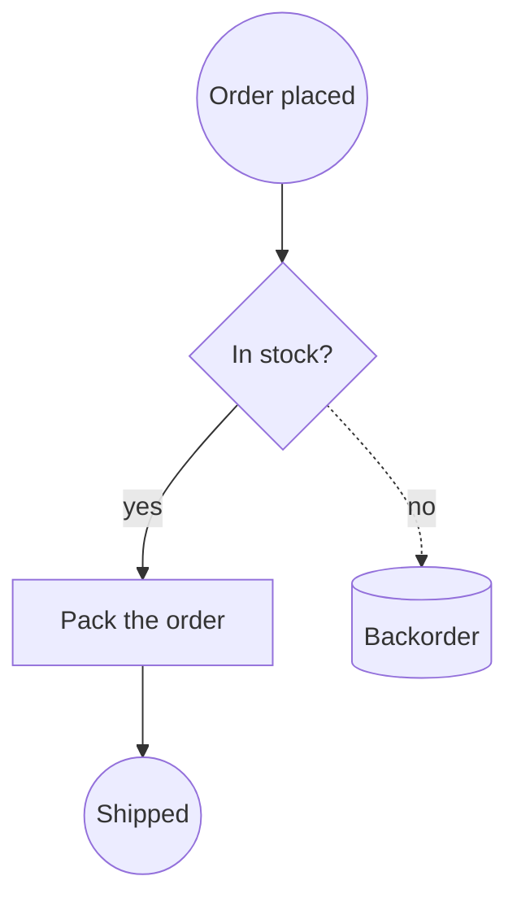
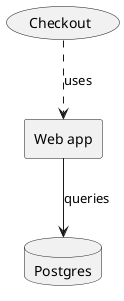
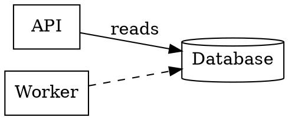

Diagramme haben ein Portabilitätsproblem, das Dokumente schon vor zwanzig Jahren gelöst haben. Eine Word-Datei öffnet sich in Pages, in Google Docs, im Browser. Ein Diagramm öffnet sich in dem Tool, mit dem es gezeichnet wurde – und sonst nirgends. Genau deshalb fristen so viele Architekturbilder ihr Dasein als PNG in einem Wiki, veralten still vor sich hin, während das bearbeitbare Original auf einem Laptop liegt, der längst mit seinem Besitzer das Unternehmen verlassen hat.

Das Creation Canvas liest jetzt neun Diagrammnotationen und schreibt sechs davon. Dieser Artikel ist die Landkarte: was jedes Format ist, wofür es wirklich taugt und in welche Richtung die Konvertierungen laufen.

[Creation Canvas öffnen →](/create/new)

## Die Idee: ein Graph in der Mitte

Neun Notationen paarweise zu unterstützen hieße, zweiundsiebzig Konverter zu bauen. Stattdessen erzeugt jeder Reader dasselbe – einen Graphen aus **Knoten** (eine Form, eine Beschriftung, eine Größe, eine Position) und **Kanten** (zwei Endpunkte, Wegpunkte, eine Beschriftung). Und jeder Writer verarbeitet genau diesen Graphen.

```bf-figure
{
  "kind": "flow",
  "title": "So läuft eine Konvertierung tatsächlich ab",
  "steps": [
    { "label": "Lesen", "note": "Draw.io, Mermaid, PlantUML, DOT, BPMN, Excalidraw, ArchiMate, SVG oder Visio", "hue": "read" },
    { "label": "Ein gemeinsamer Graph", "note": "Formen, Beschriftungen, Verbindungen, Geometrie – unabhängig von der Notation", "hue": "prove" },
    { "label": "Schreiben", "note": "Draw.io, Mermaid, PlantUML, DOT, BPMN oder Excalidraw", "hue": "build" }
  ],
  "caption": "Neun Reader plus sechs Writer statt zweiundsiebzig Konverter. Eine zehnte Notation braucht nur einen Reader – und erbt jedes Ziel."
}
```

Dieser Zwischenschritt ist der Grund, warum ein SVG aus einem Tool, für das Sie längst nicht mehr zahlen, zu dem Mermaid-Diagramm in Ihrem Repository werden kann – und warum eine Visio-Zeichnung eines Kunden zu einem BPMN-Prozess werden kann, den eine Engine ausführt.

## Die zwei Familien

Die neun Notationen teilen sich sauber in zwei Lager auf – und diese Trennung ist wichtiger als jedes einzelne Format.

**Geometrie-Notationen** speichern Koordinaten. Eine Form liegt bei x=240, y=78 und ist 100 breit. Draw.io, Visio, Excalidraw, SVG und die Diagram-Interchange-Hälfte von BPMN funktionieren so. Sie bewahren das Layout exakt – und sind in einem Code-Review praktisch unlesbar.

**Text-Notationen** beschreiben Beziehungen und überlassen die Platzierung einer Layout-Engine. `A --> B` ist schon die ganze Idee. Mermaid, PlantUML und DOT funktionieren so. Sie lassen sich in einem Pull Request diffen, ein Agent kann eine einzelne Zeile ändern, ohne einen Editor zu öffnen – und Sie haben keine Kontrolle darüber, wo etwas landet.

```bf-figure
{
  "kind": "compare",
  "title": "Welche Familie Sie brauchen, hängt davon ab, was als Nächstes passiert",
  "columns": [
    {
      "title": "Geometrie – zum Versenden",
      "hue": "accent",
      "items": [
        "Das Layout ist genau so, wie Sie es gezeichnet haben",
        "Öffnet sich in dem Tool, das der Empfänger ohnehin hat",
        "Draw.io, Visio, Excalidraw, SVG",
        "Als Diff nicht reviewbar",
        "Veraltet in dem Moment, in dem sich das System ändert"
      ]
    },
    {
      "title": "Text – zum Pflegen",
      "hue": "good",
      "items": [
        "Liegt direkt neben dem Code, den es beschreibt",
        "Änderungen erscheinen im Pull Request",
        "Mermaid, PlantUML, Graphviz DOT",
        "Das Layout entscheidet die Engine, nicht Sie",
        "Ein Agent kann es ohne Umweg aktualisieren"
      ]
    }
  ],
  "caption": "Die meisten Teams wählen beim Erstellen eine Familie und leben jahrelang damit. Erst die Konvertierung in beide Richtungen macht daraus eine Entscheidung, die Sie neu treffen können."
}
```

## Die neun im Einzelnen

### Draw.io – die Lingua franca

Eine `.drawio`-Datei ist mxGraph-XML: ein Szenengraph aus Zellen mit Stilen und Geometrie. Es ist das Format, das jeder öffnen kann, dasjenige, in das draw.io selbst Visio importiert – und der sicherste Anhang für eine E-Mail.

```xml
<mxGraphModel>
  <root>
    <mxCell id="0" /><mxCell id="1" parent="0" />
    <mxCell id="draft" value="Draft" style="rounded=1;fillColor=#dae8fc;" vertex="1" parent="1">
      <mxGeometry x="40" y="40" width="120" height="60" as="geometry" />
    </mxCell>
    <mxCell id="review" value="Review" style="rhombus;" vertex="1" parent="1">
      <mxGeometry x="260" y="40" width="120" height="60" as="geometry" />
    </mxCell>
    <mxCell id="e1" value="submit" edge="1" parent="1" source="draft" target="review">
      <mxGeometry relative="1" as="geometry" />
    </mxCell>
  </root>
</mxGraphModel>
```

Das Canvas zeichnet das aus seiner eigenen Geometrie – kein eingebetteter Editor, kein CDN-Skript, kein Netzwerkaufruf. Dateien werden bewusst unkomprimiert geschrieben, damit sie sich diffen lassen und ein Agent sie als Text bearbeiten kann.

**Lesen und Schreiben.** Vollständiger Round-Trip.

### Mermaid – das, was überlebt

Mermaid ist das richtige Format für ein Diagramm, das *gepflegt* werden soll. Es ist reiner Text, GitHub rendert es inline, und es ist die Notation, die ein Sprachmodell weitaus häufiger korrekt schreibt als jede andere.



Knotenformen sind Satzzeichen: `[box]`, `(rounded)`, `((circle))`, `{diamond}`, `{{hexagon}}`, `[(cylinder)]`. Kanten tragen ihre Beschriftung zwischen senkrechten Strichen.

**Liest und schreibt Flussdiagramme.** Die übrigen Mermaid-Diagrammtypen – `sequenceDiagram`, `classDiagram`, `gantt`, `erDiagram` – werden bewusst *nicht* konvertiert, weil sie keine Graphen aus Kästen sind. Die Bedeutung eines Sequenzdiagramms liegt in der Reihenfolge der Nachrichten entlang einer Lebenslinie; wer das in Knoten und Kanten plattdrückt, bekommt ein Bild, das sich rendern lässt und trotzdem lügt. Diese Typen werden als Mermaid gerendert und exportiert, und das Konvertierungsmenü sagt Ihnen, dass sie nur als Mermaid weiterreisen.

### PlantUML – das in Ihrer Dokumentation

PlantUML ist das, was Confluence, Sphinx und die meisten internen Wikis inline rendern. Ein Architekturbild, das *neben* der Dokumentation leben muss, ist meist eine `.puml`.



Das Komponentenvokabular – `rectangle`, `card`, `usecase`, `database`, `node`, `hexagon`, `file` – wird auf Formen abgebildet. Auch die Kurzschreibweisen `[Component]` und `(Use case)` funktionieren.

**Liest und schreibt** das Vokabular aus Deklarationen und Pfeilen. Sequenz- und Aktivitätssyntax bleiben ungelesen – aus demselben Grund wie bei Mermaid.

### Graphviz DOT – das, was eine Maschine geschrieben hat

DOT ist das, was Tools ausgeben. Abhängigkeitsgraphen, Aufrufgraphen, Zustandsautomaten, Schema-Beziehungen und Build-DAGs kommen allesamt als `.dot` oder `.gv` heraus.



Achten Sie auf den Standard: Graphviz zeichnet einen Knoten ohne Angaben als **Ellipse**, nicht als Kasten. Eine Datei, die `node [shape=box]` sagt, meint das auch – und das wird respektiert.

**Lesen und Schreiben.**

### BPMN 2.0 – das, was ausgeführt wird

BPMN ist der Sonderfall: Es ist eigentlich keine Zeichnung, sondern eine **Prozessdefinition** mit angehängtem Bild. `<process>` enthält die Semantik – welcher Schritt auf welchen folgt, welcher Zweig exklusiv ist, wo der Prozess beginnt und endet. `<BPMNDiagram>` enthält die Koordinaten. Camunda, Flowable, Zeebe und jBPM lesen alle dieselbe Datei.

```xml
<bpmn:process id="Process_1">
  <bpmn:startEvent id="s1" name="Order received" />
  <bpmn:task id="t1" name="Check stock" />
  <bpmn:exclusiveGateway id="g1" name="In stock?" />
  <bpmn:endEvent id="e1" name="Shipped" />
  <bpmn:sequenceFlow id="f1" sourceRef="s1" targetRef="t1" />
  <bpmn:sequenceFlow id="f2" sourceRef="t1" targetRef="g1" name="checked" />
  <bpmn:sequenceFlow id="f3" sourceRef="g1" targetRef="e1" name="yes" />
</bpmn:process>
```

Per Code erzeugtes BPMN lässt die Diagrammhälfte häufig komplett weg. Statt solche Dateien abzulehnen, legt das Canvas den Prozess anhand seiner Sequenzflüsse selbst an – ein Prozess ohne Zeichnung ist immer noch ein Prozess, und genau dann wollen Sie ihn am dringendsten sehen.

Beim Schreiben von BPMN wird der Elementtyp aus der Position im Fluss abgeleitet: Eine Ellipse ohne eingehende Verbindung ist ein `startEvent`, eine ohne ausgehende ein `endEvent`, eine an beiden Enden verbundene ein `intermediateThrowEvent`. Ein Pfeil, der eine Anmerkung berührt, wird zur `association`, niemals zum `sequenceFlow` – ein Sequenzfluss zu einer Textanmerkung ist ungültiges BPMN, und Engines lehnen deswegen die ganze Datei ab.

**Lesen und Schreiben.**

### Excalidraw – das, worauf Sie tatsächlich skizziert haben

In Excalidraw fangen Diagramme an. Die `.excalidraw`-Datei ist schlichtes JSON mit echter Geometrie und echten Bindungen – eine Workshop-Skizze ist also kein *Bild* eines Diagramms, sondern ein Diagramm.

```json
{
  "type": "excalidraw",
  "elements": [
    { "id": "r1", "type": "rectangle", "x": 100, "y": 80, "width": 180, "height": 90 },
    { "id": "r1-text", "type": "text", "containerId": "r1", "text": "Ingest" },
    { "id": "d1", "type": "diamond", "x": 360, "y": 70, "width": 140, "height": 110 },
    { "id": "a1", "type": "arrow", "x": 280, "y": 125, "points": [[0, 0], [80, 0]],
      "startBinding": { "elementId": "r1" }, "endBinding": { "elementId": "d1" } }
  ]
}
```

Eine Eigenheit, die man kennen sollte: Eine Beschriftung ist in Excalidraw ein eigenes Element, das an einen Container gebunden ist. Ein Writer, der den Text als Eigenschaft der Form setzt, erzeugt eine Datei, in der alle Kästen leer sind.

**Lesen und Schreiben.** Exporte sind deterministisch – dasselbe Diagramm erzeugt jedes Mal byte-identische Ausgabe statt bei jedem Export eine neue Datei.

### ArchiMate – das Modell, nicht die Zeichnung

Eine `.archimate`-Datei ist ein **Modell**, über das Ansichten gelegt werden. Elemente und Beziehungen existieren genau einmal; eine Ansicht ist eine Menge von Kästen, die auf sie *verweisen*. Die Beschriftung eines Kastens steht nicht im Kasten, sondern am Element, auf das er zeigt – weshalb ein naiver Reader ein Architekturdiagramm voller leerer Rechtecke produziert.

```xml
<folder name="Business" type="business">
  <element xsi:type="archimate:BusinessActor" name="Customer" id="e1" />
  <element xsi:type="archimate:ApplicationComponent" name="Billing" id="e2" />
</folder>
<folder name="Views" type="diagrams">
  <element xsi:type="archimate:ArchimateDiagramModel" name="Overview" id="v1">
    <children xsi:type="archimate:DiagramObject" id="o1" archimateElement="e1">
      <bounds x="24" y="36" width="120" height="55" />
    </children>
  </element>
</folder>
```

**Nur Lesen.** ArchiMate zu schreiben hieße, für jeden Kasten einen Element-*Typ* festzulegen – Business Actor, Application Component, Technology Node und vierzig weitere. Genau diese Wahl ist der gesamte Inhalt eines ArchiMate-Modells, und ein Rechteck auf einem Canvas trägt sie nicht. Einen Typ zu erfinden, ergäbe eine Datei, die sich in Archi öffnet und etwas behauptet, das der Autor nie gesagt hat.

### SVG – der universelle Notausgang

Ein SVG eines Logos ist ein Bild. Ein SVG, das *aus einem Diagrammtool exportiert* wurde, besteht aus Kästen, Pfeilen und Beschriftungen, die jemand gezeichnet hat – nur plattgedrückt. Fast jedes Tool, das Ihnen sein natives Format verweigert, gibt Ihnen ein SVG. Damit ist „Als SVG exportieren“ der Weg hinaus aus Lucidchart, Figma, Whimsical, Sketch und allem anderen, dessen Lizenz Sie nicht mehr haben.

Das Canvas liest `<rect>`, `<circle>`, `<ellipse>`, `<polygon>` (drei Punkte sind ein Dreieck, vier auf den Kantenmitten eine Entscheidungsraute, sechs ein Sechseck), gerade Verläufe aus `<path>`/`<line>`/`<polyline>` als Verbinder sowie `<text>`. Eine Beschriftung, deren Ankerpunkt innerhalb einer Form liegt, wird zum Namen dieser Form; Text, der zu nichts gehört, wird zu einer rahmenlosen Beschriftung, statt verworfen zu werden.

**Nur Lesen** – und nur auf Anfrage. Ein abgelegtes `.svg` bleibt ein Bild, denn Ihr Logo in „ein Diagramm mit einem rätselhaften Rechteck“ zu verwandeln, wäre der umgekehrte Fehler. Die Konvertierung ist ein Button, keine Überraschung.

### Visio – das von außen

Visio kommt von Kunden, aus Compliance-Paketen, von Infrastrukturteams und Prozessauditoren. Außerdem exportieren Lucidchart und SmartDraw in dieses Format – ein einziger Reader öffnet also den Weg aus dem Großteil des kommerziellen Diagramm-Markts.

Eine `.vsdx` ist ein OPC-ZIP, genau wie eine `.docx`. Zwei Dinge bringen jeden naiven Reader zu Fall: Koordinaten werden in **Zoll von unten links** angegeben, und eine Form wird über ihren **Mittelpunkt** (`PinX`, `PinY`) positioniert, nicht über ihre Ecke. Liegt man bei einem davon falsch, kommt die Zeichnung kopfüber und um eine halbe Form verrutscht an.

Visio kennt außerdem keine Formprimitive – eine „Entscheidung“ ist ein *Master* namens `Decision`, dessen Geometrie zufällig eine Raute ist. Master werden deshalb über ihren Namen zugeordnet, was die Flussdiagramm-, BPMN- und Netzwerk-Schablonen abdeckt, die tatsächlich verwendet werden. Die Endpunkte von Verbindern stammen aus `<Connects>` – der einzigen Stelle in der Datei, die angibt, welche Formen eine Linie verbindet.

**Nur Lesen.** Eine gültige `.vsdx` zu schreiben heißt, ein korrektes OPC-Paket zu schreiben – Content Types, drei Relationship-Parts, ein Document-Part, ein Masters-Part –, und Visio reagiert auf eine subtil fehlerhafte Datei nicht mit Einschränkungen, sondern verweigert das Öffnen komplett. Draw.io, das Visio importieren kann, ist der ehrliche Weg zurück.

## Was dabei herauskommt

```bf-figure
{
  "kind": "bars",
  "title": "Abdeckung – nach dem, was Sie mit jeder Notation tun können",
  "max": 2,
  "rows": [
    { "label": "Draw.io", "value": 2, "note": "lesen + schreiben", "hue": "good" },
    { "label": "Mermaid", "value": 2, "note": "lesen + schreiben (Flussdiagramme)", "hue": "good" },
    { "label": "PlantUML", "value": 2, "note": "lesen + schreiben (Komponenten)", "hue": "good" },
    { "label": "Graphviz DOT", "value": 2, "note": "lesen + schreiben", "hue": "good" },
    { "label": "BPMN 2.0", "value": 2, "note": "lesen + schreiben", "hue": "good" },
    { "label": "Excalidraw", "value": 2, "note": "lesen + schreiben", "hue": "good" },
    { "label": "ArchiMate", "value": 1, "note": "lesen – ein Typ pro Kasten lässt sich nicht erfinden", "hue": "muted" },
    { "label": "Visio", "value": 1, "note": "lesen – ein fehlerhaftes OPC-Paket öffnet sich überhaupt nicht", "hue": "muted" },
    { "label": "SVG", "value": 1, "note": "lesen – das Canvas schreibt gerendertes SVG ohnehin schon", "hue": "muted" }
  ],
  "caption": "Die drei rein lesbaren Formate lassen sich in alle anderen konvertieren, werden aber nie als Ziel angeboten – so schlägt das Menü nach dem Klick nie fehl."
}
```

Legen Sie eine der neun Notationen auf ein Board, und sie wird zu einem bearbeitbaren Diagramm. Wählen Sie ein beliebiges Diagramm aus und konvertieren Sie es in eines der sechs Zielformate. Kann ein Ziel nicht jede Verbindung abbilden – eine Text-Notation kann nur eine Kante zwischen zwei benannten Formen ausdrücken –, sagt Ihnen das Canvas das im Moment der Konvertierung, samt Anzahl, statt Sie nächsten Monat einen fehlenden Pfeil entdecken zu lassen.

## Probieren Sie es aus

1. [Öffnen Sie ein Canvas](/create/new) und legen Sie eine `.vsdx`, eine `.drawio`, eine `.puml` oder eine Workshop-`.excalidraw` darauf ab.
2. Wählen Sie das Diagramm aus und nutzen Sie **In ein Diagramm umwandeln** im Detailbereich.
3. Oder fragen Sie Brain: *„Wandle das in Mermaid um, damit ich es committen kann.“*

Weiterführend: [Welches Diagramm sollten Sie zeichnen?](/blog/which-diagram-should-you-draw) geht die Diagramm-*Typen* durch – Flussdiagramm, Sequenz, Klasse, ER, Zustand, C4, BPMN – mit je einem ausgearbeiteten Beispiel. [Befreien Sie sich von Ihrem Diagrammtool](/blog/escape-your-diagramming-tool) behandelt gezielt die Migrationswege aus Visio, Lucidchart und Miro.
