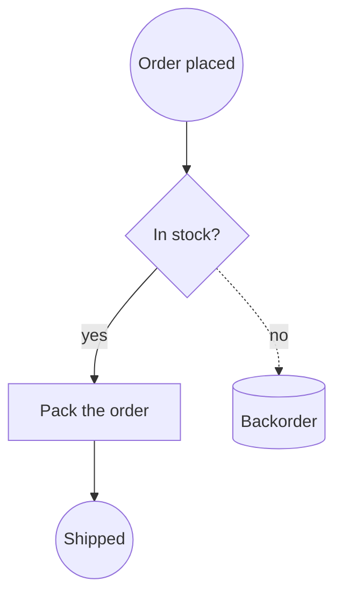
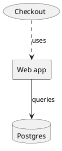
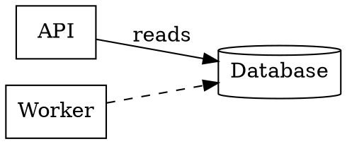

Los diagramas tienen un problema de portabilidad que los documentos resolvieron hace veinte años. Un archivo de Word se abre en Pages, en Google Docs o en un navegador. Un diagrama se abre en la herramienta que lo dibujó y en ningún otro sitio; por eso tantos esquemas de arquitectura viven como un PNG en una wiki, degradándose en silencio, mientras el original editable se quedó en un portátil que ya salió de la empresa.

El Lienzo de Creación ahora lee nueve notaciones de diagramas y escribe seis de ellas. Este artículo es el mapa: qué es cada formato, en qué destaca de verdad y en qué dirección van las conversiones.

[Abre un Lienzo de Creación →](/create/new)

## La idea: un grafo en el centro

Dar soporte a nueve notaciones por pares supondría setenta y dos conversores. En su lugar, cada lector produce lo mismo: un grafo de **vértices** (una forma, una etiqueta, un tamaño, una posición) y **aristas** (dos extremos, puntos intermedios, una etiqueta). Y cada escritor consume ese mismo grafo.

```bf-figure
{
  "kind": "flow",
  "title": "Cómo funciona realmente una conversión",
  "steps": [
    { "label": "Leer", "note": "Draw.io, Mermaid, PlantUML, DOT, BPMN, Excalidraw, ArchiMate, SVG o Visio", "hue": "read" },
    { "label": "Un grafo compartido", "note": "Formas, etiquetas, conexiones y geometría, sin depender de ninguna notación", "hue": "prove" },
    { "label": "Escribir", "note": "Draw.io, Mermaid, PlantUML, DOT, BPMN o Excalidraw", "hue": "build" }
  ],
  "caption": "Nueve lectores más seis escritores, no setenta y dos conversores. Una décima notación es un lector más, y hereda todos los destinos."
}
```

Ese paso intermedio es lo que permite que un SVG exportado desde una herramienta que ya no pagas se convierta en el Mermaid que vive en tu repositorio, y que un dibujo de Visio de un cliente se convierta en un proceso BPMN que ejecuta un motor.

## Las dos familias

Las nueve notaciones se dividen limpiamente en dos, y esa división importa más que cualquier formato concreto.

**Las notaciones de geometría** almacenan coordenadas. Una forma está en x=240, y=78 y mide 100 de ancho. Draw.io, Visio, Excalidraw, SVG y la mitad de intercambio de diagramas de BPMN funcionan así. Conservan el diseño al milímetro y, en la práctica, son ilegibles en una revisión de código.

**Las notaciones de texto** declaran relaciones y dejan la colocación a un motor de diseño. `A --> B` es toda la idea. Mermaid, PlantUML y DOT funcionan así. Se comparan en un pull request, un agente puede editar una sola línea sin abrir ningún editor y tú no controlas dónde acaba cada cosa.

```bf-figure
{
  "kind": "compare",
  "title": "La familia que te conviene depende de lo que venga después",
  "columns": [
    {
      "title": "Geometría: para enviar",
      "hue": "accent",
      "items": [
        "El diseño es exactamente lo que dibujaste",
        "Se abre en la herramienta que el destinatario ya tiene",
        "Draw.io, Visio, Excalidraw, SVG",
        "Imposible de revisar como diff",
        "Queda obsoleto en cuanto cambia el sistema"
      ]
    },
    {
      "title": "Texto: para mantener",
      "hue": "good",
      "items": [
        "Vive junto al código que describe",
        "Los cambios aparecen en un pull request",
        "Mermaid, PlantUML, Graphviz DOT",
        "El diseño lo decide el motor, no tú",
        "Un agente puede actualizarlo sin idas y vueltas"
      ]
    }
  ],
  "caption": "La mayoría de los equipos eligen una familia al crear el diagrama y cargan con ella durante años. Poder convertir en ambos sentidos es lo que la convierte en una decisión que puedes replantearte."
}
```

## Las nueve, una a una

### Draw.io: la lingua franca

Un archivo `.drawio` es XML de mxGraph: un grafo de escena formado por celdas con estilos y geometría. Es el formato que todo el mundo puede abrir, al que el propio draw.io importa los archivos de Visio y lo más seguro para adjuntar a un correo.

```xml
<mxGraphModel>
  <root>
    <mxCell id="0" /><mxCell id="1" parent="0" />
    <mxCell id="draft" value="Draft" style="rounded=1;fillColor=#dae8fc;" vertex="1" parent="1">
      <mxGeometry x="40" y="40" width="120" height="60" as="geometry" />
    </mxCell>
    <mxCell id="review" value="Review" style="rhombus;" vertex="1" parent="1">
      <mxGeometry x="260" y="40" width="120" height="60" as="geometry" />
    </mxCell>
    <mxCell id="e1" value="submit" edge="1" parent="1" source="draft" target="review">
      <mxGeometry relative="1" as="geometry" />
    </mxCell>
  </root>
</mxGraphModel>
```

El lienzo lo dibuja a partir de su propia geometría: sin editor incrustado, sin scripts de CDN y sin llamadas de red. Los archivos se escriben sin comprimir a propósito, para que se puedan comparar con diff y para que un agente pueda editarlos como texto.

**Lee y escribe.** Ida y vuelta completa.

### Mermaid: el que sobrevive

Mermaid es el formato en el que debería estar un diagrama cuando se va a *mantener*. Es texto plano, GitHub lo renderiza en línea y es la notación que un modelo de lenguaje escribe correctamente con mucha más frecuencia que cualquier otra.



Las formas de los nodos se escriben con puntuación: `[box]`, `(rounded)`, `((circle))`, `{diamond}`, `{{hexagon}}`, `[(cylinder)]`. Las aristas llevan sus etiquetas entre barras verticales.

**Lee y escribe diagramas de flujo.** Los demás tipos de diagrama de Mermaid —`sequenceDiagram`, `classDiagram`, `gantt`, `erDiagram`— deliberadamente *no* se convierten, porque no son grafos de cajas. El significado de un diagrama de secuencia es el orden de los mensajes a lo largo de una línea de vida; aplanarlo en vértices y aristas produce una imagen que se renderiza y miente. Se renderizan y se exportan como Mermaid, y el menú de conversión te avisa de que solo viajan como Mermaid.

### PlantUML: el de tu documentación

PlantUML es lo que Confluence, Sphinx y la mayoría de las wikis internas renderizan en línea. Un esquema de arquitectura que tiene que vivir *junto a* la documentación suele ser un `.puml`.



El vocabulario de componentes —`rectangle`, `card`, `usecase`, `database`, `node`, `hexagon`, `file`— se traduce a formas. Los atajos `[Component]` y `(Use case)` también funcionan.

**Lee y escribe** el vocabulario de declaraciones y flechas. La sintaxis de secuencia y de actividad no se lee, por la misma razón que en Mermaid.

### Graphviz DOT: el que escribió una máquina

DOT es lo que emiten las herramientas. Grafos de dependencias, grafos de llamadas, máquinas de estados, relaciones entre esquemas y DAG de compilación salen como `.dot` o `.gv`.



Fíjate en el valor por defecto: Graphviz dibuja un nodo sin decorar como una **elipse**, no como una caja. Un archivo que dice `node [shape=box]` lo dice en serio, y se respeta.

**Lee y escribe.**

### BPMN 2.0: el que se ejecuta

BPMN es el caso atípico: en realidad no es un dibujo, sino una **definición de proceso** con una imagen adjunta. `<process>` contiene la semántica: qué paso sigue a cuál, qué rama es exclusiva, dónde empieza y dónde termina el proceso. `<BPMNDiagram>` contiene las coordenadas. Camunda, Flowable, Zeebe y jBPM leen el mismo archivo.

```xml
<bpmn:process id="Process_1">
  <bpmn:startEvent id="s1" name="Order received" />
  <bpmn:task id="t1" name="Check stock" />
  <bpmn:exclusiveGateway id="g1" name="In stock?" />
  <bpmn:endEvent id="e1" name="Shipped" />
  <bpmn:sequenceFlow id="f1" sourceRef="s1" targetRef="t1" />
  <bpmn:sequenceFlow id="f2" sourceRef="t1" targetRef="g1" name="checked" />
  <bpmn:sequenceFlow id="f3" sourceRef="g1" targetRef="e1" name="yes" />
</bpmn:process>
```

El BPMN generado por código suele omitir por completo la mitad del diagrama. En lugar de rechazar esos archivos, el lienzo dispone el proceso a partir de sus flujos de secuencia: un proceso sin dibujo sigue siendo un proceso, y es justo entonces cuando más quieres verlo.

Al escribir BPMN, el tipo de cada elemento se deduce de su posición en el flujo: una elipse a la que no llega nada es un `startEvent`, una de la que no sale nada es un `endEvent` y una conectada por ambos extremos es un `intermediateThrowEvent`. Una flecha que toca una anotación se convierte en una `association`, nunca en un `sequenceFlow`: un flujo de secuencia hacia una anotación de texto es BPMN no válido, y los motores rechazan el archivo entero por ello.

**Lee y escribe.**

### Excalidraw: donde de verdad bocetaste

Excalidraw es donde nacen los diagramas. Su archivo `.excalidraw` es JSON plano con geometría real y vínculos reales, así que el boceto de un taller no es una *imagen* de un diagrama: es un diagrama.

```json
{
  "type": "excalidraw",
  "elements": [
    { "id": "r1", "type": "rectangle", "x": 100, "y": 80, "width": 180, "height": 90 },
    { "id": "r1-text", "type": "text", "containerId": "r1", "text": "Ingest" },
    { "id": "d1", "type": "diamond", "x": 360, "y": 70, "width": 140, "height": 110 },
    { "id": "a1", "type": "arrow", "x": 280, "y": 125, "points": [[0, 0], [80, 0]],
      "startBinding": { "elementId": "r1" }, "endBinding": { "elementId": "d1" } }
  ]
}
```

Una peculiaridad que conviene conocer: en Excalidraw, una etiqueta es un elemento propio, vinculado a un contenedor. Un escritor que guarda el texto como propiedad de la forma produce un archivo con todas las cajas en blanco.

**Lee y escribe.** Las exportaciones son deterministas: el mismo diagrama produce una salida idéntica byte a byte cada vez, en lugar de un archivo distinto en cada exportación.

### ArchiMate: el modelo, no el dibujo

Un archivo `.archimate` es un **modelo** con vistas dibujadas encima. Los elementos y las relaciones existen una sola vez; una vista es un conjunto de cajas que *hacen referencia* a ellos. La etiqueta de una caja no está en la caja, sino en el elemento al que apunta, y por eso un lector ingenuo produce un diagrama de arquitectura lleno de rectángulos vacíos.

```xml
<folder name="Business" type="business">
  <element xsi:type="archimate:BusinessActor" name="Customer" id="e1" />
  <element xsi:type="archimate:ApplicationComponent" name="Billing" id="e2" />
</folder>
<folder name="Views" type="diagrams">
  <element xsi:type="archimate:ArchimateDiagramModel" name="Overview" id="v1">
    <children xsi:type="archimate:DiagramObject" id="o1" archimateElement="e1">
      <bounds x="24" y="36" width="120" height="55" />
    </children>
  </element>
</folder>
```

**Solo lectura.** Escribir ArchiMate implica elegir un *tipo* de elemento para cada caja: actor de negocio, componente de aplicación, nodo tecnológico y cuarenta más. Esa elección es todo el contenido de un modelo ArchiMate, y un rectángulo en un lienzo no la contiene. Inventarla produciría un archivo que se abre en Archi y afirma algo que su autor nunca dijo.

### SVG: la vía de escape universal

Un SVG de un logotipo es una imagen. Un SVG *exportado desde una herramienta de diagramas* son cajas, flechas y etiquetas que alguien dibujó, aplanadas. Casi cualquier herramienta que no te da su formato nativo te da un SVG, lo que convierte «exportar como SVG» en la salida de Lucidchart, Figma, Whimsical, Sketch y cualquier otra cuya licencia ya no tengas.

El lienzo lee `<rect>`, `<circle>`, `<ellipse>`, `<polygon>` (tres puntos son un triángulo, cuatro en los puntos medios de los bordes son un rombo de decisión, seis son un hexágono), los trazos rectos de `<path>`/`<line>`/`<polyline>` como conectores, y `<text>`. Una etiqueta cuyo ancla cae dentro de una forma pasa a ser el nombre de esa forma; el texto que no pertenece a nada se convierte en una etiqueta sin borde en lugar de descartarse.

**Solo lectura**, y solo si lo pides. Un `.svg` que sueltas en el lienzo sigue siendo una Imagen, porque convertir tu logotipo en «un diagrama con un rectángulo misterioso» sería el error contrario. Convertirlo es un botón, no una sorpresa.

### Visio: el que viene de fuera

Visio llega de clientes, paquetes de cumplimiento normativo, equipos de infraestructura y auditores de procesos. También es el formato al que exportan Lucidchart y SmartDraw, así que un único lector abre la puerta a la mayor parte del mercado comercial de diagramación.

Un `.vsdx` es un ZIP OPC, como un `.docx`. Dos cosas hacen tropezar a cualquier lector ingenuo: las coordenadas están en **pulgadas desde la esquina inferior izquierda**, y una forma se posiciona por su **centro** (`PinX`, `PinY`) y no por su esquina. Si fallas en cualquiera de las dos, el dibujo llega boca abajo y con media forma fuera de sitio.

Visio tampoco tiene primitivas de forma: una «decisión» es un *maestro* llamado `Decision` cuya geometría resulta ser un rombo. Por eso los maestros se identifican por su nombre, lo que cubre las galerías de símbolos de diagramas de flujo, BPMN y redes que la gente usa de verdad. Los extremos de los conectores salen de `<Connects>`, el único lugar del archivo que indica qué formas une una línea.

**Solo lectura.** Escribir un `.vsdx` válido implica generar un paquete OPC correcto —tipos de contenido, tres partes de relaciones, una parte de documento y una parte de maestros—, y Visio no se degrada ante un archivo sutilmente incorrecto: se niega a abrirlo. Draw.io, que Visio sí importa, es el camino de vuelta honesto.

## Lo que suma todo esto

```bf-figure
{
  "kind": "bars",
  "title": "Cobertura, según lo que puedes hacer con cada notación",
  "max": 2,
  "rows": [
    { "label": "Draw.io", "value": 2, "note": "lectura + escritura", "hue": "good" },
    { "label": "Mermaid", "value": 2, "note": "lectura + escritura (diagramas de flujo)", "hue": "good" },
    { "label": "PlantUML", "value": 2, "note": "lectura + escritura (componentes)", "hue": "good" },
    { "label": "Graphviz DOT", "value": 2, "note": "lectura + escritura", "hue": "good" },
    { "label": "BPMN 2.0", "value": 2, "note": "lectura + escritura", "hue": "good" },
    { "label": "Excalidraw", "value": 2, "note": "lectura + escritura", "hue": "good" },
    { "label": "ArchiMate", "value": 1, "note": "lectura: no se puede inventar un tipo para cada caja", "hue": "muted" },
    { "label": "Visio", "value": 1, "note": "lectura: un paquete OPC incorrecto ni siquiera se abre", "hue": "muted" },
    { "label": "SVG", "value": 1, "note": "lectura: el lienzo ya escribe SVG renderizado", "hue": "muted" }
  ],
  "caption": "Los tres formatos de solo lectura se convierten HACIA todos los demás y nunca se ofrecen como destino, así que el menú nunca falla después del clic."
}
```

Suelta cualquiera de los nueve en un tablero y se convertirá en un diagrama editable. Selecciona cualquier diagrama y conviértelo a cualquiera de los seis. Si un destino no puede transportar todas las conexiones —una notación de texto solo puede expresar una arista entre dos formas con nombre—, el lienzo te lo dice en el momento de la conversión, con un recuento, en lugar de dejar que descubras una flecha perdida el mes que viene.

## Pruébalo

1. [Abre un lienzo](/create/new) y suelta un `.vsdx`, un `.drawio`, un `.puml` o el `.excalidraw` de un taller.
2. Selecciona el diagrama y usa **Convertir en diagrama** en el panel de detalles.
3. O pídeselo a Brain: *«conviértelo a Mermaid para que pueda hacer commit»*.

Lecturas relacionadas: [¿Qué diagrama deberías dibujar?](/blog/which-diagram-should-you-draw) repasa los *tipos* de diagrama —flujo, secuencia, clases, ER, estados, C4, BPMN— con un ejemplo desarrollado de cada uno. [Escapa de tu herramienta de diagramas](/blog/escape-your-diagramming-tool) cubre específicamente las rutas de migración desde Visio, Lucidchart y Miro.
