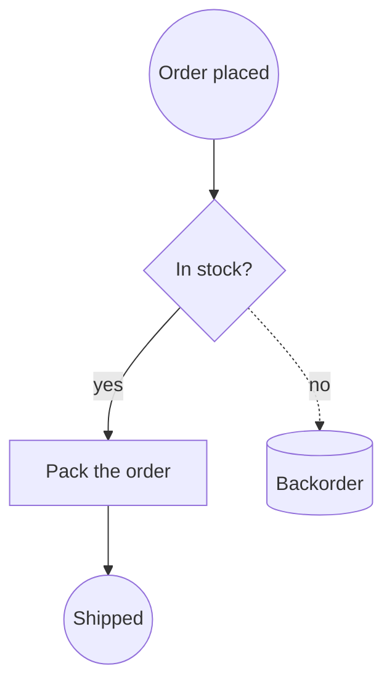
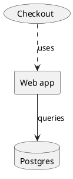
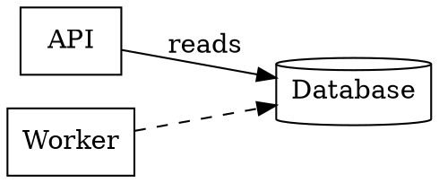

Les diagrammes ont un problème de portabilité que les documents ont réglé il y a vingt ans. Un fichier Word s'ouvre dans Pages, dans Google Docs, dans un navigateur. Un diagramme s'ouvre dans l'outil qui l'a dessiné, et nulle part ailleurs — c'est pourquoi tant de schémas d'architecture finissent en PNG sur un wiki, à se dégrader en silence, pendant que l'original modifiable dort sur l'ordinateur portable de quelqu'un qui a quitté l'entreprise.

Le Canvas de création lit désormais neuf notations de diagramme et en écrit six. Cet article en est la carte : ce qu'est chaque format, ce pour quoi il est vraiment bon, et dans quel sens vont les conversions.

[Ouvrir un Canvas de création →](/create/new)

## L'idée : un graphe unique au centre

Prendre en charge neuf notations deux à deux, ce serait soixante-douze convertisseurs. À la place, chaque module de lecture produit la même chose — un graphe de **sommets** (une forme, un libellé, une taille, une position) et d'**arêtes** (deux extrémités, des points de passage, un libellé). Chaque module d'écriture consomme ce même graphe.

```bf-figure
{
  "kind": "flow",
  "title": "Comment se déroule réellement une conversion",
  "steps": [
    { "label": "Lire", "note": "Draw.io, Mermaid, PlantUML, DOT, BPMN, Excalidraw, ArchiMate, SVG ou Visio", "hue": "read" },
    { "label": "Un graphe partagé", "note": "Formes, libellés, connexions, géométrie — indépendamment de toute notation", "hue": "prove" },
    { "label": "Écrire", "note": "Draw.io, Mermaid, PlantUML, DOT, BPMN ou Excalidraw", "hue": "build" }
  ],
  "caption": "Neuf modules de lecture et six d'écriture, pas soixante-douze convertisseurs. Une dixième notation, c'est un seul module de lecture de plus — et elle hérite de toutes les destinations."
}
```

C'est grâce à cette étape intermédiaire qu'un SVG exporté depuis un outil pour lequel vous ne payez plus peut devenir le Mermaid qui vit dans votre dépôt, et qu'un dessin Visio envoyé par un client peut devenir un processus BPMN qu'un moteur exécute.

## Les deux familles

Les neuf notations se répartissent nettement en deux groupes, et cette répartition compte davantage que n'importe quel format pris isolément.

**Les notations géométriques** stockent des coordonnées. Une forme se trouve à x=240, y=78, et mesure 100 de large. Draw.io, Visio, Excalidraw, SVG et la partie « diagram interchange » de BPMN fonctionnent tous ainsi. Elles préservent la mise en page à l'identique, et sont pratiquement illisibles en revue de code.

**Les notations textuelles** énoncent des relations et laissent le placement à un moteur de mise en page. `A --> B`, c'est toute l'idée. Mermaid, PlantUML et DOT fonctionnent ainsi. Elles produisent un diff lisible dans une pull request, un agent peut en modifier une ligne sans ouvrir d'éditeur, et vous ne contrôlez pas où chaque élément atterrit.

```bf-figure
{
  "kind": "compare",
  "title": "La famille qu'il vous faut dépend de ce qui se passe ensuite",
  "columns": [
    {
      "title": "Géométrie — pour envoyer",
      "hue": "accent",
      "items": [
        "La mise en page est exactement celle que vous avez dessinée",
        "S'ouvre dans l'outil que le destinataire possède déjà",
        "Draw.io, Visio, Excalidraw, SVG",
        "Impossible à relire sous forme de diff",
        "Obsolète dès que le système change"
      ]
    },
    {
      "title": "Texte — pour maintenir",
      "hue": "good",
      "items": [
        "Vit à côté du code qu'il décrit",
        "Les modifications apparaissent dans une pull request",
        "Mermaid, PlantUML, Graphviz DOT",
        "La mise en page est le choix du moteur, pas le vôtre",
        "Un agent peut le mettre à jour sans aller-retour"
      ]
    }
  ],
  "caption": "La plupart des équipes en choisissent une à la création et vivent avec pendant des années. Convertir dans les deux sens, c'est ce qui en fait une décision sur laquelle vous pouvez revenir."
}
```

## Les neuf, un par un

### Draw.io — la lingua franca

Un fichier `.drawio` est du XML mxGraph : un graphe de scène composé de cellules dotées de styles et d'une géométrie. C'est le format que tout le monde peut ouvrir, celui dans lequel draw.io lui-même importe les fichiers Visio, et la pièce jointe la plus sûre pour un e-mail.

```xml
<mxGraphModel>
  <root>
    <mxCell id="0" /><mxCell id="1" parent="0" />
    <mxCell id="draft" value="Draft" style="rounded=1;fillColor=#dae8fc;" vertex="1" parent="1">
      <mxGeometry x="40" y="40" width="120" height="60" as="geometry" />
    </mxCell>
    <mxCell id="review" value="Review" style="rhombus;" vertex="1" parent="1">
      <mxGeometry x="260" y="40" width="120" height="60" as="geometry" />
    </mxCell>
    <mxCell id="e1" value="submit" edge="1" parent="1" source="draft" target="review">
      <mxGeometry relative="1" as="geometry" />
    </mxCell>
  </root>
</mxGraphModel>
```

Le canevas le dessine à partir de sa propre géométrie — pas d'éditeur intégré, pas de script CDN, pas d'appel réseau. Les fichiers sont volontairement écrits non compressés, pour qu'ils produisent des diffs lisibles et qu'un agent puisse les modifier comme du texte.

**Lecture et écriture.** L'aller-retour est complet.

### Mermaid — celui qui dure

Mermaid est la forme qu'un diagramme devrait prendre dès lors qu'il va être *maintenu*. C'est du texte brut, GitHub l'affiche directement dans la page, et c'est la notation qu'un modèle de langage écrit correctement bien plus souvent que toute autre.



Les formes des nœuds sont de la ponctuation : `[box]`, `(rounded)`, `((circle))`, `{diamond}`, `{{hexagon}}`, `[(cylinder)]`. Les arêtes portent leurs libellés entre barres verticales.

**Lecture et écriture des logigrammes.** Les autres types de diagrammes Mermaid — `sequenceDiagram`, `classDiagram`, `gantt`, `erDiagram` — ne sont volontairement *pas* convertis, car ce ne sont pas des graphes de boîtes. Le sens d'un diagramme de séquence, c'est l'ordre des messages le long d'une ligne de vie ; l'aplatir en sommets et en arêtes produit une image qui s'affiche correctement… et qui ment. Ces diagrammes s'affichent et s'exportent en Mermaid, et le menu de conversion vous indique qu'ils ne voyagent qu'en Mermaid.

### PlantUML — celui de votre documentation

PlantUML est ce que Confluence, Sphinx et la plupart des wikis internes affichent directement dans la page. Un schéma d'architecture qui doit vivre *à côté* de la documentation est généralement un `.puml`.



Le vocabulaire des composants — `rectangle`, `card`, `usecase`, `database`, `node`, `hexagon`, `file` — correspond à des formes. Les raccourcis `[Component]` et `(Use case)` fonctionnent aussi.

**Lecture et écriture** du vocabulaire déclarations-et-flèches. Les syntaxes de séquence et d'activité ne sont pas lues, pour la même raison que chez Mermaid.

### Graphviz DOT — celui qu'une machine a écrit

DOT est ce que les outils génèrent. Graphes de dépendances, graphes d'appels, machines à états, relations de schéma et DAG de build sortent tous en `.dot` ou `.gv`.



Attention à la valeur par défaut : Graphviz dessine un nœud sans attribut comme une **ellipse**, pas comme une boîte. Un fichier qui indique `node [shape=box]` le fait exprès, et c'est respecté.

**Lecture et écriture.**

### BPMN 2.0 — celui qui s'exécute

BPMN fait figure d'exception : ce n'est pas vraiment un dessin, c'est une **définition de processus** accompagnée d'une image. `<process>` porte la sémantique — quelle étape suit laquelle, quelle branche est exclusive, où le processus commence et se termine. `<BPMNDiagram>` porte les coordonnées. Camunda, Flowable, Zeebe et jBPM lisent tous le même fichier.

```xml
<bpmn:process id="Process_1">
  <bpmn:startEvent id="s1" name="Order received" />
  <bpmn:task id="t1" name="Check stock" />
  <bpmn:exclusiveGateway id="g1" name="In stock?" />
  <bpmn:endEvent id="e1" name="Shipped" />
  <bpmn:sequenceFlow id="f1" sourceRef="s1" targetRef="t1" />
  <bpmn:sequenceFlow id="f2" sourceRef="t1" targetRef="g1" name="checked" />
  <bpmn:sequenceFlow id="f3" sourceRef="g1" targetRef="e1" name="yes" />
</bpmn:process>
```

Le BPMN généré par du code omet souvent entièrement la partie diagramme. Plutôt que de refuser ces fichiers, le canevas met en page le processus à partir de ses flux de séquence — un processus sans dessin reste un processus, et c'est précisément là que vous avez le plus besoin de le voir.

À l'écriture, le type d'élément BPMN est déduit de sa position dans le flux : une ellipse sans rien d'entrant est un `startEvent`, une ellipse sans rien de sortant est un `endEvent`, une ellipse reliée des deux côtés est un `intermediateThrowEvent`. Une flèche qui touche une annotation devient une `association`, jamais un `sequenceFlow` — un flux de séquence vers une annotation textuelle est du BPMN invalide, et les moteurs rejettent le fichier entier pour cette seule raison.

**Lecture et écriture.**

### Excalidraw — celui sur lequel vous avez vraiment esquissé

Excalidraw, c'est là que naissent les diagrammes. Son fichier `.excalidraw` est du JSON brut avec une vraie géométrie et de vraies liaisons : un croquis d'atelier n'est donc pas l'*image* d'un diagramme — c'en est un.

```json
{
  "type": "excalidraw",
  "elements": [
    { "id": "r1", "type": "rectangle", "x": 100, "y": 80, "width": 180, "height": 90 },
    { "id": "r1-text", "type": "text", "containerId": "r1", "text": "Ingest" },
    { "id": "d1", "type": "diamond", "x": 360, "y": 70, "width": 140, "height": 110 },
    { "id": "a1", "type": "arrow", "x": 280, "y": 125, "points": [[0, 0], [80, 0]],
      "startBinding": { "elementId": "r1" }, "endBinding": { "elementId": "d1" } }
  ]
}
```

Une particularité à connaître : dans Excalidraw, un libellé est un élément à part entière, lié à un conteneur. Un module d'écriture qui définit le texte comme une propriété de la forme produit un fichier dont toutes les boîtes sont vides.

**Lecture et écriture.** Les exports sont déterministes — le même diagramme produit à chaque fois une sortie identique à l'octet près, plutôt qu'un nouveau fichier à chaque export.

### ArchiMate — le modèle, pas le dessin

Un fichier `.archimate` est un **modèle** sur lequel sont dessinées des vues. Les éléments et les relations n'existent qu'une fois ; une vue est un ensemble de boîtes qui y *font référence*. Le libellé d'une boîte n'est pas dans la boîte — il est porté par l'élément vers lequel elle pointe, ce qui explique qu'un lecteur naïf produise un schéma d'architecture rempli de rectangles vides.

```xml
<folder name="Business" type="business">
  <element xsi:type="archimate:BusinessActor" name="Customer" id="e1" />
  <element xsi:type="archimate:ApplicationComponent" name="Billing" id="e2" />
</folder>
<folder name="Views" type="diagrams">
  <element xsi:type="archimate:ArchimateDiagramModel" name="Overview" id="v1">
    <children xsi:type="archimate:DiagramObject" id="o1" archimateElement="e1">
      <bounds x="24" y="36" width="120" height="55" />
    </children>
  </element>
</folder>
```

**Lecture seule.** Écrire de l'ArchiMate implique de choisir un *type* d'élément pour chaque boîte — acteur métier, composant applicatif, nœud technologique, et une quarantaine d'autres. Ce choix constitue tout le contenu d'un modèle ArchiMate, et un rectangle sur un canevas ne le porte pas. En inventer un produirait un fichier qui s'ouvre dans Archi et affirme quelque chose que l'auteur n'a jamais dit.

### SVG — l'issue de secours universelle

Le SVG d'un logo est une image. Un SVG *exporté depuis un outil de diagramme*, ce sont des boîtes, des flèches et des libellés que quelqu'un a dessinés, puis aplatis. Presque tous les outils qui refusent de vous donner leur format natif vous donneront un SVG, ce qui fait de « exporter en SVG » la porte de sortie de Lucidchart, Figma, Whimsical, Sketch et de tout ce dont vous n'avez plus la licence.

Le canevas lit `<rect>`, `<circle>`, `<ellipse>`, `<polygon>` (trois points font un triangle, quatre placés au milieu des côtés un losange de décision, six un hexagone), les tracés droits `<path>`/`<line>`/`<polyline>` comme connecteurs, et `<text>`. Un libellé dont l'ancre tombe à l'intérieur d'une forme devient le nom de cette forme ; un texte qui n'appartient à rien devient un libellé sans bordure au lieu d'être supprimé.

**Lecture seule** — et uniquement à la demande. Un `.svg` déposé reste une Image, car transformer votre logo en « diagramme avec un mystérieux rectangle » serait l'erreur inverse. La conversion est un bouton, pas une surprise.

### Visio — celui qui vient de l'extérieur

Visio arrive par les clients, les dossiers de conformité, les équipes infrastructure et les auditeurs de processus. C'est aussi le format d'export de Lucidchart et de SmartDraw : un seul module de lecture ouvre donc la porte à l'essentiel du marché commercial des outils de diagramme.

Un `.vsdx` est une archive ZIP OPC, comme un `.docx`. Deux choses piègent tous les lecteurs naïfs : les coordonnées sont exprimées en **pouces depuis le coin inférieur gauche**, et une forme est positionnée par son **centre** (`PinX`, `PinY`) plutôt que par son coin. Si l'une des deux est mal gérée, le dessin arrive à l'envers et décalé d'une demi-forme.

Visio n'a pas non plus de formes primitives — une « décision » est une *forme maître* nommée `Decision` dont la géométrie se trouve être un losange — les formes maîtres sont donc reconnues par leur nom, ce qui couvre les gabarits de logigramme, de BPMN et de réseau réellement utilisés. Les extrémités des connecteurs proviennent de `<Connects>`, le seul endroit où le fichier indique quelles formes une ligne relie.

**Lecture seule.** Écrire un `.vsdx` valide implique de produire un package OPC correct — types de contenu, trois parties de relations, une partie document, une partie formes maîtres — et Visio ne se montre pas indulgent face à un fichier subtilement incorrect : il refuse de l'ouvrir. Draw.io, que Visio sait importer, est le chemin de retour honnête.

## Ce que cela donne au total

```bf-figure
{
  "kind": "bars",
  "title": "Couverture, selon ce que vous pouvez faire de chaque notation",
  "max": 2,
  "rows": [
    { "label": "Draw.io", "value": 2, "note": "lecture + écriture", "hue": "good" },
    { "label": "Mermaid", "value": 2, "note": "lecture + écriture (logigrammes)", "hue": "good" },
    { "label": "PlantUML", "value": 2, "note": "lecture + écriture (composants)", "hue": "good" },
    { "label": "Graphviz DOT", "value": 2, "note": "lecture + écriture", "hue": "good" },
    { "label": "BPMN 2.0", "value": 2, "note": "lecture + écriture", "hue": "good" },
    { "label": "Excalidraw", "value": 2, "note": "lecture + écriture", "hue": "good" },
    { "label": "ArchiMate", "value": 1, "note": "lecture — impossible d'inventer un type pour chaque boîte", "hue": "muted" },
    { "label": "Visio", "value": 1, "note": "lecture — un package OPC incorrect ne s'ouvre pas du tout", "hue": "muted" },
    { "label": "SVG", "value": 1, "note": "lecture — le canevas écrit déjà du SVG rendu", "hue": "muted" }
  ],
  "caption": "Les trois formats en lecture seule se convertissent VERS tous les autres et ne sont jamais proposés comme destination : le menu n'échoue donc jamais après le clic."
}
```

Déposez n'importe laquelle des neuf sur un tableau et elle devient un diagramme modifiable. Sélectionnez un diagramme et convertissez-le dans n'importe laquelle des six. Si une destination ne peut pas porter toutes les connexions — une notation textuelle ne peut exprimer qu'une arête entre deux formes nommées — le canevas vous le dit au moment de la conversion, chiffres à l'appui, plutôt que de vous laisser découvrir une flèche manquante le mois suivant.

## Essayez

1. [Ouvrez un canevas](/create/new) et déposez-y un `.vsdx`, un `.drawio`, un `.puml` ou un `.excalidraw` issu d'un atelier.
2. Sélectionnez le diagramme et utilisez **Convertir en diagramme** dans le panneau de détails.
3. Ou demandez à Brain : *« convertis ceci en Mermaid pour que je puisse le versionner dans le dépôt. »*

À lire aussi : [Quel diagramme dessiner ?](/blog/which-diagram-should-you-draw) passe en revue les *types* de diagrammes — logigramme, séquence, classes, entité-relation, états, C4, BPMN — avec un exemple détaillé pour chacun. [Libérez-vous de votre outil de diagramme](/blog/escape-your-diagramming-tool) couvre plus précisément les voies de migration pour quitter Visio, Lucidchart et Miro.
