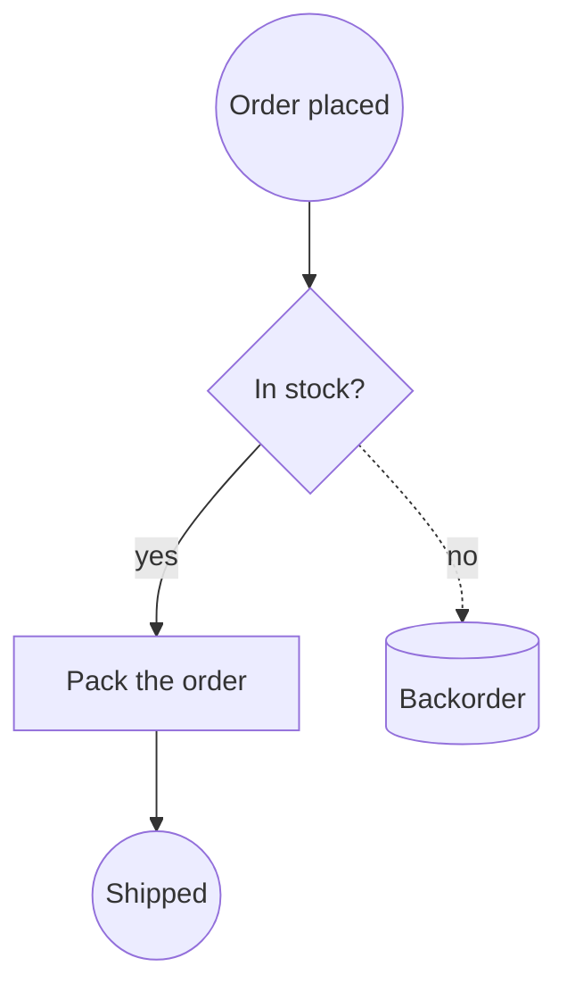
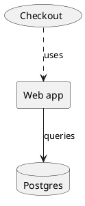
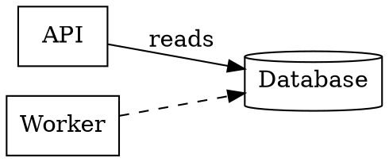

# Every Diagram Format the Creation Canvas Reads and Writes

Diagrams have a portability problem that documents solved twenty years ago. A Word file opens in Pages, in Google Docs, in a browser. A diagram opens in the tool that drew it, and nowhere else — which is why so many architecture pictures live as a PNG in a wiki, decaying quietly, with the editable original on a laptop that left the company.

The Creation Canvas now reads nine diagram notations and writes six of them. This article is the map: what each format is, what it is genuinely good at, and which way the conversions run.

[Open a Creation Canvas →](/create/new)

## The idea: one graph in the middle

Supporting nine notations pairwise would be seventy-two converters. Instead every reader produces the same thing — a graph of **vertices** (a shape, a label, a size, a position) and **edges** (two endpoints, waypoints, a label). Every writer consumes that same graph.

```bf-figure
{
  "kind": "flow",
  "title": "How a conversion actually runs",
  "steps": [
    { "label": "Read", "note": "Draw.io, Mermaid, PlantUML, DOT, BPMN, Excalidraw, ArchiMate, SVG or Visio", "hue": "read" },
    { "label": "One shared graph", "note": "Shapes, labels, connections, geometry — notation-free", "hue": "prove" },
    { "label": "Write", "note": "Draw.io, Mermaid, PlantUML, DOT, BPMN or Excalidraw", "hue": "build" }
  ],
  "caption": "Nine readers plus six writers, not seventy-two converters. A tenth notation is one reader, and it inherits every destination."
}
```

That middle step is why an SVG exported from a tool you no longer pay for can become the Mermaid that lives in your repository, and why a Visio drawing from a client can become a BPMN process an engine executes.

## The two families

The nine notations split cleanly, and the split matters more than any individual format.

**Geometry notations** store coordinates. A shape is at x=240, y=78, 100 wide. Draw.io, Visio, Excalidraw, SVG and BPMN's diagram-interchange half all work this way. They preserve layout exactly, and they are effectively unreadable in a code review.

**Text notations** state relationships and leave placement to a layout engine. `A --> B` is the whole idea. Mermaid, PlantUML and DOT work this way. They diff in a pull request, an agent can edit one line of one without opening an editor, and you do not control where anything lands.

```bf-figure
{
  "kind": "compare",
  "title": "Which family you want depends on what happens next",
  "columns": [
    {
      "title": "Geometry — for sending",
      "hue": "accent",
      "items": [
        "Layout is exactly what you drew",
        "Opens in the tool the recipient already has",
        "Draw.io, Visio, Excalidraw, SVG",
        "Unreviewable as a diff",
        "Goes stale the moment the system changes"
      ]
    },
    {
      "title": "Text — for maintaining",
      "hue": "good",
      "items": [
        "Lives beside the code it describes",
        "Changes show up in a pull request",
        "Mermaid, PlantUML, Graphviz DOT",
        "Layout is the engine's choice, not yours",
        "An agent can update it without a round-trip"
      ]
    }
  ],
  "caption": "Most teams pick one at creation time and live with it for years. Converting both ways is what makes it a decision you can revisit."
}
```

## The nine, one at a time

### Draw.io — the lingua franca

An `.drawio` file is mxGraph XML: a scene graph of cells with styles and geometry. It is the format everyone can open, the one draw.io itself will import Visio into, and the safest thing to attach to an email.

```xml
<mxGraphModel>
  <root>
    <mxCell id="0" /><mxCell id="1" parent="0" />
    <mxCell id="draft" value="Draft" style="rounded=1;fillColor=#dae8fc;" vertex="1" parent="1">
      <mxGeometry x="40" y="40" width="120" height="60" as="geometry" />
    </mxCell>
    <mxCell id="review" value="Review" style="rhombus;" vertex="1" parent="1">
      <mxGeometry x="260" y="40" width="120" height="60" as="geometry" />
    </mxCell>
    <mxCell id="e1" value="submit" edge="1" parent="1" source="draft" target="review">
      <mxGeometry relative="1" as="geometry" />
    </mxCell>
  </root>
</mxGraphModel>
```

The canvas draws this from its own geometry — no editor embed, no CDN script, no network call. Files are written uncompressed on purpose, so they diff, and so an agent can edit one as text.

**Reads and writes.** Round-trips fully.

### Mermaid — the one that survives

Mermaid is what a diagram should be in when it is going to be *maintained*. It is plain text, GitHub renders it inline, and it is the notation a language model writes correctly far more often than any other.



Node shapes are punctuation: `[box]`, `(rounded)`, `((circle))`, `{diamond}`, `{{hexagon}}`, `[(cylinder)]`. Edges carry labels between pipes.

**Reads and writes flowcharts.** Mermaid's other diagram types — `sequenceDiagram`, `classDiagram`, `gantt`, `erDiagram` — are deliberately *not* converted, because they are not graphs of boxes. A sequence diagram's meaning is the order of messages down a lifeline; flattening that into vertices and edges produces a picture that renders and lies. They render and export as Mermaid, and the conversion menu tells you they travel as Mermaid only.

### PlantUML — the one in your documentation

PlantUML is what Confluence, Sphinx and most internal wikis render inline. An architecture picture that has to live *next to* the documentation is usually a `.puml`.



The component vocabulary — `rectangle`, `card`, `usecase`, `database`, `node`, `hexagon`, `file` — maps onto shapes. The `[Component]` and `(Use case)` shorthands work too.

**Reads and writes** the declaration-and-arrow vocabulary. Sequence and activity syntax are left unread, for the same reason as Mermaid's.

### Graphviz DOT — the one a machine wrote

DOT is what tools emit. Dependency graphs, call graphs, state machines, schema relationships and build DAGs all come out as `.dot` or `.gv`.



Note the default: Graphviz draws an undecorated node as an **ellipse**, not a box. A file that says `node [shape=box]` means it, and that is honoured.

**Reads and writes.**

### BPMN 2.0 — the one that executes

BPMN is the outlier: it is not really a drawing, it is a **process definition** with a picture attached. `<process>` holds the semantics — which step follows which, which branch is exclusive, where the process starts and ends. `<BPMNDiagram>` holds coordinates. Camunda, Flowable, Zeebe and jBPM all read the same file.

```xml
<bpmn:process id="Process_1">
  <bpmn:startEvent id="s1" name="Order received" />
  <bpmn:task id="t1" name="Check stock" />
  <bpmn:exclusiveGateway id="g1" name="In stock?" />
  <bpmn:endEvent id="e1" name="Shipped" />
  <bpmn:sequenceFlow id="f1" sourceRef="s1" targetRef="t1" />
  <bpmn:sequenceFlow id="f2" sourceRef="t1" targetRef="g1" name="checked" />
  <bpmn:sequenceFlow id="f3" sourceRef="g1" targetRef="e1" name="yes" />
</bpmn:process>
```

Code-generated BPMN frequently omits the diagram half entirely. Rather than refusing those files, the canvas lays the process out from its sequence flows — a process with no drawing is still a process, and that is exactly when you most want to see it.

Writing BPMN derives the element type from position in the flow: an ellipse with nothing coming in is a `startEvent`, one with nothing going out is an `endEvent`, one joined at both ends is an `intermediateThrowEvent`. An arrow touching an annotation becomes an `association`, never a `sequenceFlow` — a sequence flow to a text annotation is invalid BPMN and engines reject the whole file for it.

**Reads and writes.**

### Excalidraw — the one you actually sketched on

Excalidraw is where diagrams start. Its `.excalidraw` file is plain JSON with real geometry and real bindings, so a workshop sketch is not a *picture* of a diagram — it is one.

```json
{
  "type": "excalidraw",
  "elements": [
    { "id": "r1", "type": "rectangle", "x": 100, "y": 80, "width": 180, "height": 90 },
    { "id": "r1-text", "type": "text", "containerId": "r1", "text": "Ingest" },
    { "id": "d1", "type": "diamond", "x": 360, "y": 70, "width": 140, "height": 110 },
    { "id": "a1", "type": "arrow", "x": 280, "y": 125, "points": [[0, 0], [80, 0]],
      "startBinding": { "elementId": "r1" }, "endBinding": { "elementId": "d1" } }
  ]
}
```

One quirk worth knowing: a label in Excalidraw is its own element, bound to a container. A writer that sets text as a property of the shape produces a file whose boxes are all blank.

**Reads and writes.** Exports are deterministic — the same diagram produces byte-identical output every time, rather than a new file per export.

### ArchiMate — the model, not the drawing

An `.archimate` file is a **model** with views drawn over it. Elements and relationships live once; a view is a set of boxes that *refer* to them. The label on a box is not in the box — it is on the element the box points at, which is why a naive reader produces an architecture diagram full of empty rectangles.

```xml
<folder name="Business" type="business">
  <element xsi:type="archimate:BusinessActor" name="Customer" id="e1" />
  <element xsi:type="archimate:ApplicationComponent" name="Billing" id="e2" />
</folder>
<folder name="Views" type="diagrams">
  <element xsi:type="archimate:ArchimateDiagramModel" name="Overview" id="v1">
    <children xsi:type="archimate:DiagramObject" id="o1" archimateElement="e1">
      <bounds x="24" y="36" width="120" height="55" />
    </children>
  </element>
</folder>
```

**Reads only.** Writing ArchiMate means choosing an element *type* for every box — business actor, application component, technology node, and forty more. That choice is the entire content of an ArchiMate model, and a rectangle on a canvas does not carry it. Inventing one would produce a file that opens in Archi and states something the author never said.

### SVG — the universal escape hatch

An SVG of a logo is a picture. An SVG *exported from a diagram tool* is boxes, arrows and labels that someone drew, flattened. Almost every tool that will not give you its native format will give you an SVG, which makes "export as SVG" the way out of Lucidchart, Figma, Whimsical, Sketch and anything else with a licence you no longer have.

The canvas reads `<rect>`, `<circle>`, `<ellipse>`, `<polygon>` (three points is a triangle, four at the mid-edges is a decision diamond, six is a hexagon), straight `<path>`/`<line>`/`<polyline>` runs as connectors, and `<text>`. A label whose anchor falls inside a shape becomes that shape's name; text belonging to nothing becomes a borderless label rather than being discarded.

**Reads only** — and only on request. A dropped `.svg` stays an Image, because turning your logo into "a diagram with one mysterious rectangle" would be the opposite mistake. Converting it is a button, not a surprise.

### Visio — the one from outside

Visio arrives from clients, compliance packs, infrastructure teams and process auditors. It is also what Lucidchart and SmartDraw export to, so one reader is the way in from most of the commercial diagramming market.

A `.vsdx` is an OPC ZIP, like a `.docx`. Two things trip up every naive reader: coordinates are in **inches from the bottom-left**, and a shape is positioned by its **centre** (`PinX`, `PinY`) rather than its corner. Get either wrong and the drawing arrives upside down and half a shape out of place.

Visio also has no shape primitives — a "decision" is a *master* named `Decision` whose geometry happens to be a diamond — so masters are matched by name, which covers the flowchart, BPMN and network stencils people actually use. Connector endpoints come from `<Connects>`, the only place the file states which shapes a line joins.

**Reads only.** Writing a valid `.vsdx` means writing a correct OPC package — content types, three relationship parts, a document part, a masters part — and Visio does not degrade on a subtly wrong file, it refuses to open it. Draw.io, which Visio imports, is the honest route back.

## What that adds up to

```bf-figure
{
  "kind": "bars",
  "title": "Coverage, by what you can do with each notation",
  "max": 2,
  "rows": [
    { "label": "Draw.io", "value": 2, "note": "read + write", "hue": "good" },
    { "label": "Mermaid", "value": 2, "note": "read + write (flowcharts)", "hue": "good" },
    { "label": "PlantUML", "value": 2, "note": "read + write (components)", "hue": "good" },
    { "label": "Graphviz DOT", "value": 2, "note": "read + write", "hue": "good" },
    { "label": "BPMN 2.0", "value": 2, "note": "read + write", "hue": "good" },
    { "label": "Excalidraw", "value": 2, "note": "read + write", "hue": "good" },
    { "label": "ArchiMate", "value": 1, "note": "read — a type per box cannot be invented", "hue": "muted" },
    { "label": "Visio", "value": 1, "note": "read — a wrong OPC package will not open at all", "hue": "muted" },
    { "label": "SVG", "value": 1, "note": "read — the canvas already writes rendered SVG", "hue": "muted" }
  ],
  "caption": "The three read-only formats convert OUT to everything and are never offered as a destination, so the menu never fails after the click."
}
```

Drop any of the nine on a board and it becomes an editable diagram. Select any diagram and convert it to any of the six. If a destination cannot carry every connection — a text notation can only express an edge between two named shapes — the canvas says so at the moment of conversion, with a count, rather than leaving you to find a missing arrow next month.

## Try it

1. [Open a canvas](/create/new) and drop in a `.vsdx`, a `.drawio`, a `.puml` or a workshop `.excalidraw`.
2. Select the diagram and use **Convert to a diagram** in the details panel.
3. Or ask Brain: *"convert this to Mermaid so I can commit it."*

Related reading: [Which diagram should you draw?](/blog/which-diagram-should-you-draw) walks through the diagram *types* — flowchart, sequence, class, ER, state, C4, BPMN — with a worked example of each. [Escape your diagramming tool](/blog/escape-your-diagramming-tool) covers the migration routes out of Visio, Lucidchart and Miro specifically.
