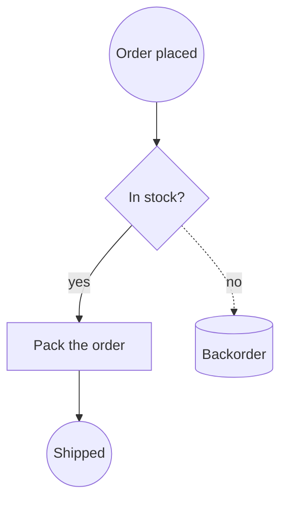
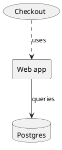
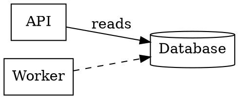

文档的可移植性问题，二十年前就解决了；图表却至今没有。一份 Word 文件可以在 Pages、Google Docs 甚至浏览器里打开；一张图表却只能在画它的那个工具里打开，别无他处。这就是为什么那么多架构图最后都成了 wiki 里的一张 PNG，悄无声息地过时——而可编辑的原稿，还躺在某台早已随人离职的笔记本电脑里。

现在，创作画布可以读取九种图表格式，并写出其中六种。本文就是一张地图：每种格式是什么、真正擅长什么，以及转换可以朝哪个方向进行。

[打开创作画布 →](/create/new)

## 核心思路：中间只有一张图

如果九种格式两两互转，需要七十二个转换器。我们的做法是：每个读取器都产出同一种东西——一张由**顶点**（形状、标签、尺寸、位置）和**边**（两个端点、路径点、标签）组成的图；每个写出器也都消费这同一张图。

```bf-figure
{
  "kind": "flow",
  "title": "一次转换究竟是怎么进行的",
  "steps": [
    { "label": "读取", "note": "Draw.io、Mermaid、PlantUML、DOT、BPMN、Excalidraw、ArchiMate、SVG 或 Visio", "hue": "read" },
    { "label": "一张共享的图", "note": "形状、标签、连线、几何信息——与具体格式无关", "hue": "prove" },
    { "label": "写出", "note": "Draw.io、Mermaid、PlantUML、DOT、BPMN 或 Excalidraw", "hue": "build" }
  ],
  "caption": "九个读取器加六个写出器，而不是七十二个转换器。新增第十种格式只需一个读取器，它就能自动继承所有输出目标。"
}
```

正是中间这一步，让一个从你早已停止付费的工具里导出的 SVG，能变成存放在代码仓库里的 Mermaid；也让客户发来的一份 Visio 图，能变成流程引擎可以直接执行的 BPMN 流程。

## 两大家族

这九种格式可以清晰地分成两类，而这个分类比任何单一格式都更重要。

**几何类格式**存储坐标。一个形状位于 x=240、y=78，宽 100。Draw.io、Visio、Excalidraw、SVG 以及 BPMN 的图形交换部分都是这样工作的。它们能精确保留布局，但在代码评审里基本不可读。

**文本类格式**只声明关系，把摆放位置交给布局引擎。`A --> B` 就是全部思想。Mermaid、PlantUML 和 DOT 都是这样工作的。它们能在拉取请求里显示差异，智能体无需打开编辑器就能改动其中一行——代价是，你无法控制任何元素落在哪里。

```bf-figure
{
  "kind": "compare",
  "title": "选哪一类，取决于接下来要做什么",
  "columns": [
    {
      "title": "几何类——用于发送",
      "hue": "accent",
      "items": [
        "布局与你画的一模一样",
        "能在接收方已有的工具里直接打开",
        "Draw.io、Visio、Excalidraw、SVG",
        "无法以差异形式评审",
        "系统一变，图就过时"
      ]
    },
    {
      "title": "文本类——用于维护",
      "hue": "good",
      "items": [
        "和它描述的代码放在一起",
        "改动会出现在拉取请求里",
        "Mermaid、PlantUML、Graphviz DOT",
        "布局由引擎决定，而不是你",
        "智能体无需来回导入导出就能更新它"
      ]
    }
  ],
  "caption": "大多数团队在创建时选定一类，然后一用就是好几年。能双向转换，才让这成为一个可以随时重新考虑的决定。"
}
```

## 九种格式，逐一来看

### Draw.io——通用语

`.drawio` 文件就是 mxGraph XML：一个由带样式和几何信息的单元格组成的场景图。它是人人都能打开的格式，draw.io 自己导入 Visio 时也会转成它，也是作为邮件附件最稳妥的选择。

```xml
<mxGraphModel>
  <root>
    <mxCell id="0" /><mxCell id="1" parent="0" />
    <mxCell id="draft" value="Draft" style="rounded=1;fillColor=#dae8fc;" vertex="1" parent="1">
      <mxGeometry x="40" y="40" width="120" height="60" as="geometry" />
    </mxCell>
    <mxCell id="review" value="Review" style="rhombus;" vertex="1" parent="1">
      <mxGeometry x="260" y="40" width="120" height="60" as="geometry" />
    </mxCell>
    <mxCell id="e1" value="submit" edge="1" parent="1" source="draft" target="review">
      <mxGeometry relative="1" as="geometry" />
    </mxCell>
  </root>
</mxGraphModel>
```

画布根据自身的几何信息直接绘制它——不嵌入编辑器，不加载 CDN 脚本，不发起任何网络请求。写出的文件刻意不压缩，这样既能比较差异，智能体也能把它当作文本来编辑。

**可读可写。**完整往返转换。

### Mermaid——最能活下来的那个

当一张图需要被*持续维护*时，它就应该是 Mermaid。它是纯文本，GitHub 会直接内联渲染，而且在所有格式中，大语言模型写 Mermaid 写对的概率远高于其他任何一种。



节点形状由标点决定：`[box]`、`(rounded)`、`((circle))`、`{diamond}`、`{{hexagon}}`、`[(cylinder)]`。边的标签写在两条竖线之间。

**可读可写流程图。**Mermaid 的其他图表类型——`sequenceDiagram`、`classDiagram`、`gantt`、`erDiagram`——我们刻意*不做*转换，因为它们本质上不是方框构成的图。时序图的含义在于消息沿生命线自上而下的顺序；把它压平成顶点和边，得到的只是一张能渲染、却会说谎的图。它们会以 Mermaid 形式渲染和导出，转换菜单也会明确告诉你：它们只能以 Mermaid 形式流转。

### PlantUML——住在你文档里的那个

PlantUML 是 Confluence、Sphinx 以及大多数内部 wiki 都能内联渲染的格式。一张必须和文档*放在一起*的架构图，通常就是一个 `.puml`。



组件词汇——`rectangle`、`card`、`usecase`、`database`、`node`、`hexagon`、`file`——都会映射为对应形状。`[Component]` 和 `(Use case)` 这类简写同样支持。

**可读可写**声明加箭头这套词汇。时序图和活动图语法不做读取，原因与 Mermaid 相同。

### Graphviz DOT——机器写出来的那个

DOT 是各种工具的输出格式。依赖图、调用图、状态机、数据库表关系、构建 DAG，最终都会以 `.dot` 或 `.gv` 的形式出现。



注意默认值：Graphviz 会把未加修饰的节点画成**椭圆**，而不是方框。文件里写了 `node [shape=box]`，就是明确要方框，画布会如实遵从。

**可读可写。**

### BPMN 2.0——能执行的那个

BPMN 是个异类：它其实不算一张图，而是一份附带了图形的**流程定义**。`<process>` 承载语义——哪一步接着哪一步、哪个分支是排他的、流程从哪里开始、在哪里结束。`<BPMNDiagram>` 则承载坐标。Camunda、Flowable、Zeebe 和 jBPM 读取的都是同一个文件。

```xml
<bpmn:process id="Process_1">
  <bpmn:startEvent id="s1" name="Order received" />
  <bpmn:task id="t1" name="Check stock" />
  <bpmn:exclusiveGateway id="g1" name="In stock?" />
  <bpmn:endEvent id="e1" name="Shipped" />
  <bpmn:sequenceFlow id="f1" sourceRef="s1" targetRef="t1" />
  <bpmn:sequenceFlow id="f2" sourceRef="t1" targetRef="g1" name="checked" />
  <bpmn:sequenceFlow id="f3" sourceRef="g1" targetRef="e1" name="yes" />
</bpmn:process>
```

由代码生成的 BPMN 经常完全省略图形部分。画布不会拒收这类文件，而是根据顺序流自动排布流程——没有图形的流程依然是流程，而这恰恰是你最想看到它长什么样的时候。

写出 BPMN 时，元素类型由它在流程中的位置推断：没有入边的椭圆是 `startEvent`，没有出边的是 `endEvent`，两端都有连接的是 `intermediateThrowEvent`。连到注释上的箭头会成为 `association`，绝不会成为 `sequenceFlow`——指向文本注释的顺序流是无效的 BPMN，引擎会因此拒收整个文件。

**可读可写。**

### Excalidraw——你真正随手画过的那个

图表往往从 Excalidraw 开始。它的 `.excalidraw` 文件是纯 JSON，带有真实的几何信息和真实的绑定关系，所以一张工作坊草图不只是一张图表的*图片*——它本身就是图表。

```json
{
  "type": "excalidraw",
  "elements": [
    { "id": "r1", "type": "rectangle", "x": 100, "y": 80, "width": 180, "height": 90 },
    { "id": "r1-text", "type": "text", "containerId": "r1", "text": "Ingest" },
    { "id": "d1", "type": "diamond", "x": 360, "y": 70, "width": 140, "height": 110 },
    { "id": "a1", "type": "arrow", "x": 280, "y": 125, "points": [[0, 0], [80, 0]],
      "startBinding": { "elementId": "r1" }, "endBinding": { "elementId": "d1" } }
  ]
}
```

有一个值得了解的小怪癖：Excalidraw 里的标签是一个独立元素，绑定在容器上。如果写出器把文本设置为形状的属性，得到的文件里所有方框都会是空白的。

**可读可写。**导出结果是确定性的——同一张图每次导出都会得到逐字节相同的输出，而不是每导一次就生成一个新文件。

### ArchiMate——是模型，不是图

`.archimate` 文件是一个**模型**，视图是画在模型之上的。元素和关系只存在一份；视图是一组*引用*它们的方框。方框上的标签并不在方框里——它在方框所指向的元素上。这也是为什么一个天真的读取器会产出一张满是空矩形的架构图。

```xml
<folder name="Business" type="business">
  <element xsi:type="archimate:BusinessActor" name="Customer" id="e1" />
  <element xsi:type="archimate:ApplicationComponent" name="Billing" id="e2" />
</folder>
<folder name="Views" type="diagrams">
  <element xsi:type="archimate:ArchimateDiagramModel" name="Overview" id="v1">
    <children xsi:type="archimate:DiagramObject" id="o1" archimateElement="e1">
      <bounds x="24" y="36" width="120" height="55" />
    </children>
  </element>
</folder>
```

**仅可读取。**写出 ArchiMate 意味着要为每个方框选定一个元素*类型*——业务参与者、应用组件、技术节点，以及另外四十多种。这个选择就是 ArchiMate 模型的全部内容，而画布上的一个矩形并不携带这个信息。凭空编造一个，只会得到一个能在 Archi 里打开、却表达了作者从未说过的内容的文件。

### SVG——万能逃生通道

一个 logo 的 SVG 只是一张图片。但一个*从图表工具导出*的 SVG，是某人画的方框、箭头和标签，只不过被压平了。几乎每个不肯给你原生格式的工具，都会给你一个 SVG，于是“导出为 SVG”就成了逃离 Lucidchart、Figma、Whimsical、Sketch 以及任何你已不再持有许可的工具的出路。

画布会读取 `<rect>`、`<circle>`、`<ellipse>`、`<polygon>`（三个点是三角形，四个点落在各边中点是判断菱形，六个点是六边形），把直线的 `<path>`/`<line>`/`<polyline>` 读作连接线，并读取 `<text>`。锚点落在某个形状内部的标签会成为该形状的名称；不属于任何形状的文本会成为一个无边框标签，而不是被丢弃。

**仅可读取**——而且只在你要求时才转换。拖入的 `.svg` 默认仍是一张图片，因为把你的 logo 变成“一张带有一个神秘矩形的图表”，是另一种方向的错误。转换是一个按钮，而不是一次意外。

### Visio——来自外部的那个

Visio 文件来自客户、合规资料包、基础设施团队和流程审计人员。它也是 Lucidchart 和 SmartDraw 的导出格式，所以只要一个读取器，就能打通商业图表市场的大部分入口。

`.vsdx` 和 `.docx` 一样，是一个 OPC ZIP 包。有两件事会绊倒每一个天真的读取器：坐标以**英寸为单位、从左下角算起**；形状以其**中心点**（`PinX`、`PinY`）而非角点定位。任何一个弄错，图就会上下颠倒，而且每个形状都偏移半个身位。

Visio 也没有形状原语——"判断"是一个名为 `Decision` 的*母版*，只是它的几何形状恰好是菱形——所以母版按名称匹配，这覆盖了人们实际在用的流程图、BPMN 和网络图模具。连接线的端点来自 `<Connects>`，这是文件中唯一声明一条线连接了哪些形状的地方。

**仅可读取。**写出有效的 `.vsdx` 意味着要写出一个完全正确的 OPC 包——内容类型、三个关系部件、一个文档部件、一个母版部件——而 Visio 面对一个有细微错误的文件不会降级处理，而是直接拒绝打开。Visio 可以导入 Draw.io，这才是回到 Visio 的诚实路径。

## 汇总起来

```bf-figure
{
  "kind": "bars",
  "title": "覆盖范围：每种格式能做什么",
  "max": 2,
  "rows": [
    { "label": "Draw.io", "value": 2, "note": "读取 + 写出", "hue": "good" },
    { "label": "Mermaid", "value": 2, "note": "读取 + 写出（流程图）", "hue": "good" },
    { "label": "PlantUML", "value": 2, "note": "读取 + 写出（组件）", "hue": "good" },
    { "label": "Graphviz DOT", "value": 2, "note": "读取 + 写出", "hue": "good" },
    { "label": "BPMN 2.0", "value": 2, "note": "读取 + 写出", "hue": "good" },
    { "label": "Excalidraw", "value": 2, "note": "读取 + 写出", "hue": "good" },
    { "label": "ArchiMate", "value": 1, "note": "读取——无法为每个方框凭空编造类型", "hue": "muted" },
    { "label": "Visio", "value": 1, "note": "读取——错误的 OPC 包根本打不开", "hue": "muted" },
    { "label": "SVG", "value": 1, "note": "读取——画布本身已能写出渲染后的 SVG", "hue": "muted" }
  ],
  "caption": "三种只读格式可以转出为任意格式，但从不作为转换目标出现，所以菜单永远不会在你点击之后才失败。"
}
```

把这九种格式中的任意一种拖到看板上，它就会变成一张可编辑的图表。选中任意图表，就能把它转换成六种格式中的任意一种。如果目标格式无法承载所有连线——文本类格式只能表达两个具名形状之间的边——画布会在转换那一刻就告诉你，并附上数量，而不是让你在下个月才发现少了一个箭头。

## 动手试试

1. [打开一个画布](/create/new)，拖入一个 `.vsdx`、`.drawio`、`.puml` 或一份工作坊的 `.excalidraw`。
2. 选中图表，在详情面板中使用 **Convert to a diagram**。
3. 或者直接问 Brain：*“把这个转成 Mermaid，我好提交到仓库。”*

延伸阅读：[该画哪种图？](/blog/which-diagram-should-you-draw) 逐一讲解各种图表*类型*——流程图、时序图、类图、ER 图、状态图、C4、BPMN——每种都配有完整示例。[逃离你的图表工具](/blog/escape-your-diagramming-tool) 专门介绍如何从 Visio、Lucidchart 和 Miro 迁移出来。
