Die meisten schlechten Diagramme sind nicht schlecht gezeichnet. Sie haben den falschen *Typ* – ein Flussdiagramm, das die Arbeit eines Sequenzdiagramms erledigen soll, ein Architekturbild, das in Wahrheit ein Deployment-Diagramm ist, nur ohne Deployment. Das Ergebnis liest sich gut und beantwortet keine einzige Frage, die irgendjemand hatte.

Jeder der folgenden Typen existiert, weil eine bestimmte Frage immer wieder gestellt wurde. Hier finden Sie die Frage, das Beispiel und den Hinweis, wann Sie besser zu etwas anderem greifen. Jedes Beispiel ist echter Quelltext, den Sie direkt auf ein Canvas einfügen können.

[Creation Canvas öffnen →](/create/new)

## Wählen Sie nach der Frage, die Sie beantworten

```bf-figure
{
  "kind": "compare",
  "title": "Die Frage bestimmt den Typ",
  "columns": [
    {
      "title": "„Was passiert, in welcher Reihenfolge?“",
      "hue": "read",
      "items": [
        "Flussdiagramm – verzweigte Abläufe",
        "Sequenz – wer ruft wen auf, im zeitlichen Verlauf",
        "Zustand – was ein einzelnes Ding sein kann",
        "BPMN – ein Prozess, den jemand verantworten muss"
      ]
    },
    {
      "title": "„Was existiert, und wie hängt es zusammen?“",
      "hue": "prove",
      "items": [
        "ER – Tabellen und ihre Schlüssel",
        "Klasse – Typen und ihre Beziehungen",
        "C4 – Systeme, Container, Komponenten",
        "Abhängigkeitsgraph – was was kaputt macht"
      ]
    },
    {
      "title": "„Wo läuft es, und wann?“",
      "hue": "build",
      "items": [
        "Deployment – was worauf läuft",
        "Gantt – Arbeit im Kalender",
        "Journey – wie es sich anfühlt, Schritt für Schritt",
        "Mindmap – eine Idee, bevor sie Struktur hat"
      ]
    }
  ]
}
```

## 1. Flussdiagramm – verzweigte Abläufe

**Die Frage:** Was passiert als Nächstes, und was entscheidet darüber?

Das am häufigsten gezeichnete und am häufigsten missbrauchte Diagramm. Ein Flussdiagramm ist dann richtig, wenn die *Verzweigung* der Punkt ist. Enthält Ihr Flussdiagramm keine einzige Raute, haben Sie eine Liste gezeichnet.

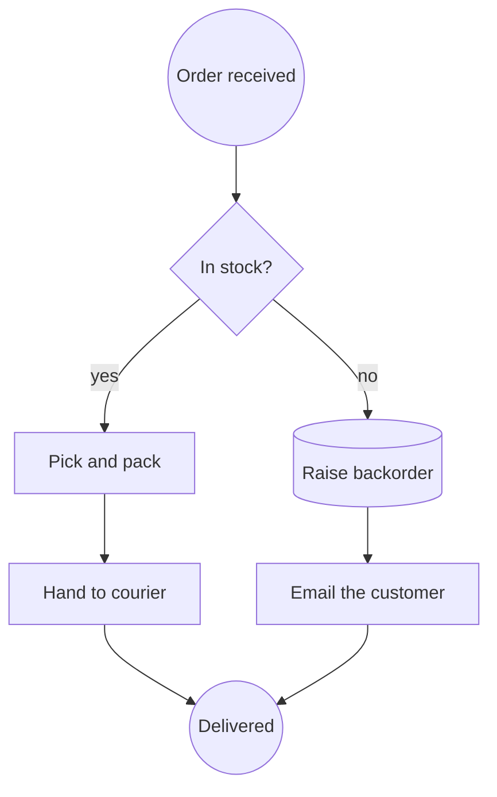

**Greifen Sie zu etwas anderem, wenn:** das Interessante ist, *welcher Service welchen aufgerufen hat* (Sequenz), oder wenn ein echter Mensch den Ablauf ausführen und dafür geradestehen muss (BPMN).

## 2. Sequenzdiagramm – wer ruft wen auf, im zeitlichen Verlauf

**Die Frage:** In welcher Reihenfolge sprechen diese Beteiligten miteinander, und was kostet jeder Roundtrip?

Das einzige Diagramm, das ein Latenzproblem sichtbar macht. Die Zeit läuft die Seite hinunter; jede Nachricht ist ein Pfeil zwischen Lebenslinien.

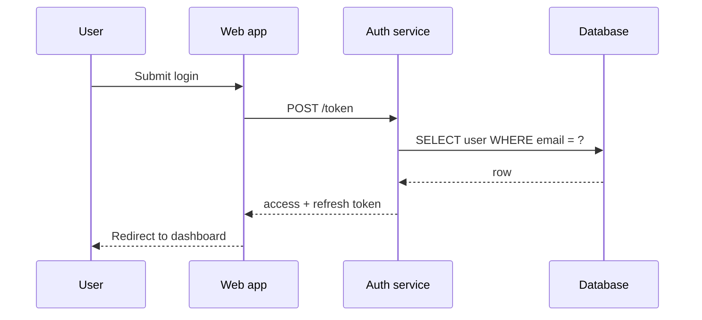

Diesen Typ kann ein Flussdiagramm nicht ersetzen und sollte es auch gar nicht versuchen. Seine Bedeutung *ist* die Reihenfolge entlang der Lebenslinien – deshalb behält das Creation Canvas Sequenzdiagramme als Mermaid, statt sie in Kästen und Pfeile umzuwandeln. Sie plattzudrücken, ergäbe ein Bild, das sich rendern lässt und trotzdem lügt.

**Greifen Sie zu etwas anderem, wenn:** es nur einen Beteiligten gibt (nehmen Sie ein Zustandsdiagramm).

## 3. Zustandsdiagramm – was ein einzelnes Ding sein kann

**Die Frage:** In welchen Zuständen kann sich diese eine Entität befinden, und was bewegt sie zwischen ihnen?

Zu selten genutzt – und der schnellste Weg, den Fehler in einem Lebenszyklus zu finden. Zeichnen Sie es für alles, was eine `status`-Spalte hat.

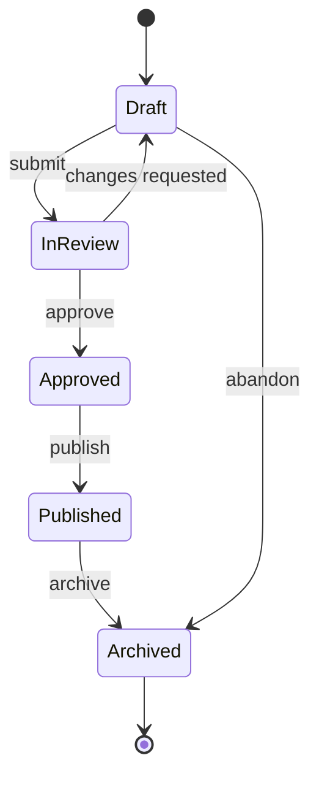

Sobald Sie es gezeichnet haben, können Sie die Frage stellen, die den Defekt aufdeckt: *Gibt es hier einen Übergang, den der Code erlaubt, das Diagramm aber nicht?*

**Greifen Sie zu etwas anderem, wenn:** mehrere Dinge miteinander interagieren (Sequenz) oder wenn Menschen statt des Systems über die Übergänge entscheiden (BPMN).

## 4. Entity-Relationship – Tabellen und ihre Schlüssel

**Die Frage:** Welche Daten existieren, und wie werden sie verknüpft?

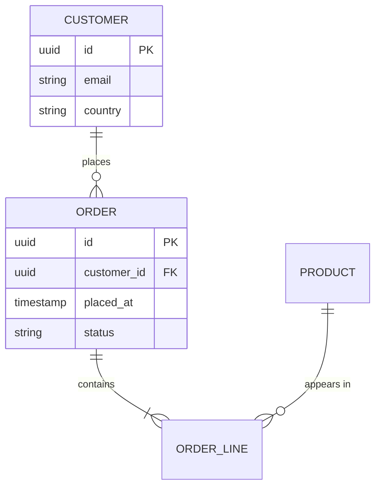

Die Krähenfüße tragen das ganze Argument: `||--o{` bedeutet „genau eins zu null oder vielen“. Wer die richtig setzt, fängt einen Normalisierungsfehler ab, bevor er zur Migration wird.

**Greifen Sie zu etwas anderem, wenn:** Ihnen das Verhalten wichtiger ist als die Speicherung (Klassendiagramm).

## 5. Klassendiagramm – Typen und ihre Beziehungen

**Die Frage:** Welche Typen gibt es, was besitzen sie, und was erbt wovon?

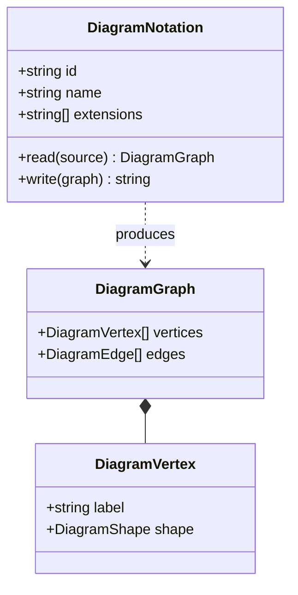

**Greifen Sie zu etwas anderem, wenn:** die Leserin oder der Leser den Code nicht lesen wird (nehmen Sie stattdessen C4 – derselbe Gedanke, nur auf einer menschenfreundlichen Flughöhe).

## 6. C4 – Architektur in vier Zoomstufen

**Die Frage:** Was ist dieses System – aus der Perspektive der Person, die gerade hinschaut?

Der Beitrag von C4 ist nicht die Notation, sondern *Disziplin bei der Flughöhe*: Context (Systeme und Nutzer), Container (deploybare Einheiten), Component (was in einem Container steckt), Code (lohnt sich selten zu zeichnen). Die meisten Architekturdiagramme scheitern, weil sie zwei Ebenen auf einer Seite mischen.

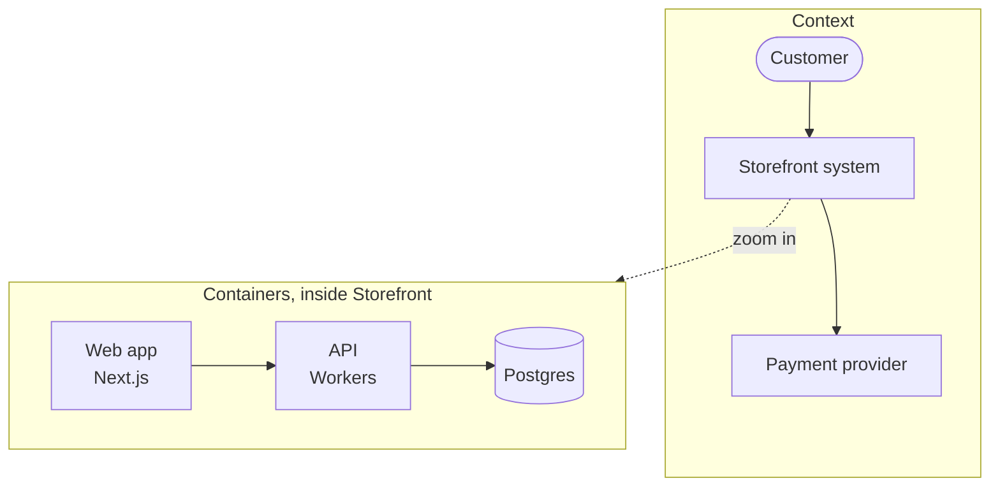

**Die Regel, mit der C4 funktioniert:** eine Ebene pro Diagramm. Wenn Sie eine Datenbank neben einen Akteur zeichnen, haben Sie zwei Diagramme.

## 7. BPMN – ein Prozess, für den jemand verantwortlich ist

**Die Frage:** Wer macht was, in welcher Reihenfolge, und was passiert, wenn etwas schiefgeht?

BPMN ist der einzige Typ in dieser Liste, der zugleich ein ausführbares Artefakt ist. Camunda, Flowable und Zeebe führen genau die Datei aus, die Sie gezeichnet haben.

```xml
<bpmn:process id="Onboarding" isExecutable="true">
  <bpmn:startEvent id="s1" name="Application received" />
  <bpmn:userTask id="t1" name="Verify identity" />
  <bpmn:exclusiveGateway id="g1" name="Documents valid?" />
  <bpmn:serviceTask id="t2" name="Create account" />
  <bpmn:userTask id="t3" name="Request re-submission" />
  <bpmn:endEvent id="e1" name="Onboarded" />

  <bpmn:sequenceFlow id="f1" sourceRef="s1" targetRef="t1" />
  <bpmn:sequenceFlow id="f2" sourceRef="t1" targetRef="g1" />
  <bpmn:sequenceFlow id="f3" sourceRef="g1" targetRef="t2" name="yes" />
  <bpmn:sequenceFlow id="f4" sourceRef="g1" targetRef="t3" name="no" />
  <bpmn:sequenceFlow id="f5" sourceRef="t2" targetRef="e1" />
</bpmn:process>
```

Beachten Sie `userTask` gegenüber `serviceTask` – BPMN unterscheidet zwischen Arbeit, die ein *Mensch* erledigt, und Arbeit, die ein *System* erledigt. Diese Unterscheidung ist der Hauptgrund, BPMN einem Flussdiagramm vorzuziehen.

**Greifen Sie zu etwas anderem, wenn:** niemand jemals dafür geradestehen muss und keine Engine den Prozess ausführen wird. Dann ist ein Flussdiagramm ehrlicher und günstiger.

## 8. Abhängigkeitsgraph – was was kaputt macht

**Die Frage:** Wenn sich das hier ändert, was muss sonst noch neu gebaut, neu getestet oder neu deployt werden?

Wird meist generiert statt gezeichnet – weshalb er meist als DOT ankommt.

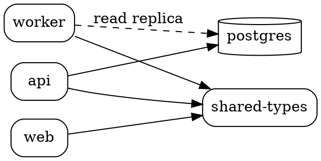

Suchen Sie beim Lesen den Knoten mit den meisten eingehenden Pfeilen. Das ist derjenige, bei dessen Änderungen das Review am langsamsten sein sollte.

## 9. Deployment-Diagramm – was worauf läuft

**Die Frage:** Wo wird das tatsächlich ausgeführt, und wie groß ist der Explosionsradius?

Das Deployment-Vokabular von PlantUML ist dafür am klarsten.

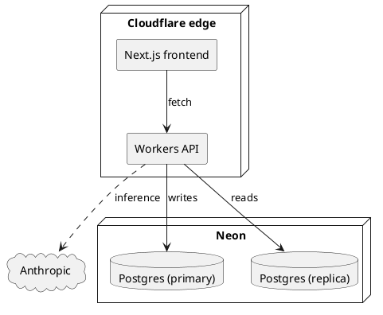

**Greifen Sie zu etwas anderem, wenn:** Sie die logische Struktur beschreiben statt des Orts, an dem etwas läuft (C4 auf Container-Ebene).

## 10. Journey Map – wie es sich anfühlt, Schritt für Schritt

**Die Frage:** An welcher Stelle geht diese Erfahrung für die Person, die sie macht, tatsächlich schief?

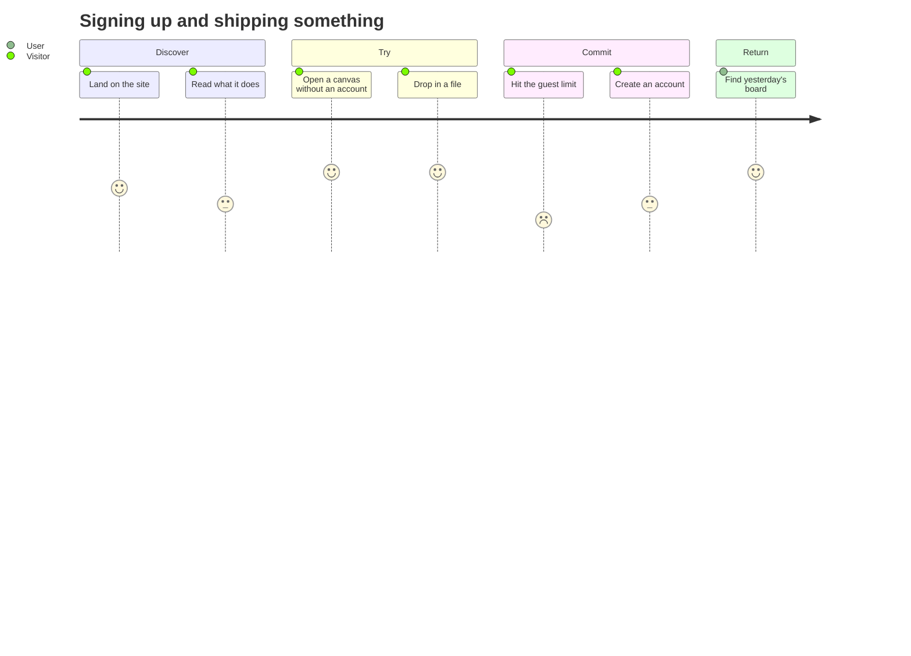

Die Punktwerte sind der eigentliche Punkt. Ein Schritt mit 2 inmitten von lauter Fünfen ist die Stelle, an der Sie Menschen verlieren.

## 11. Gantt – Arbeit im Kalender

**Die Frage:** Was ist die Reihenfolgebeschränkung, und wo liegt der Puffer?

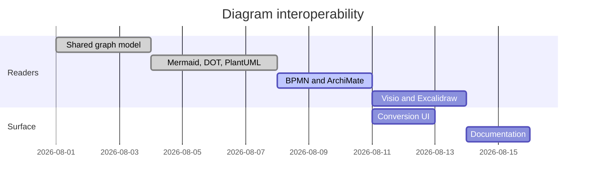

Ein Gantt-Diagramm täuscht eine Gewissheit vor, die es nicht gibt – und das weiß jeder. Zeichnen Sie es wegen der *Abhängigkeiten* – `after a1` ist der nützliche Teil –, nicht wegen der Termine.

## 12. Mindmap – eine Idee, bevor sie Struktur hat

**Die Frage:** Was gehört hier überhaupt dazu?

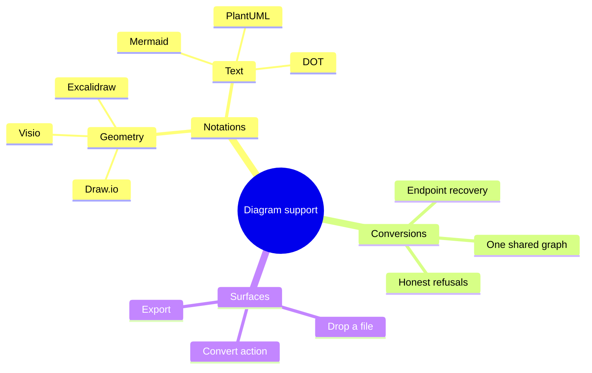

Der einzige Typ in dieser Liste, bei dem es in Ordnung ist, *falschzuliegen*. Er ist ein Denkwerkzeug; wandeln Sie ihn in etwas Verbindliches um, sobald sich die Dinge gesetzt haben.

## Die eine Regel, die sich zu merken lohnt

```bf-figure
{
  "kind": "stack",
  "title": "Wählen Sie den Typ, bevor Sie das Tool wählen",
  "bands": [
    { "label": "Benennen Sie die Frage", "note": "„In welcher Reihenfolge rufen sich die Services gegenseitig auf?“ – nicht „Wir brauchen ein Architekturdiagramm“", "hue": "idea" },
    { "label": "Die Frage bestimmt den Typ", "note": "Reihenfolge zwischen Beteiligten ist ein Sequenzdiagramm. Nichts anderes beantwortet das.", "hue": "read" },
    { "label": "Der Typ bestimmt die Notation", "note": "Ein Sequenzdiagramm ist Mermaid. Ein Prozess, den jemand ausführt, ist BPMN. Ein Abhängigkeitsgraph ist DOT.", "hue": "prove" },
    { "label": "Die Notation ist jetzt umkehrbar", "note": "Konvertieren Sie später zwischen ihnen. Genau das müssen Sie nicht mehr von Anfang an richtig machen.", "hue": "build" }
  ],
  "caption": "Die Entscheidung, die früher endgültig war – welches Tool, welches Dateiformat –, kostet heute nichts mehr, wenn Sie sie ändern."
}
```

Jedes der Beispiele oben lässt sich als Datei auf ein Creation Canvas ziehen oder in ein Diagramm-Objekt einfügen und von dort aus konvertieren. Unter [Jedes Diagrammformat, das das Canvas liest und schreibt](/blog/every-diagram-format-the-canvas-reads) sehen Sie, was einen Round-Trip übersteht und was nicht, und unter [Befreien Sie sich von Ihrem Diagrammtool](/blog/escape-your-diagramming-tool), wie Sie bestehende Arbeit aus Visio, Lucidchart und Miro herausholen.

[Canvas öffnen und ausprobieren →](/create/new)
