La mayoría de los malos diagramas no están mal dibujados. Son del *tipo* equivocado: un diagrama de flujo haciendo el trabajo de un diagrama de secuencia, o un esquema de arquitectura que en realidad es un diagrama de despliegue al que le falta el despliegue. El resultado se lee bien y no responde a ninguna pregunta que nadie se hiciera.

Cada uno de los tipos que siguen existe porque alguien no dejaba de hacer una pregunta concreta. Aquí tienes la pregunta, el ejemplo y cuándo conviene recurrir a otra cosa. Todos los ejemplos son código fuente real que puedes pegar en un lienzo.

[Abre un Lienzo de Creación →](/create/new)

## Elige según la pregunta que quieres responder

```bf-figure
{
  "kind": "compare",
  "title": "La pregunta decide el tipo",
  "columns": [
    {
      "title": "«¿Qué pasa y en qué orden?»",
      "hue": "read",
      "items": [
        "Diagrama de flujo: trabajo con bifurcaciones",
        "Secuencia: quién llama a quién, a lo largo del tiempo",
        "Estados: lo que puede ser una sola cosa",
        "BPMN: un proceso que alguien debe ejecutar"
      ]
    },
    {
      "title": "«¿Qué existe y cómo se relaciona?»",
      "hue": "prove",
      "items": [
        "ER: tablas y sus claves",
        "Clases: tipos y sus relaciones",
        "C4: sistemas, contenedores, componentes",
        "Grafo de dependencias: qué rompe qué"
      ]
    },
    {
      "title": "«¿Dónde vive y cuándo?»",
      "hue": "build",
      "items": [
        "Despliegue: qué se ejecuta sobre qué",
        "Gantt: trabajo frente a un calendario",
        "Recorrido: cómo se vive, paso a paso",
        "Mapa mental: una idea, antes de tener estructura"
      ]
    }
  ]
}
```

## 1. Diagrama de flujo: trabajo con bifurcaciones

**La pregunta:** ¿qué pasa después y qué lo decide?

El diagrama más dibujado y peor utilizado. Un diagrama de flujo es la elección correcta cuando lo importante son las *bifurcaciones*. Si tu diagrama de flujo no tiene rombos, lo que has dibujado es una lista.

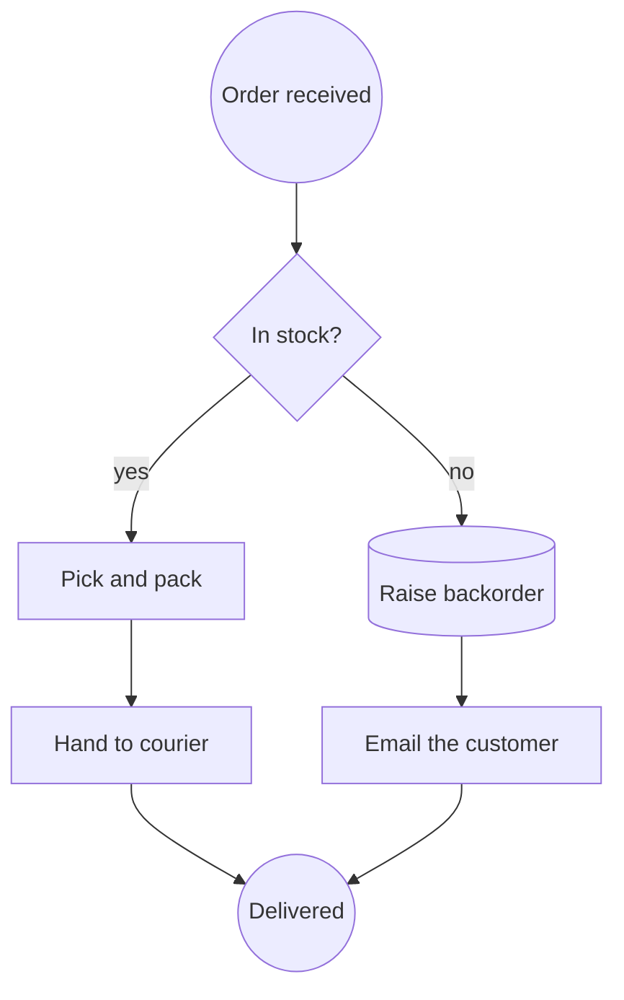

**Recurre a otra cosa cuando:** lo interesante sea *qué servicio llamó a cuál* (secuencia), o cuando una persona real tenga que ejecutarlo y rendir cuentas por ello (BPMN).

## 2. Diagrama de secuencia: quién llama a quién, a lo largo del tiempo

**La pregunta:** ¿en qué orden se comunican estos participantes y cuánto cuesta cada ida y vuelta?

El único diagrama que hace visible un problema de latencia. El tiempo avanza hacia abajo en la página y cada mensaje es una flecha entre líneas de vida.

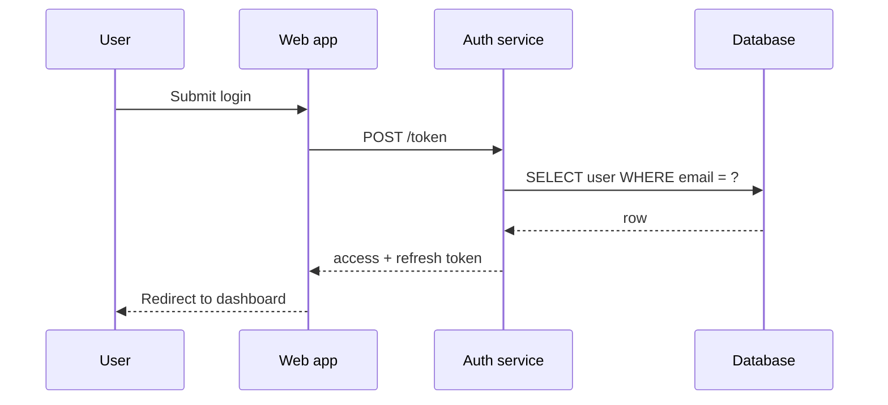

Este es el tipo que un diagrama de flujo no puede sustituir, y no debería intentarlo. Su significado *es* el orden a lo largo de las líneas de vida, y por eso el Lienzo de Creación mantiene los diagramas de secuencia como Mermaid en lugar de convertirlos en cajas y flechas: aplanarlos produciría una imagen que se renderiza y miente.

**Recurre a otra cosa cuando:** solo haya un participante (usa un diagrama de estados).

## 3. Diagrama de estados: lo que puede ser una sola cosa

**La pregunta:** ¿en qué estados puede estar esta entidad y qué la hace pasar de uno a otro?

Infrautilizado, y la forma más rápida de encontrar el fallo en un ciclo de vida. Dibújalo para cualquier cosa que tenga una columna `status`.

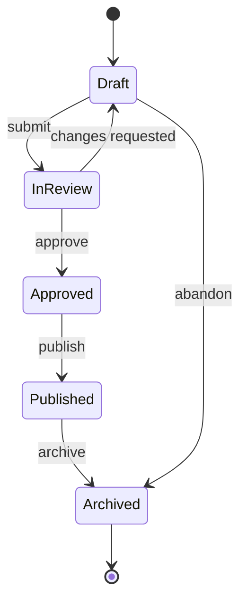

En cuanto lo dibujas, puedes hacerte la pregunta que destapa el defecto: *¿hay alguna transición que el código permite pero el diagrama no?*

**Recurre a otra cosa cuando:** interactúen varias cosas (secuencia), o cuando las transiciones las decidan personas y no el sistema (BPMN).

## 4. Entidad–relación: tablas y sus claves

**La pregunta:** ¿qué datos existen y cómo se relacionan entre sí?

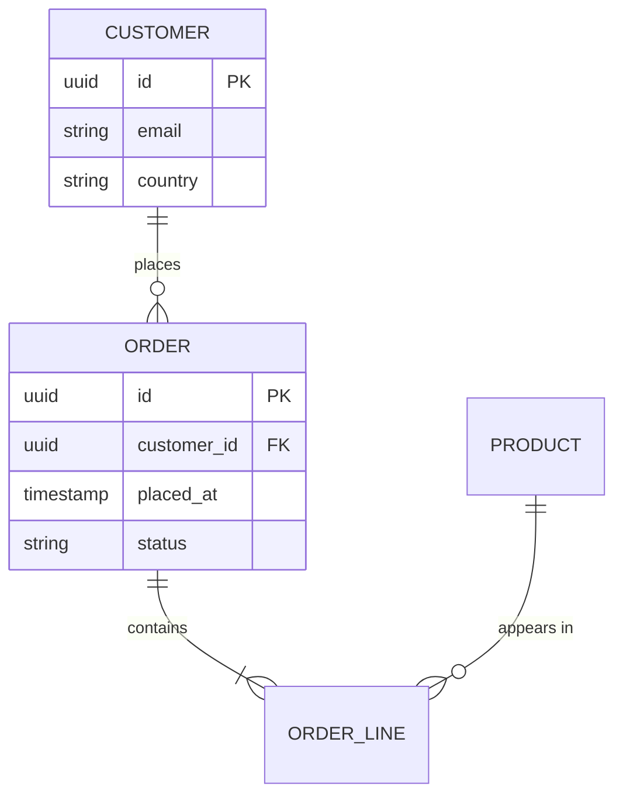

Las patas de gallo sostienen todo el argumento: `||--o{` significa «exactamente uno, con cero o muchos». Acertar con ellas detecta un error de normalización antes de que se convierta en una migración.

**Recurre a otra cosa cuando:** te importe más el comportamiento que el almacenamiento (diagrama de clases).

## 5. Diagrama de clases: tipos y sus relaciones

**La pregunta:** ¿cuáles son los tipos, qué contiene cada uno y qué hereda de qué?

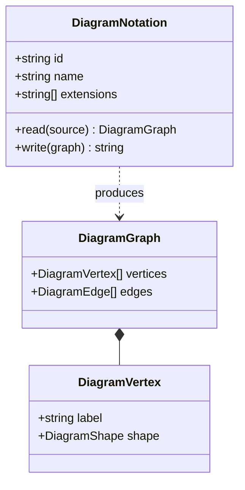

**Recurre a otra cosa cuando:** el lector no vaya a leer el código (usa C4: es el mismo instinto a una altura más humana).

## 6. C4: arquitectura en cuatro niveles de zoom

**La pregunta:** ¿qué es este sistema, visto desde donde está el lector?

La aportación de C4 no es la notación, sino la *disciplina de altura*: Contexto (sistemas y usuarios), Contenedor (lo que se despliega), Componente (lo que hay dentro de un contenedor) y Código (que rara vez merece la pena dibujar). La mayoría de los diagramas de arquitectura fallan porque mezclan dos niveles en una misma página.

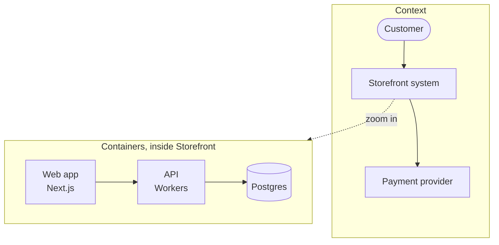

**La regla que hace que C4 funcione:** un nivel por diagrama. Si te ves dibujando una base de datos junto a un actor, tienes dos diagramas.

## 7. BPMN: un proceso del que alguien es responsable

**La pregunta:** ¿quién hace qué, en qué orden y qué pasa cuando algo sale mal?

BPMN es el único tipo de esta lista que además es un artefacto ejecutable. Camunda, Flowable y Zeebe ejecutan el mismo archivo que dibujaste.

```xml
<bpmn:process id="Onboarding" isExecutable="true">
  <bpmn:startEvent id="s1" name="Application received" />
  <bpmn:userTask id="t1" name="Verify identity" />
  <bpmn:exclusiveGateway id="g1" name="Documents valid?" />
  <bpmn:serviceTask id="t2" name="Create account" />
  <bpmn:userTask id="t3" name="Request re-submission" />
  <bpmn:endEvent id="e1" name="Onboarded" />

  <bpmn:sequenceFlow id="f1" sourceRef="s1" targetRef="t1" />
  <bpmn:sequenceFlow id="f2" sourceRef="t1" targetRef="g1" />
  <bpmn:sequenceFlow id="f3" sourceRef="g1" targetRef="t2" name="yes" />
  <bpmn:sequenceFlow id="f4" sourceRef="g1" targetRef="t3" name="no" />
  <bpmn:sequenceFlow id="f5" sourceRef="t2" targetRef="e1" />
</bpmn:process>
```

Fíjate en `userTask` frente a `serviceTask`: BPMN distingue el trabajo que hace una *persona* del que hace un *sistema*, y esa distinción es buena parte de lo que justifica usarlo en lugar de un diagrama de flujo.

**Recurre a otra cosa cuando:** nadie vaya a rendir cuentas por esto y ningún motor vaya a ejecutarlo. En ese caso, un diagrama de flujo es honesto y más barato.

## 8. Grafo de dependencias: qué rompe qué

**La pregunta:** si esto cambia, ¿qué más hay que recompilar, volver a probar o volver a desplegar?

Normalmente se genera en lugar de dibujarse, y por eso suele llegar como DOT.

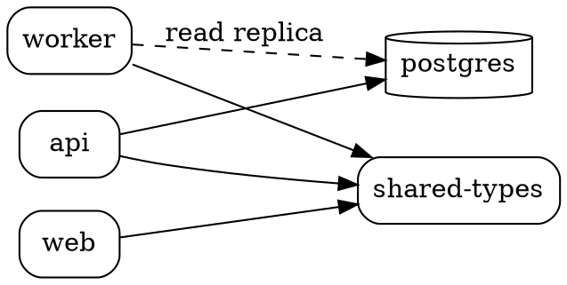

Léelo buscando el nodo con más flechas entrantes. Ese es el que necesita la revisión de cambios más pausada.

## 9. Diagrama de despliegue: qué se ejecuta sobre qué

**La pregunta:** ¿dónde se ejecuta esto realmente y hasta dónde llega el impacto si falla?

El vocabulario de despliegue de PlantUML es el más claro para esto.

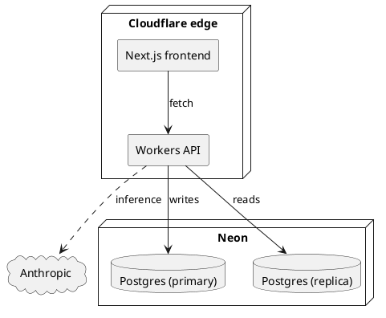

**Recurre a otra cosa cuando:** estés describiendo la estructura lógica y no dónde se ejecutan las cosas (nivel de contenedor de C4).

## 10. Mapa de recorrido: cómo se vive, paso a paso

**La pregunta:** ¿en qué punto falla realmente esta experiencia para la persona que la vive?

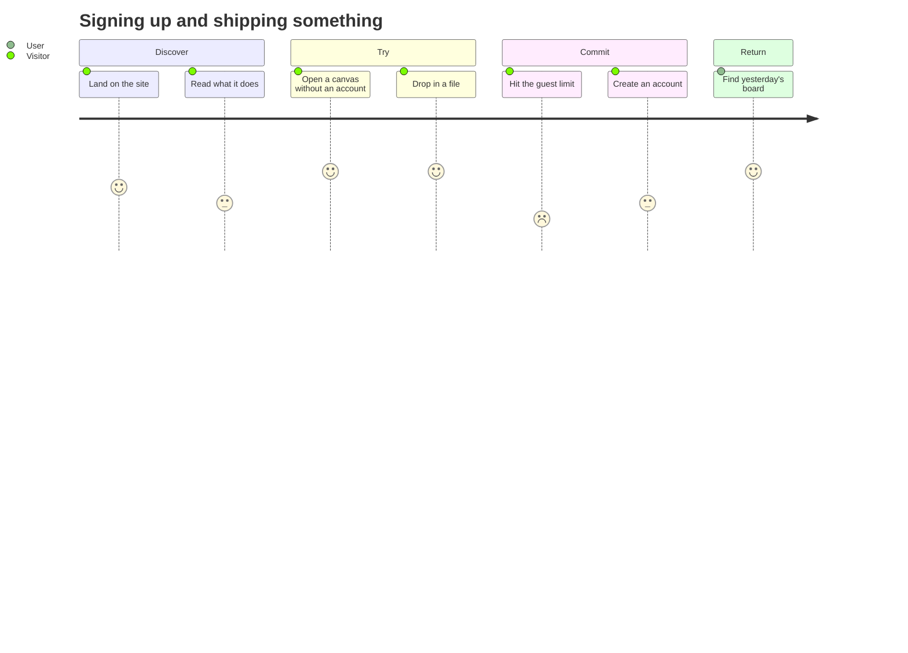

Las puntuaciones son lo importante. Un paso con un 2 en medio de cincos es donde pierdes a la gente.

## 11. Gantt: trabajo frente a un calendario

**La pregunta:** ¿cuál es la restricción de orden y dónde está el margen?

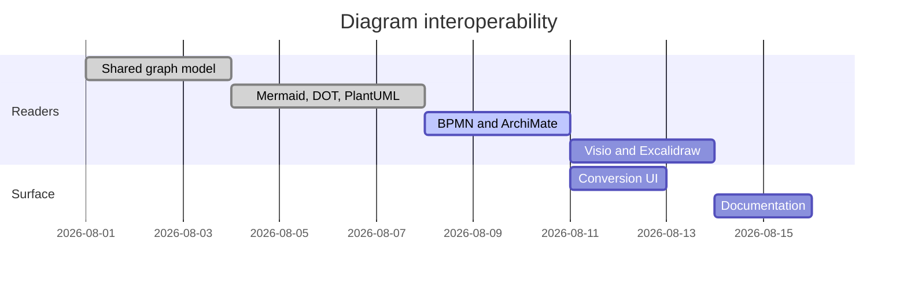

Un diagrama de Gantt es una mentira sobre la certeza, y todo el mundo lo sabe. Dibújalo por las *dependencias* —`after a1` es la parte útil—, no por las fechas.

## 12. Mapa mental: una idea antes de tener estructura

**La pregunta:** ¿qué entra siquiera en el alcance?

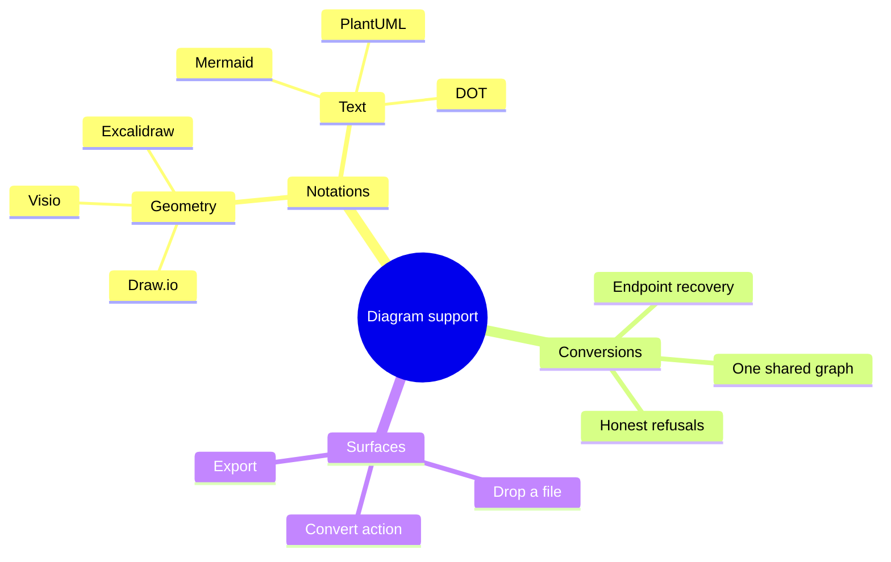

El único tipo de la lista en el que *equivocarse* no pasa nada. Es una herramienta para pensar; conviértelo en algo que rinda cuentas cuando las ideas se asienten.

## La única regla que merece la pena conservar

```bf-figure
{
  "kind": "stack",
  "title": "Elige el tipo antes que la herramienta",
  "bands": [
    { "label": "Formula la pregunta", "note": "«¿En qué orden se llaman los servicios entre sí?», no «necesitamos un diagrama de arquitectura»", "hue": "idea" },
    { "label": "La pregunta determina el tipo", "note": "El orden entre participantes es un diagrama de secuencia. Nada más lo responde.", "hue": "read" },
    { "label": "El tipo determina la notación", "note": "Un diagrama de secuencia es Mermaid. Un proceso que alguien ejecuta es BPMN. Un grafo de dependencias es DOT.", "hue": "prove" },
    { "label": "La notación ya es reversible", "note": "Podrás convertir entre ellas más adelante. Esa es la parte que ya no tienes que acertar desde el principio.", "hue": "build" }
  ],
  "caption": "La elección que antes era permanente —qué herramienta, qué formato de archivo— es la que ahora no cuesta nada cambiar."
}
```

Todos los ejemplos anteriores se pueden soltar como archivo en un Lienzo de Creación, o pegar en un objeto Diagrama, y convertirse desde ahí. Consulta [Todos los formatos de diagrama que el lienzo lee y escribe](/blog/every-diagram-format-the-canvas-reads) para saber qué admite ida y vuelta y qué no, y [Escapa de tu herramienta de diagramas](/blog/escape-your-diagramming-tool) para sacar tu trabajo actual de Visio, Lucidchart y Miro.

[Abre un lienzo y prueba uno →](/create/new)
