La plupart des mauvais diagrammes ne sont pas mal dessinés. Ils sont du mauvais *type* — un logigramme qui fait le travail d'un diagramme de séquence, un schéma d'architecture qui est en réalité un diagramme de déploiement dont on aurait oublié le déploiement. Le résultat se lit sans peine et ne répond à aucune question que quiconque se posait.

Chaque type ci-dessous existe parce qu'une question précise revenait sans cesse. Voici la question, l'exemple, et le moment où il vaut mieux choisir autre chose. Chaque exemple est une vraie source que vous pouvez coller sur un canevas.

[Ouvrir un Canvas de création →](/create/new)

## Choisissez selon la question à laquelle vous répondez

```bf-figure
{
  "kind": "compare",
  "title": "C'est la question qui décide du type",
  "columns": [
    {
      "title": "« Que se passe-t-il, et dans quel ordre ? »",
      "hue": "read",
      "items": [
        "Logigramme — un travail qui bifurque",
        "Séquence — qui appelle qui, au fil du temps",
        "États — ce qu'une seule chose peut être",
        "BPMN — un processus que quelqu'un doit exécuter"
      ]
    },
    {
      "title": "« Qu'est-ce qui existe, et comment tout cela est-il lié ? »",
      "hue": "prove",
      "items": [
        "Entité-relation — les tables et leurs clés",
        "Classes — les types et leurs relations",
        "C4 — systèmes, conteneurs, composants",
        "Graphe de dépendances — ce qui casse quoi"
      ]
    },
    {
      "title": "« Où cela tourne-t-il, et quand ? »",
      "hue": "build",
      "items": [
        "Déploiement — ce qui tourne sur quoi",
        "Gantt — le travail face au calendrier",
        "Parcours — le ressenti, étape par étape",
        "Carte mentale — une idée, avant qu'elle ait une structure"
      ]
    }
  ]
}
```

## 1. Logigramme — un travail qui bifurque

**La question :** que se passe-t-il ensuite, et qu'est-ce qui en décide ?

Le diagramme le plus dessiné, et le plus mal employé. Un logigramme est pertinent quand ce sont les *bifurcations* qui comptent. Si votre logigramme ne contient aucun losange, vous avez dessiné une liste.

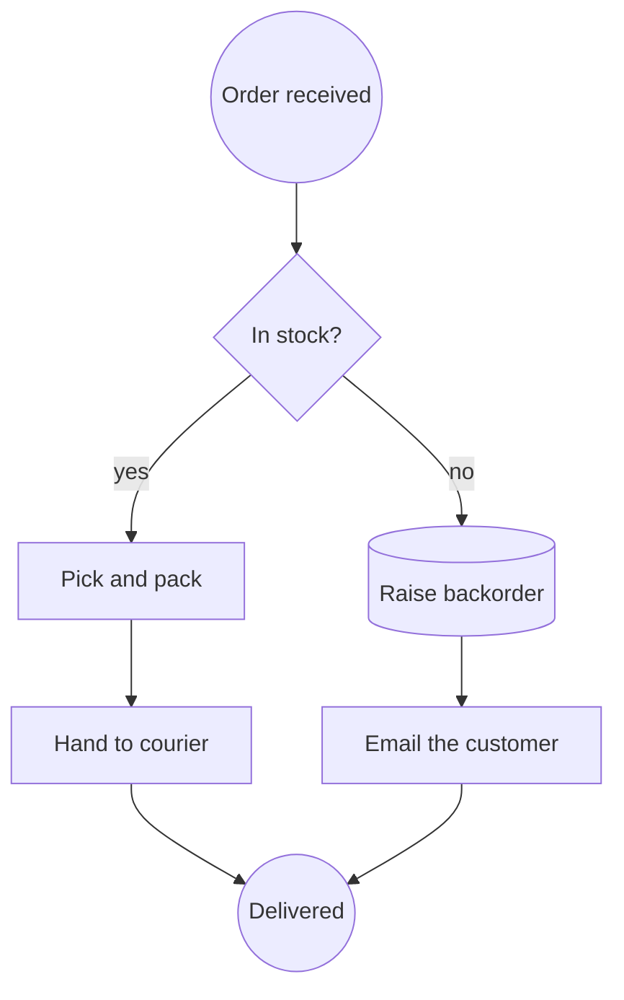

**Choisissez autre chose quand :** l'intérêt réside dans *quel service a appelé lequel* (séquence), ou quand une vraie personne doit l'exécuter et en rendre compte (BPMN).

## 2. Diagramme de séquence — qui appelle qui, au fil du temps

**La question :** dans quel ordre ces participants échangent-ils, et combien coûte chaque aller-retour ?

Le seul diagramme qui rend un problème de latence visible. Le temps s'écoule vers le bas de la page ; chaque message est une flèche entre deux lignes de vie.

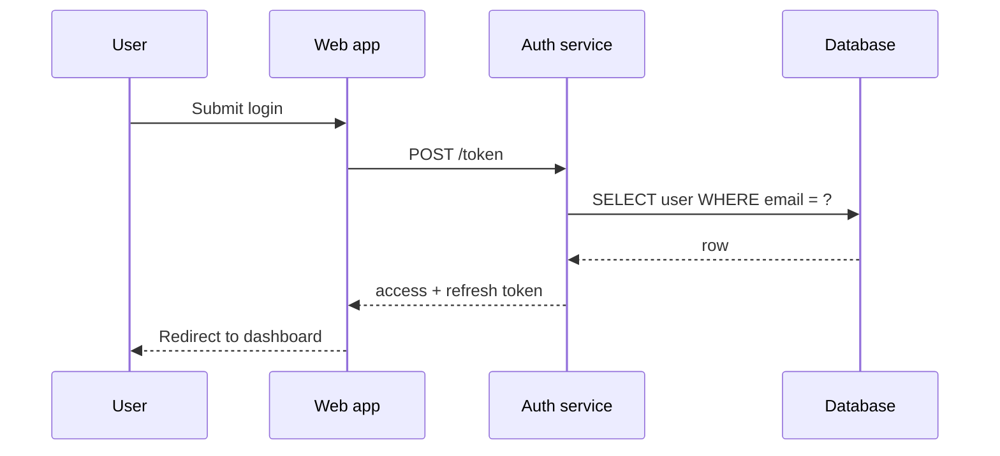

C'est le type qu'un logigramme ne peut pas remplacer et ne devrait pas tenter de remplacer. Son sens *est* l'ordre le long des lignes de vie, et c'est pourquoi le Canvas de création conserve les diagrammes de séquence en Mermaid au lieu de les convertir en boîtes et en flèches — les aplatir produirait une image qui s'affiche correctement… et qui ment.

**Choisissez autre chose quand :** il n'y a qu'un seul participant (utilisez un diagramme d'états).

## 3. Diagramme d'états — ce qu'une seule chose peut être

**La question :** dans quels états cette entité unique peut-elle se trouver, et qu'est-ce qui la fait passer de l'un à l'autre ?

Sous-utilisé, et c'est pourtant le moyen le plus rapide de trouver le bug d'un cycle de vie. Dessinez-le pour tout ce qui possède une colonne `status`.

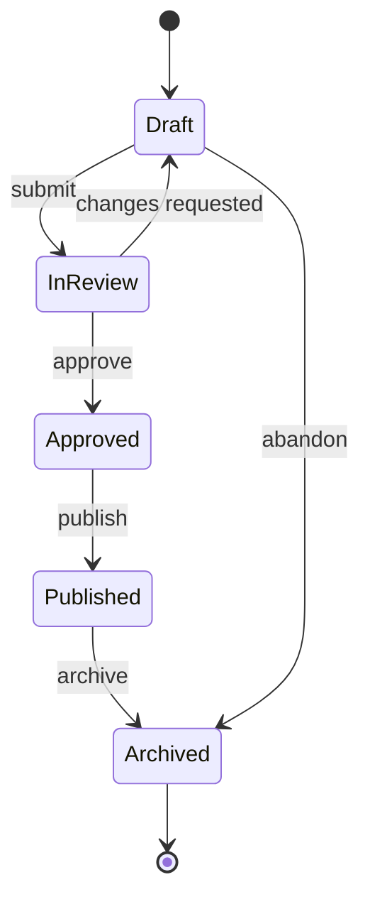

Dès que vous le dessinez, vous pouvez poser la question qui débusque le défaut : *existe-t-il ici une transition que le code autorise mais que le diagramme n'autorise pas ?*

**Choisissez autre chose quand :** plusieurs choses interagissent (séquence), ou les transitions sont décidées par des personnes plutôt que par le système (BPMN).

## 4. Entité-relation — les tables et leurs clés

**La question :** quelles données existent, et comment sont-elles jointes ?

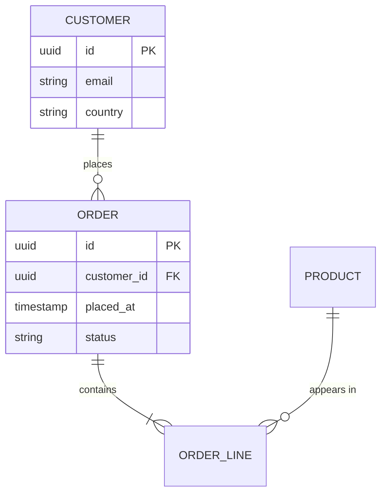

Les pattes de corbeau portent tout le raisonnement : `||--o{` signifie « exactement un, pour zéro ou plusieurs ». Les poser correctement permet de repérer une erreur de normalisation avant qu'elle ne devienne une migration.

**Choisissez autre chose quand :** c'est le comportement qui vous intéresse plutôt que le stockage (diagramme de classes).

## 5. Diagramme de classes — les types et leurs relations

**La question :** quels sont les types, que possèdent-ils, et qui hérite de quoi ?

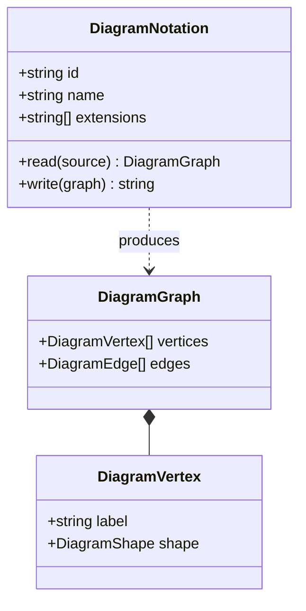

**Choisissez autre chose quand :** le lecteur ne va pas lire le code (préférez C4 — c'est le même réflexe, à une altitude plus humaine).

## 6. C4 — l'architecture à quatre niveaux de zoom

**La question :** qu'est-ce que ce système, vu depuis là où se trouve le lecteur ?

L'apport de C4 n'est pas une notation, c'est une *discipline d'altitude* : Contexte (systèmes et utilisateurs), Conteneur (éléments déployables), Composant (ce qu'il y a dans un conteneur), Code (rarement utile à dessiner). La plupart des schémas d'architecture échouent parce qu'ils mélangent deux niveaux sur une même page.

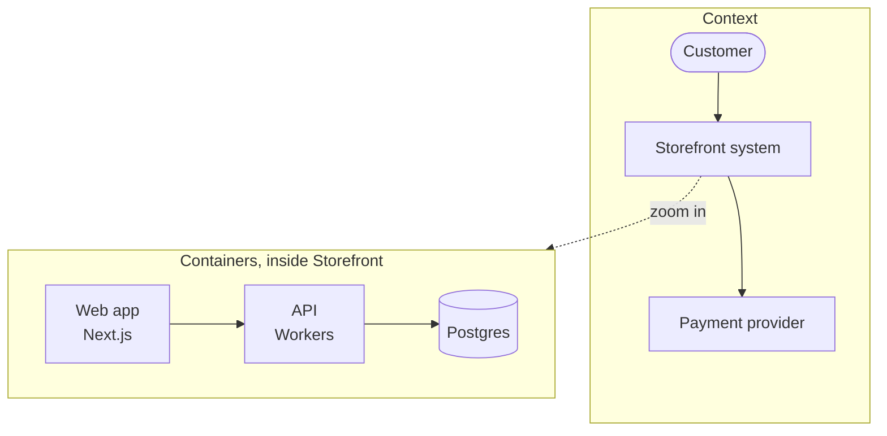

**La règle qui fait fonctionner C4 :** un niveau par diagramme. Si vous vous surprenez à dessiner une base de données à côté d'un acteur, vous avez deux diagrammes.

## 7. BPMN — un processus dont quelqu'un est responsable

**La question :** qui fait quoi, dans quel ordre, et que se passe-t-il quand ça tourne mal ?

BPMN est le seul type de cette liste qui soit aussi un artefact exécutable. Camunda, Flowable et Zeebe exécutent le fichier même que vous avez dessiné.

```xml
<bpmn:process id="Onboarding" isExecutable="true">
  <bpmn:startEvent id="s1" name="Application received" />
  <bpmn:userTask id="t1" name="Verify identity" />
  <bpmn:exclusiveGateway id="g1" name="Documents valid?" />
  <bpmn:serviceTask id="t2" name="Create account" />
  <bpmn:userTask id="t3" name="Request re-submission" />
  <bpmn:endEvent id="e1" name="Onboarded" />

  <bpmn:sequenceFlow id="f1" sourceRef="s1" targetRef="t1" />
  <bpmn:sequenceFlow id="f2" sourceRef="t1" targetRef="g1" />
  <bpmn:sequenceFlow id="f3" sourceRef="g1" targetRef="t2" name="yes" />
  <bpmn:sequenceFlow id="f4" sourceRef="g1" targetRef="t3" name="no" />
  <bpmn:sequenceFlow id="f5" sourceRef="t2" targetRef="e1" />
</bpmn:process>
```

Notez la différence entre `userTask` et `serviceTask` — BPMN distingue le travail effectué par une *personne* de celui effectué par un *système*, et cette distinction explique en grande partie pourquoi il vaut la peine de le préférer à un logigramme.

**Choisissez autre chose quand :** personne n'en rendra jamais compte et aucun moteur ne l'exécutera. Un logigramme est alors honnête, et moins coûteux.

## 8. Graphe de dépendances — ce qui casse quoi

**La question :** si ceci change, qu'est-ce qui doit être reconstruit, retesté ou redéployé ?

Généralement généré plutôt que dessiné — c'est pourquoi il arrive le plus souvent en DOT.

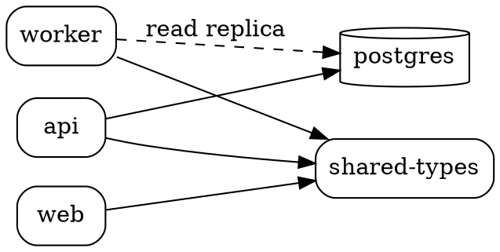

Cherchez-y le nœud qui reçoit le plus de flèches. C'est celui dont les modifications méritent la revue la plus lente.

## 9. Diagramme de déploiement — ce qui tourne sur quoi

**La question :** où cela s'exécute-t-il réellement, et quel est le rayon d'impact ?

Le vocabulaire de déploiement de PlantUML est le plus clair pour cela.

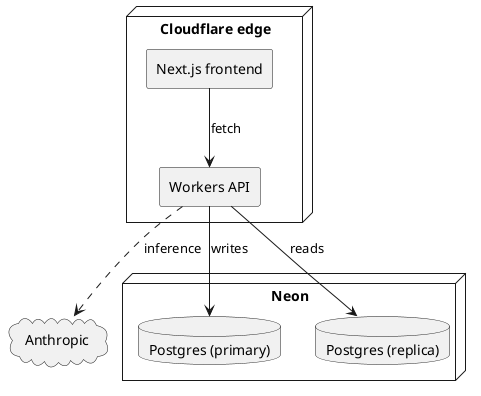

**Choisissez autre chose quand :** vous décrivez une structure logique plutôt que l'endroit où les choses tournent (niveau conteneur de C4).

## 10. Carte de parcours — le ressenti, étape par étape

**La question :** où cette expérience déraille-t-elle vraiment pour la personne qui la vit ?

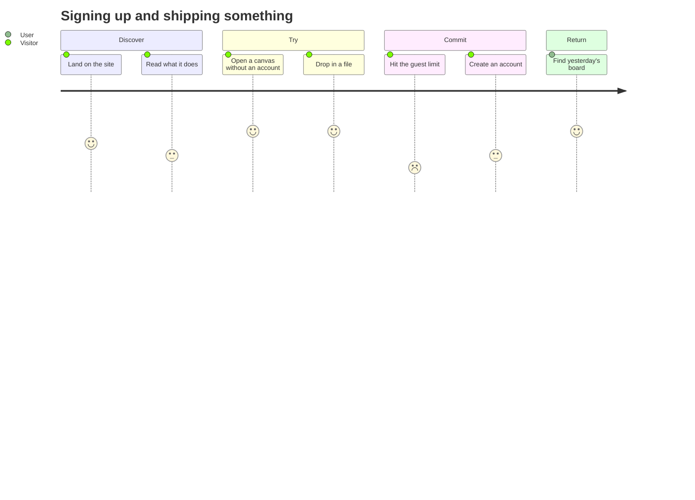

Les scores sont tout l'intérêt. Une étape notée 2 au milieu de 5, c'est là que vous perdez des gens.

## 11. Gantt — le travail face au calendrier

**La question :** quelle est la contrainte d'ordonnancement, et où se trouve la marge ?

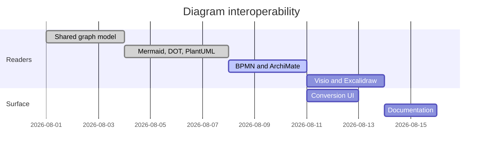

Un diagramme de Gantt est un mensonge sur la certitude, et tout le monde le sait. Dessinez-le pour les *dépendances* — `after a1` est la partie utile — pas pour les dates.

## 12. Carte mentale — une idée avant qu'elle ait une structure

**La question :** qu'est-ce qui entre, au juste, dans le périmètre ?

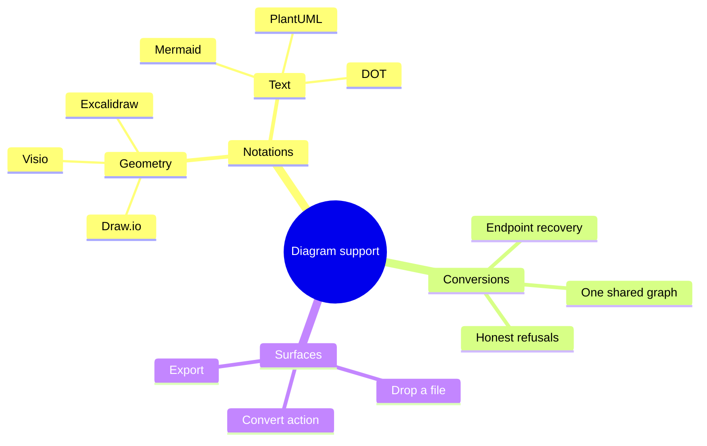

Le seul type de cette liste où se *tromper* ne pose aucun problème. C'est un outil de réflexion ; convertissez-la en quelque chose de plus rigoureux une fois qu'elle s'est stabilisée.

## La seule règle à retenir

```bf-figure
{
  "kind": "stack",
  "title": "Choisissez le type avant de choisir l'outil",
  "bands": [
    { "label": "Nommez la question", "note": "« Dans quel ordre les services s'appellent-ils ? » — et non « il nous faut un schéma d'architecture »", "hue": "idea" },
    { "label": "La question désigne le type", "note": "L'ordre entre participants, c'est un diagramme de séquence. Rien d'autre n'y répond.", "hue": "read" },
    { "label": "Le type désigne la notation", "note": "Un diagramme de séquence, c'est du Mermaid. Un processus que quelqu'un exécute, c'est du BPMN. Un graphe de dépendances, c'est du DOT.", "hue": "prove" },
    { "label": "La notation est désormais réversible", "note": "Convertissez de l'une à l'autre plus tard. C'est la partie que vous n'avez plus à réussir dès le départ.", "hue": "build" }
  ],
  "caption": "Le choix qui était autrefois définitif — quel outil, quel format de fichier — est celui qui ne coûte désormais plus rien à changer."
}
```

Chacun des exemples ci-dessus peut être déposé sur un Canvas de création sous forme de fichier, ou collé dans un objet Diagramme, puis converti à partir de là. Consultez [Tous les formats de diagramme que le canevas lit et écrit](/blog/every-diagram-format-the-canvas-reads) pour savoir ce qui fait l'aller-retour et ce qui ne le fait pas, et [Libérez-vous de votre outil de diagramme](/blog/escape-your-diagramming-tool) pour sortir vos travaux existants de Visio, Lucidchart et Miro.

[Ouvrez un canevas et essayez-en un →](/create/new)
