# Which Diagram Should You Draw? Twelve Types, With Examples

Most bad diagrams are not badly drawn. They are the wrong *type* — a flowchart doing the job of a sequence diagram, an architecture picture that is really a deployment diagram with the deployment left out. The result reads fine and answers no question anybody had.

Each type below exists because a specific question kept getting asked. Here is the question, the example, and when to reach for something else. Every example is real source you can paste onto a canvas.

[Open a Creation Canvas →](/create/new)

## Pick by the question you are answering

```bf-figure
{
  "kind": "compare",
  "title": "The question decides the type",
  "columns": [
    {
      "title": "\"What happens, in what order?\"",
      "hue": "read",
      "items": [
        "Flowchart — branching work",
        "Sequence — who calls whom, over time",
        "State — what a single thing can be",
        "BPMN — a process someone must run"
      ]
    },
    {
      "title": "\"What exists, and how does it relate?\"",
      "hue": "prove",
      "items": [
        "ER — tables and their keys",
        "Class — types and their relationships",
        "C4 — systems, containers, components",
        "Dependency graph — what breaks what"
      ]
    },
    {
      "title": "\"Where does it live, and when?\"",
      "hue": "build",
      "items": [
        "Deployment — what runs on what",
        "Gantt — work against a calendar",
        "Journey — how it feels, step by step",
        "Mindmap — an idea, before it has structure"
      ]
    }
  ]
}
```

## 1. Flowchart — branching work

**The question:** what happens next, and what decides it?

The most-drawn and most-misused diagram. A flowchart is right when the *branching* is the point. If your flowchart has no diamonds in it, you have drawn a list.

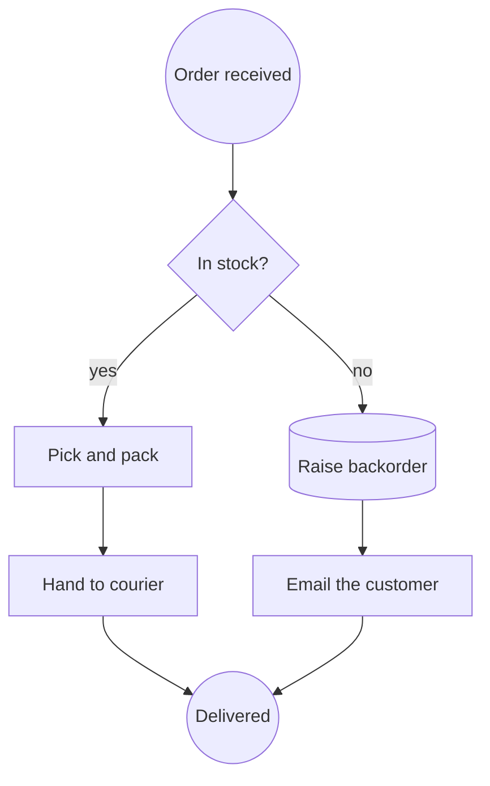

**Reach for something else when:** the interesting part is *which service called which* (sequence), or when a real person has to run it and be held to it (BPMN).

## 2. Sequence diagram — who calls whom, over time

**The question:** in what order do these participants talk, and what does each round trip cost?

The one diagram that makes a latency problem visible. Time runs down the page; every message is an arrow between lifelines.

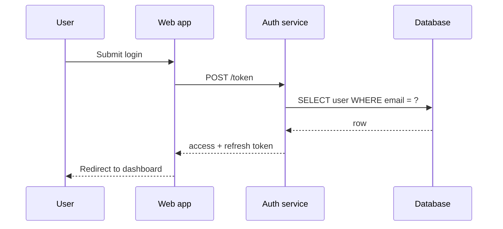

This is the type a flowchart cannot replace and should not try to. Its meaning *is* the ordering down the lifelines, which is why the Creation Canvas keeps sequence diagrams as Mermaid rather than converting them into boxes and arrows — flattening them would produce a picture that renders and lies.

**Reach for something else when:** there is only one participant (use a state diagram).

## 3. State diagram — what one thing can be

**The question:** what states can this single entity be in, and what moves it between them?

Underused, and the fastest way to find the bug in a lifecycle. Draw it for anything with a `status` column.

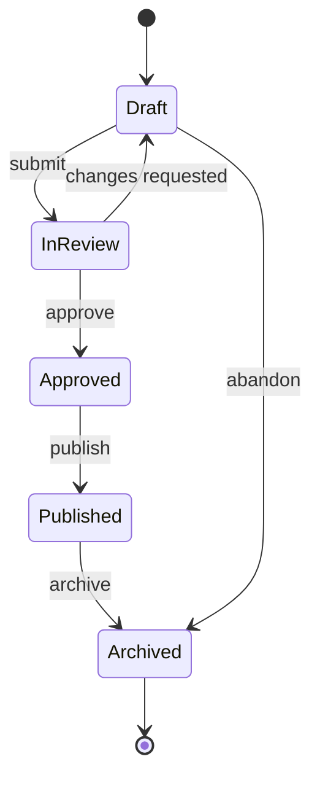

The moment you draw this, you can ask the question that finds the defect: *is there a transition here the code allows but the diagram does not?*

**Reach for something else when:** several things are interacting (sequence), or the transitions are decided by people rather than by the system (BPMN).

## 4. Entity–relationship — tables and their keys

**The question:** what data exists, and how is it joined?

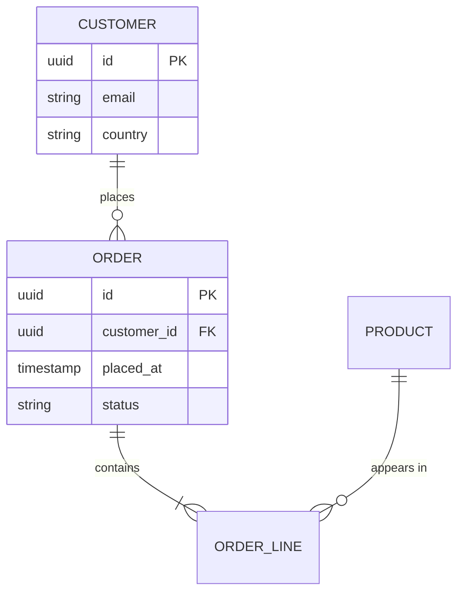

The crow's feet carry the whole argument: `||--o{` is "exactly one, to zero or many". Getting those right catches a normalisation mistake before it becomes a migration.

**Reach for something else when:** you care about behaviour rather than storage (class diagram).

## 5. Class diagram — types and their relationships

**The question:** what are the types, what do they own, and what inherits from what?

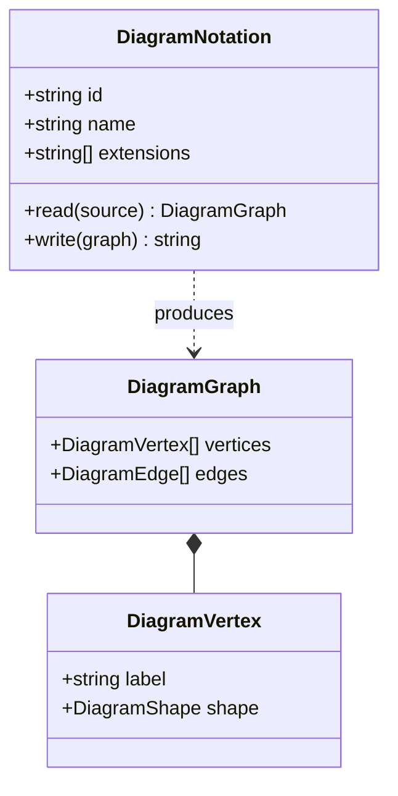

**Reach for something else when:** the reader is not going to read the code (use C4 instead — it is the same instinct at a humane altitude).

## 6. C4 — architecture at four zoom levels

**The question:** what is this system, from where the reader is standing?

C4's contribution is not notation, it is *altitude discipline*: Context (systems and users), Container (deployable things), Component (what is inside one container), Code (rarely worth drawing). Most architecture diagrams fail because they mix two levels on one page.

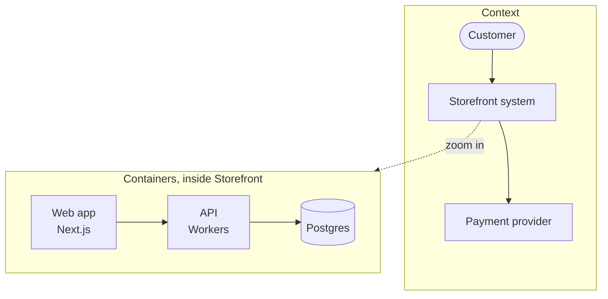

**The rule that makes C4 work:** one level per diagram. If you find yourself drawing a database next to an actor, you have two diagrams.

## 7. BPMN — a process someone is accountable for

**The question:** who does what, in what order, and what happens when it goes wrong?

BPMN is the only type here that is also an executable artefact. Camunda, Flowable and Zeebe run the same file you drew.

```xml
<bpmn:process id="Onboarding" isExecutable="true">
  <bpmn:startEvent id="s1" name="Application received" />
  <bpmn:userTask id="t1" name="Verify identity" />
  <bpmn:exclusiveGateway id="g1" name="Documents valid?" />
  <bpmn:serviceTask id="t2" name="Create account" />
  <bpmn:userTask id="t3" name="Request re-submission" />
  <bpmn:endEvent id="e1" name="Onboarded" />

  <bpmn:sequenceFlow id="f1" sourceRef="s1" targetRef="t1" />
  <bpmn:sequenceFlow id="f2" sourceRef="t1" targetRef="g1" />
  <bpmn:sequenceFlow id="f3" sourceRef="g1" targetRef="t2" name="yes" />
  <bpmn:sequenceFlow id="f4" sourceRef="g1" targetRef="t3" name="no" />
  <bpmn:sequenceFlow id="f5" sourceRef="t2" targetRef="e1" />
</bpmn:process>
```

Note `userTask` versus `serviceTask` — BPMN distinguishes work a *person* does from work a *system* does, and that distinction is most of why it is worth using over a flowchart.

**Reach for something else when:** nobody will ever be held to this, and no engine will run it. Then a flowchart is honest and cheaper.

## 8. Dependency graph — what breaks what

**The question:** if this changes, what else has to be rebuilt, retested or redeployed?

Usually generated rather than drawn — which is why it usually arrives as DOT.

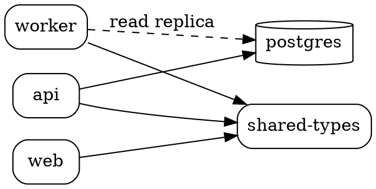

Read it for the node with the most inbound arrows. That is the one whose change review needs to be slowest.

## 9. Deployment diagram — what runs on what

**The question:** where does this actually execute, and what is the blast radius?

PlantUML's deployment vocabulary is the clearest for this.

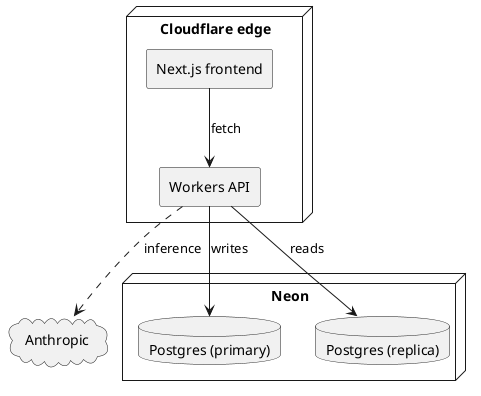

**Reach for something else when:** you are describing logical structure rather than where things run (C4 container level).

## 10. Journey map — how it feels, step by step

**The question:** where does this experience actually go wrong for the person having it?

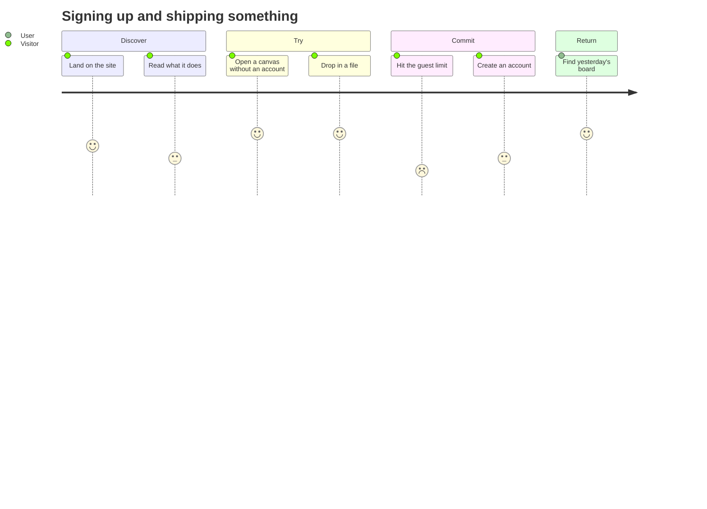

The scores are the point. A step scoring 2 in the middle of fives is where you lose people.

## 11. Gantt — work against a calendar

**The question:** what is the ordering constraint, and where is the slack?

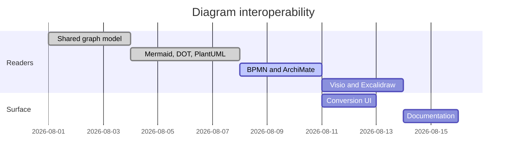

A Gantt chart is a lie about certainty and everybody knows it. Draw it for the *dependencies* — `after a1` is the useful part — not for the dates.

## 12. Mindmap — an idea before it has structure

**The question:** what is even in scope here?

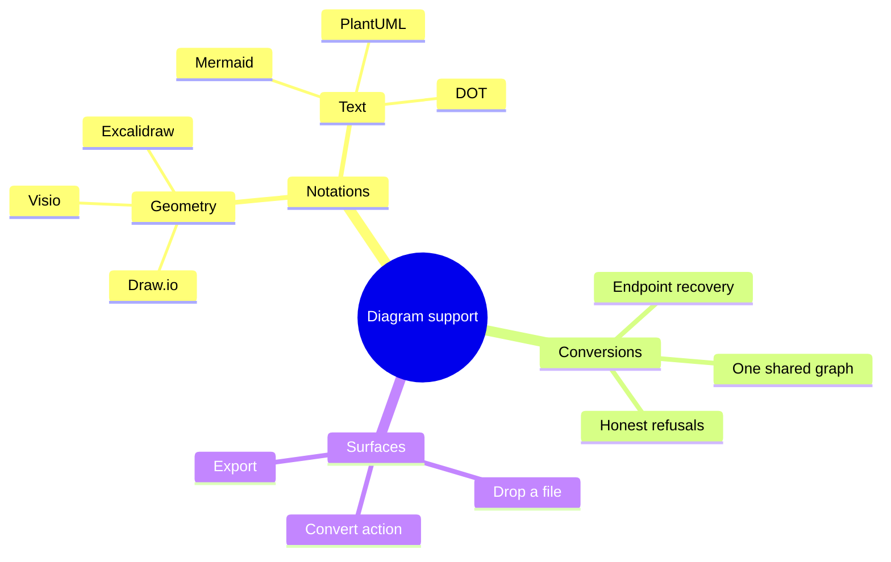

The only type on this list where being *wrong* is fine. It is a thinking tool; convert it to something accountable once it settles.

## The one rule worth keeping

```bf-figure
{
  "kind": "stack",
  "title": "Choose the type before you choose the tool",
  "bands": [
    { "label": "Name the question", "note": "\"What order do the services call each other in?\" — not \"we need an architecture diagram\"", "hue": "idea" },
    { "label": "The question names the type", "note": "Ordering between participants is a sequence diagram. Nothing else answers it.", "hue": "read" },
    { "label": "The type names the notation", "note": "A sequence diagram is Mermaid. A process someone runs is BPMN. A dependency graph is DOT.", "hue": "prove" },
    { "label": "The notation is now reversible", "note": "Convert between them later. That is the part you no longer have to get right up front.", "hue": "build" }
  ],
  "caption": "The choice that used to be permanent — which tool, which file format — is the one that now costs nothing to change."
}
```

Every example above can be dropped onto a Creation Canvas as a file, or pasted into a Diagram object, and converted from there. See [Every diagram format the canvas reads and writes](/blog/every-diagram-format-the-canvas-reads) for what round-trips and what does not, and [Escape your diagramming tool](/blog/escape-your-diagramming-tool) for getting existing work out of Visio, Lucidchart and Miro.

[Open a canvas and try one →](/create/new)
