大多数糟糕的图表，问题并不在于画得不好，而在于*类型*选错了——用流程图去干时序图的活，或者一张所谓的架构图，其实是一张漏掉了部署信息的部署图。结果看起来没毛病，却回答不了任何人真正关心的问题。

下面每一种图表类型之所以存在，都是因为某个特定问题被反复提出。这里给出每种图对应的问题、示例，以及什么时候该换用别的图。每个示例都是真实可用的源码，可以直接粘贴到画布上。

[打开创作画布 →](/create/new)

## 按你要回答的问题来选

```bf-figure
{
  "kind": "compare",
  "title": "问题决定图表类型",
  "columns": [
    {
      "title": "“发生了什么，按什么顺序？”",
      "hue": "read",
      "items": [
        "流程图——有分支的工作",
        "时序图——谁调用谁，随时间展开",
        "状态图——单个事物可能处于哪些状态",
        "BPMN——必须有人执行的流程"
      ]
    },
    {
      "title": "“有哪些东西，彼此什么关系？”",
      "hue": "prove",
      "items": [
        "ER 图——表及其键",
        "类图——类型及其关系",
        "C4——系统、容器、组件",
        "依赖图——牵一发而动全身"
      ]
    },
    {
      "title": "“它在哪里运行，什么时候？”",
      "hue": "build",
      "items": [
        "部署图——什么跑在什么上面",
        "甘特图——工作与日历的对照",
        "旅程图——一步步的真实感受",
        "思维导图——一个尚未成形的想法"
      ]
    }
  ]
}
```

## 1. 流程图——有分支的工作

**要回答的问题：**接下来会发生什么，由什么决定？

这是被画得最多、也被误用得最多的图。只有当*分支*本身是重点时，流程图才是对的选择。如果你的流程图里一个菱形都没有，那你画的其实是一张清单。

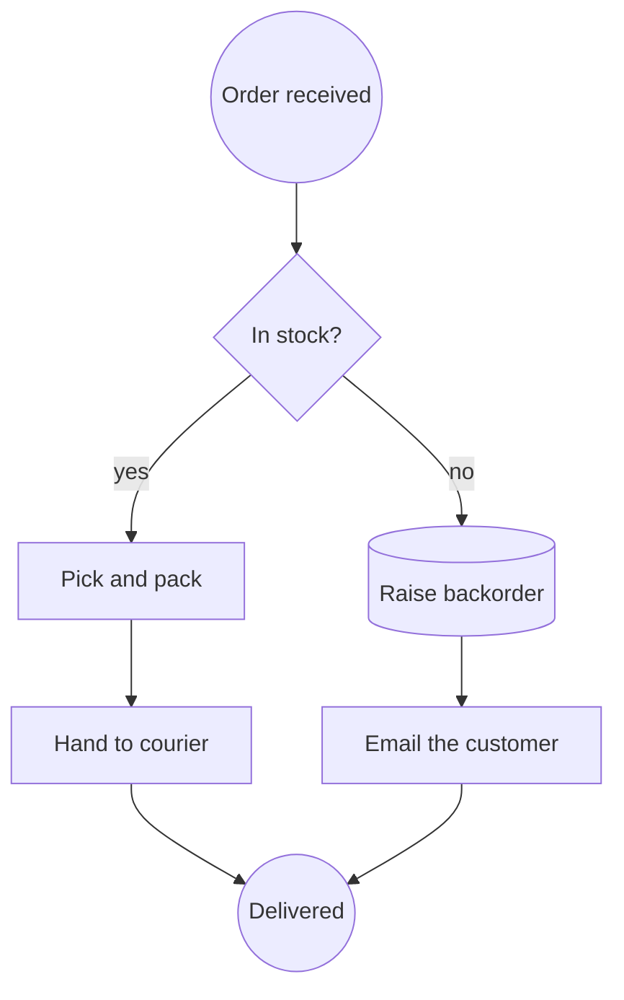

**什么时候该换用别的图：**当真正有意思的是*哪个服务调用了哪个服务*时（用时序图），或者当需要由真人来执行、并对结果负责时（用 BPMN）。

## 2. 时序图——谁调用谁，随时间展开

**要回答的问题：**这些参与者按什么顺序交互，每一次往返的代价是多少？

这是唯一能让延迟问题一目了然的图。时间沿页面自上而下流动，每条消息都是生命线之间的一支箭头。

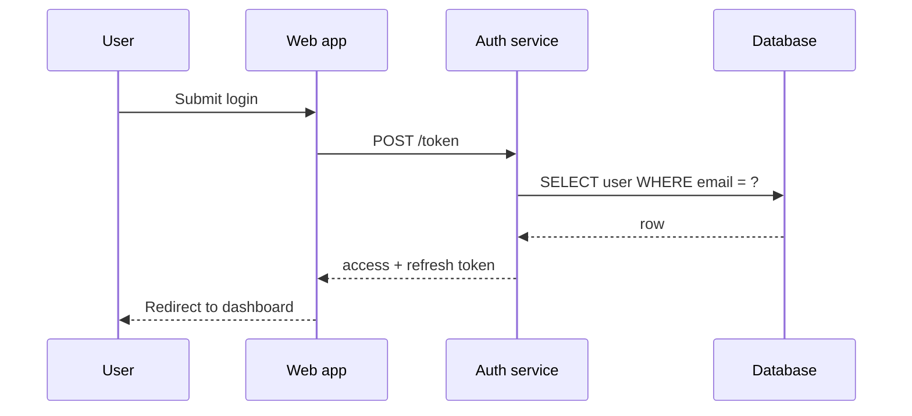

这是流程图无法取代、也不该试图取代的类型。它的含义*就是*沿生命线自上而下的顺序，这也是创作画布将时序图保留为 Mermaid、而不把它转换成方框和箭头的原因——把它压平，只会得到一张能渲染、却会说谎的图。

**什么时候该换用别的图：**当只有一个参与者时（用状态图）。

## 3. 状态图——一个事物可能处于哪些状态

**要回答的问题：**这个单一实体可能处于哪些状态，又是什么让它在状态间切换？

它被严重低估，却是找出生命周期缺陷最快的方法。凡是带 `status` 字段的东西，都值得画一张。

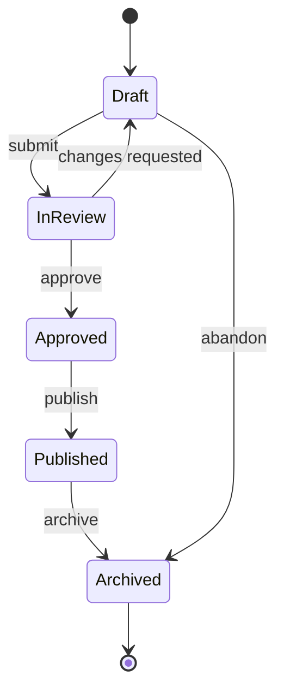

一旦画出来，你就能提出那个能揪出缺陷的问题：*有没有哪个状态转换是代码允许、但图上没有的？*

**什么时候该换用别的图：**当多个事物相互作用时（用时序图），或者当状态转换由人而非系统决定时（用 BPMN）。

## 4. 实体关系图——表及其键

**要回答的问题：**有哪些数据，它们如何关联？

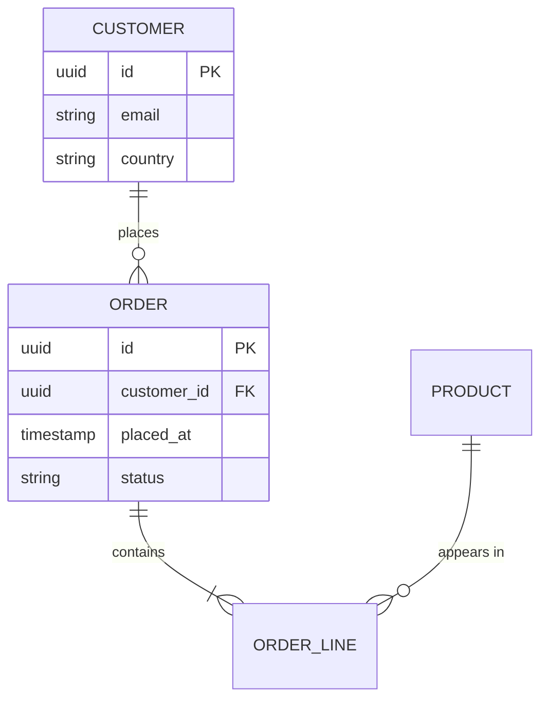

鸦爪符号承载了全部论点：`||--o{` 表示“恰好一个，对应零个或多个”。把这些画对，就能在范式设计错误变成一次数据迁移之前把它拦下来。

**什么时候该换用别的图：**当你关心的是行为而不是存储时（用类图）。

## 5. 类图——类型及其关系

**要回答的问题：**有哪些类型，它们各自拥有什么，谁继承自谁？

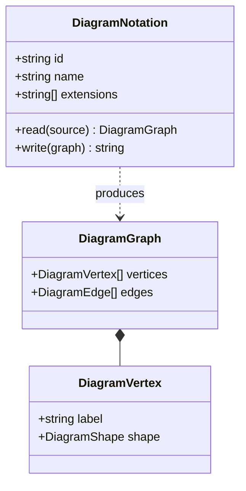

**什么时候该换用别的图：**当读者并不会去读代码时（改用 C4——同样的直觉，只是换到了一个更友好的高度）。

## 6. C4——四个缩放层级的架构

**要回答的问题：**从读者所处的位置看，这个系统是什么？

C4 的贡献不在于符号，而在于*层级纪律*：上下文（系统与用户）、容器（可部署的单元）、组件（单个容器内部有什么）、代码（很少值得画）。大多数架构图之所以失败，是因为在一页上混用了两个层级。

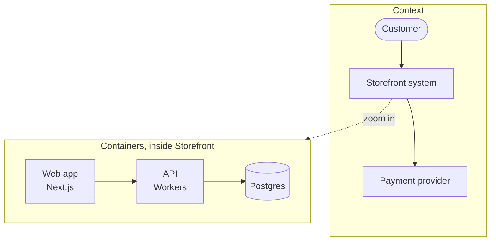

**让 C4 行之有效的规则：**每张图只画一个层级。如果你发现自己在一个参与者旁边画了一个数据库，那你手上其实是两张图。

## 7. BPMN——有人要为之负责的流程

**要回答的问题：**谁做什么，按什么顺序，出错时怎么办？

BPMN 是这里唯一同时也是可执行制品的类型。Camunda、Flowable 和 Zeebe 运行的就是你画出来的那个文件。

```xml
<bpmn:process id="Onboarding" isExecutable="true">
  <bpmn:startEvent id="s1" name="Application received" />
  <bpmn:userTask id="t1" name="Verify identity" />
  <bpmn:exclusiveGateway id="g1" name="Documents valid?" />
  <bpmn:serviceTask id="t2" name="Create account" />
  <bpmn:userTask id="t3" name="Request re-submission" />
  <bpmn:endEvent id="e1" name="Onboarded" />

  <bpmn:sequenceFlow id="f1" sourceRef="s1" targetRef="t1" />
  <bpmn:sequenceFlow id="f2" sourceRef="t1" targetRef="g1" />
  <bpmn:sequenceFlow id="f3" sourceRef="g1" targetRef="t2" name="yes" />
  <bpmn:sequenceFlow id="f4" sourceRef="g1" targetRef="t3" name="no" />
  <bpmn:sequenceFlow id="f5" sourceRef="t2" targetRef="e1" />
</bpmn:process>
```

注意 `userTask` 与 `serviceTask` 的区别——BPMN 区分由*人*完成的工作和由*系统*完成的工作，而这种区分，正是它比流程图更值得使用的主要原因。

**什么时候该换用别的图：**当没有人需要为此负责，也没有引擎会运行它时。这时流程图更诚实，也更省事。

## 8. 依赖图——牵一发而动全身

**要回答的问题：**如果这里变了，还有什么需要重新构建、重新测试或重新部署？

它通常是生成出来的，而不是画出来的——这也是为什么它通常以 DOT 的形式出现。

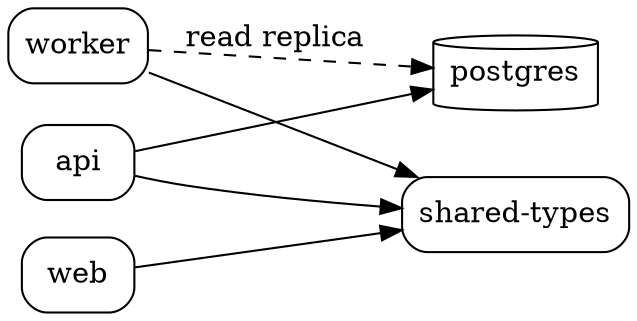

看图时找入边最多的那个节点。它的变更评审，应该是最慢、最谨慎的。

## 9. 部署图——什么跑在什么上面

**要回答的问题：**它实际在哪里执行，出了问题会波及多大范围？

在这方面，PlantUML 的部署词汇最为清晰。

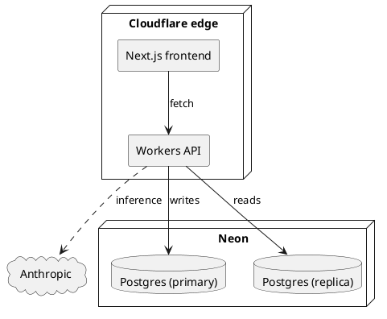

**什么时候该换用别的图：**当你描述的是逻辑结构，而不是东西在哪里运行时（用 C4 的容器层级）。

## 10. 旅程图——一步步的真实感受

**要回答的问题：**对亲历者来说，这段体验究竟在哪里出了问题？

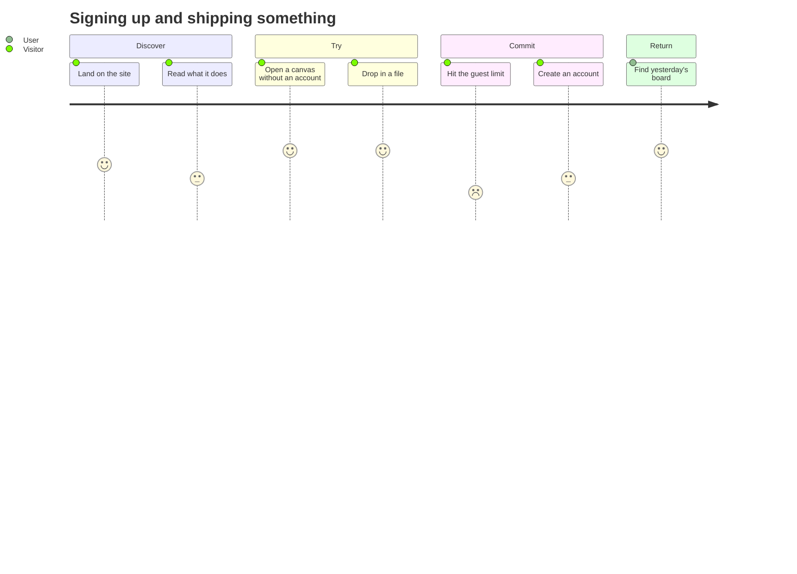

分数才是重点。一连串 5 分中间夹着一个 2 分，那就是你流失用户的地方。

## 11. 甘特图——工作与日历的对照

**要回答的问题：**顺序上的约束是什么，余量在哪里？

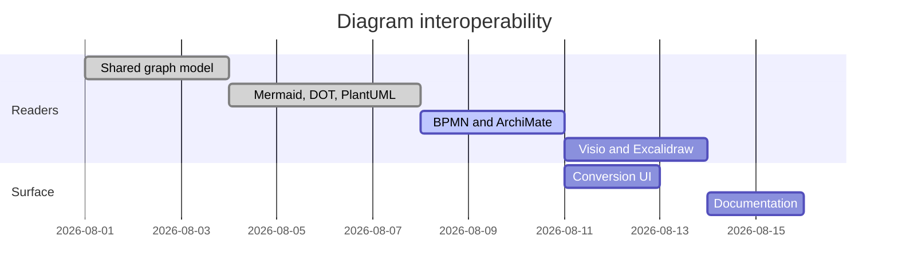

甘特图是一个关于确定性的谎言，这一点人人心知肚明。画它是为了*依赖关系*——`after a1` 才是有用的部分——而不是为了那些日期。

## 12. 思维导图——一个尚未成形的想法

**要回答的问题：**这件事到底涵盖哪些范围？

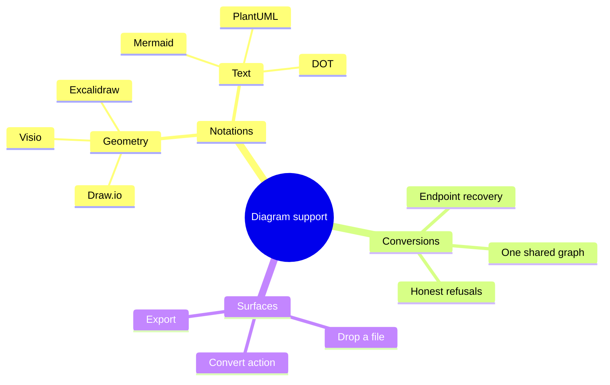

这是列表中唯一一种画*错*也无妨的类型。它是一个思考工具；一旦想法稳定下来，就把它转换成某种需要负责的图。

## 值得记住的唯一一条规则

```bf-figure
{
  "kind": "stack",
  "title": "先选图表类型，再选工具",
  "bands": [
    { "label": "说出问题", "note": "“各服务之间按什么顺序调用？”——而不是“我们需要一张架构图”", "hue": "idea" },
    { "label": "问题决定类型", "note": "参与者之间的顺序就是时序图。别的图都回答不了。", "hue": "read" },
    { "label": "类型决定格式", "note": "时序图用 Mermaid。有人要执行的流程用 BPMN。依赖图用 DOT。", "hue": "prove" },
    { "label": "格式现在可以回退", "note": "以后随时可以相互转换。这一部分，你不再需要一开始就选对。", "hue": "build" }
  ],
  "caption": "过去一旦选定就无法更改的决定——用哪个工具、哪种文件格式——如今改起来毫无成本。"
}
```

上面的每个示例都可以作为文件拖到创作画布上，或粘贴进一个图表对象，然后从那里进行转换。想知道哪些格式能往返转换、哪些不能，请看 [画布可读写的所有图表格式](/blog/every-diagram-format-the-canvas-reads)；想把现有作品从 Visio、Lucidchart 和 Miro 里迁出来，请看 [逃离你的图表工具](/blog/escape-your-diagramming-tool)。

[打开画布，动手画一张 →](/create/new)
