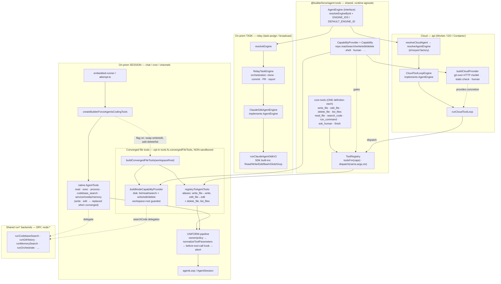

# 12a — Unified Agent Engine: dependency + flow diagram, and an end-to-end / divergence assessment

Companion to [12-prd-unified-agent-engine.md](12-prd-unified-agent-engine.md). Diagrams the
post-convergence architecture (engine seam + tool contract + the new on-prem file-tool convergence),
then walks each surface end-to-end to assess divergence and anti-patterns.

---

## 1. Dependency + flow (structure)



## 2. End-to-end execution — a converged on-prem `write` call

```mermaid
sequenceDiagram
    participant M as Model (via gateway)
    participant L as agentLoop / AgentSession
    participant W as wrappers (normalize→policy→hook→abort)
    participant A as registryToAgentTools shim (exposed as write)
    participant R as ToolRegistry (shared)
    participant D as writeFileTool.execute (shared core-tool)
    participant P as buildNodeCapabilityProvider.repoWrite (disk)

    M->>L: tool_call write { path, content }
    L->>W: dispatch "write"
    Note over W: SAME pipeline as every native tool<br/>(owner/policy, schema normalize, loop-detect hook, abort)
    W->>A: execute(params, signal)
    A->>R: (shim wraps def.execute; ctx.caps = disk provider)
    R->>D: writeFile via ctx.caps.repoWrite!
    D->>P: writeFile(path, content)
    P->>P: resolveInside(root,path) → mkdir -p → fs.write
    P-->>D: { ok, change: created|modified }
    D-->>A: ToolResult { data:{ ok:true } }
    A-->>W: AgentToolResult (JSON text block)
    W-->>L: result (hooks/abort applied)
    L-->>M: tool result → next turn
```

---

## 3. Assessment — end-to-end correctness & divergence

### 3.1 What is genuinely UNIFIED (no anti-pattern)

| Concern | Single source | Anti-pattern avoided |
|---|---|---|
| **Engine selection** | `resolveEngineById(registry,id,default)` in shared `engine.ts` — relay `resolveEngine` AND cloud `resolveAgentEngine` both call it | No two divergent resolvers; a V3 = one registry entry on either surface |
| **Engine contract** | `AgentEngine.run(input)→AgentRunResult` — cloud `CloudToolLoopEngine`, on-prem `ClaudeSdkAgentEngine` both implement it | No surface-specific engine universe |
| **Converged tool defs** | shared `core-tools` `write_file`/`edit_file`/`delete_file`/`list_files` — cloud dispatches them; on-prem adapts the SAME objects | **No duplicate definition** of those 4 tools |
| **Tool→surface gating** | `CapabilityProvider` + `Capability` (DI) — cloud=git concretion, on-prem=disk concretion | Surfaces differ only by concretion, not by a forked tool list |
| **The adapter bridge** | `registryToAgentTools` now has a **production caller** (`buildConvergedFileTools`) | **No dead seam** (it was previously unwired) |
| **Hardening pipeline** | converged tools flow through the SAME `coding-tools.ts` normalize→policy→hook→abort `.map(wrap…)` chain | Hardening not bypassed/duplicated for the converged path |
| **Ignore set / search** | `IGNORED_DIRS` exported once in `node-code-tools.ts`; disk provider's `searchCode` delegates to `runCodebaseSearch` | DRY — fixed the `LIST_IGNORED_DIRS` literal dup this pass |
| **Registry build cost** | converged `ToolRegistry` hoisted to module scope (workspace-independent); only the disk provider is per-session | No per-turn/per-request recomputation of a static registry |

### 3.2 Divergence that REMAINS — scoped & documented, not anti-patterns

These are capability-gated or contract-scoped differences with a recorded reason — the seam's purpose,
not drift:

- **On-prem TASK loop (SDK) still runs SDK built-ins, not the shared registry** → Phase C. This is the
  one remaining *structural* divergence (a third tool set on the task path); tracked in PRD 12 §5 Phase C.
- **`read` / `exec` / `process` stay native** → `read` needs a shared read-capability media affordance
  (text-only today would lose image-reading); exec/process need streaming `ctx.onUpdate?`. Prereqs in §5.
- **`search_code` left native** → converging it would double the on-prem `codebase_search`; intentional.
- **Sandboxed sessions stay native** → the disk provider writes via `node:fs`, not the sandbox fs-bridge;
  gated off for sandbox to avoid bypassing container isolation (a sandbox-aware provider is the follow-up).
- **Return fields differ by surface** (cloud `{ok,branch,commitUrl}` vs disk `{ok,change}`) — but the
  TYPE is the one shared `RepoWriteResult`; surface-appropriate optional fields, same contract. Not a fork.

### 3.3 Finding from this assessment (logged)

**Converged `write`/`edit` are ALWAYS workspace-root-guarded; native `write`/`edit` are only guarded
when `tools.fs.workspaceOnly` is set.** The shared `write_file`/`edit_file` contract is repo/workspace
relative by design (matches cloud), so the disk provider rejects out-of-workspace paths unconditionally.
A non-sandboxed session that today writes to an absolute path OUTSIDE the workspace (legacy native
behavior with `workspaceOnly=false`) would have that rejected once converged. This is a (safer)
behavior NARROWING, not a break — but it must be verified in the pre-flip smoke test and is logged to
the Consolidated Gap Register so the default-on flip accounts for it.

### 3.4 Verdict

For the converged scope (engine seam + the file-tool subset on cloud + on-prem session) the graph is a
**tree of single definitions resolved through DI seams** — one engine contract, one resolver, one tool
definition per converged tool, one hardening pipeline, shared backends. No duplicate definitions, no dead
seam, no second resolver, no per-turn recomputation. The remaining divergences (SDK task path,
read/exec/process, sandbox, search) are **explicitly capability-gated and gap-tracked**, each with a
prerequisite — they are the seam working as intended, not architectural drift.
